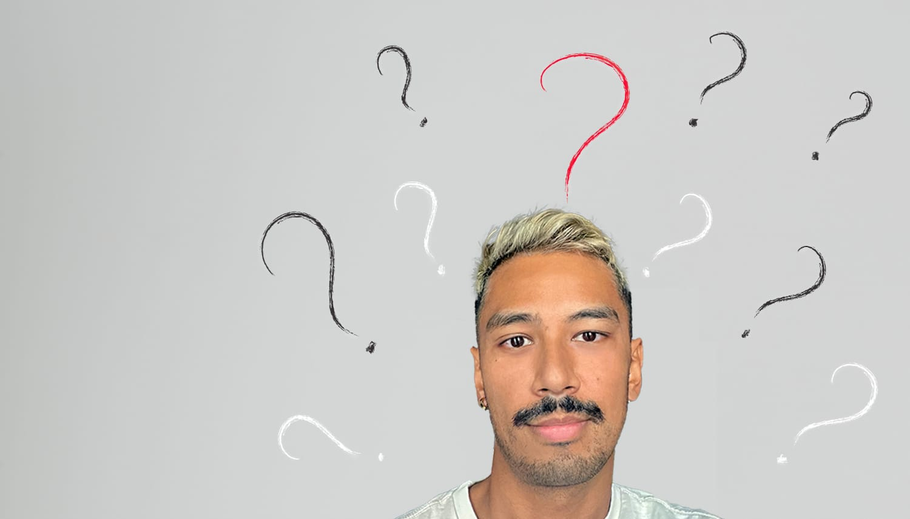

Welcome to the "Chronicles of a Millennial Techie", where the digital realm intertwines with the labyrinth of my thoughts. I'm Shaun Pezeshki, your guide through the twists and turns of existence in my 30s. This decade feels like a constant second-guessing, an endless struggle to find purpose amidst the noise.

## The Social 180

Ah, my 20s - that decade of pure spontaneity and adventure. I was a total social butterfly back then, flitting from one exciting experience to the next without a care in the world. But as the years went by, the social whirlwind slowed to a grinding halt. Now in my 30s, I find myself craving real connection yet paralyzed by hesitation, struggling to break out of my mundane routine.

## The Existential Struggle

Amid this search for purpose, I'm constantly wrestling with existential dread. That nagging feeling of not having it all figured out weighs heavily. I find myself mindlessly scrolling through others' portrayed picture-perfect lives, which only fuels more uncertainty about my own path. 

## The Comfort of Going Inward

I find comfort in introspection and the realization that life doesn't have to follow some pre-written script. Deep down, I've come to understand that existence is inherently messy, with no clear-cut answers or predictable routes. It's a nonlinear journey of discovery where the beauty lies in being present amid the twists and turns.

## Seeing the Full Human

Perhaps it's this intimate familiarity with life's messiness that has allowed me to cultivate deeper empathy. I've developed an unusual knack for seeing past people's rough exteriors to the complicated realities we all grapple with internally. We've all been through seasons of doubt, hurt, and feeling hopelessly adrift. I've faced such pain myself, which has reminded me that beneath our polished public personas, every human is a multidimensional mix of light and dark.

This perspective helps me look beyond someone's prickly behaviors or obvious flaws to understand their deeper self driven actions. Because at our core, we all share that fundamental need to be truly seen and accepted for our whole, imperfect selves - jagged edges and all. 

## Let's Explore Together

So join me as we dive into the depth and messiness of the human experience. Let's embrace the uncertainty together, finding solace in our shared experiences of navigating this beautiful, chaotic world. 

