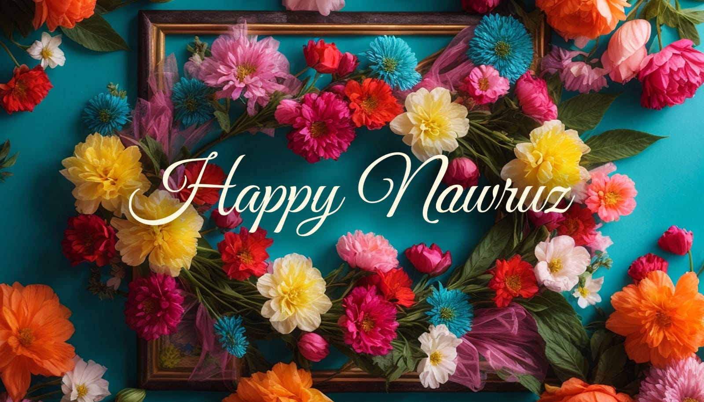

 

## The Tradition of Naw Ruz

Naw Ruz, the Persian New Year, marks the arrival of spring on the vernal equinox. For centuries, it has been a cherished tradition among Iranians, celebrating the renewal of nature and the beginning of a new annual cycle. It's a time for gathering with loved ones, enjoying traditional Persian cuisine, and embracing the spirit of rebirth and growth.

## A Community Celebration

My dad took a hands-on approach to celebrate Naw Ruz with our local Bahá'í community. He set out to organize an event that included everything needed for a proper celebration: he found a venue, arranged for a variety of foods to be served, and made sure there was music and space for dancing. His goal was not only to create a welcoming atmosphere where everyone could come together, enjoy the festivities, and mark the start of the New Year but also to share this important tradition with me and my sister. Thanks to his efforts, the event became a memorable gathering for our community, highlighting the importance of unity and joy in our cultural traditions.

## The Goldfish Giveaway

One particular Naw Ruz stands out vividly in my memory: the year my father decided to give away goldfish. This gesture, in Persian tradition symbolizing life and prosperity, added a unique and personal touch to the celebration. Although not an annual tradition, the goldfish giveaway is a testament to my dad's creativity and desire to make each Naw Ruz special and memorable.

## A Turning Point After Dad's Passing

The loss of my father marked a turning point in my family Naw Ruz observances. The absence of his organizational skills led to more subdued celebrations, focusing on the essence of the New Year rather than elaborate gatherings. This change prompted a period of reflection on the impact of his efforts and how they shaped my family's experience of Naw Ruz, highlighting the deep connection between personal relationships and cultural traditions.

## Reconnecting with Traditions

This year, I am inspired by a renewed desire to celebrate Naw Ruz. By having a simple family dinner and maybe creating a haft-seen table — a traditional arrangement of seven symbolic items starting with the letter 'S' in Persian, each representing a key aspect of life and the rejuvenation of nature — I aim to reconnect with this meaningful tradition. This celebration serves as a tribute to his memory, while also adapting the observance to our current stage in life. It is an opportunity to seamlessly blend respect for the past with the practical realities of the present.

## Keeping the Tradition Alive

Celebrating Naw Ruz throughout my life has shown me how traditions can change and grow with us. Even though we might celebrate differently over time, what these traditions mean to us remains the same, giving us a sense of belonging and a chance to start anew. Looking forward to future Naw Ruz celebrations, I want to find new ways to honor these traditions. In doing so, I hope to create lasting memories and build stronger connections, keeping the spirit of my dad's celebrations alive.

