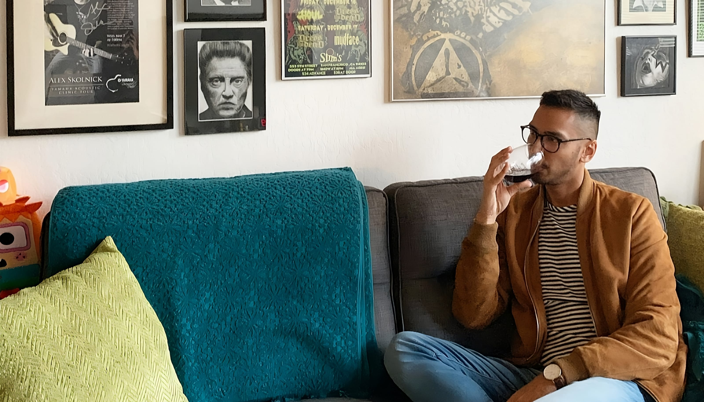

 

As a Michigan native, you'd think the Midwest holds few surprises for me. Yet, Ohio, especially Columbus with its blend of liberal energy and subtle conservative undertones from its neighboring areas, offered an unexpected sense of belonging. While Detroit, with its celebrated LGBTQ+ vibrancy, promised inclusivity, it was Columbus that truly delivered. This city, where the liberal surface is enriched by the conservative values of its wider community, showed me the depth of connection I'd been seeking. It's a reminder that sometimes, the essence of home is found in the most unexpected places, even within the familiar bounds of the Midwest.

## The Disconnect in My Progressive Hometown

Living in Metro Detroit, I pictured myself in a vibrant setting where diversity and acceptance were celebrated. Yet, the reality was somewhat different. It often seemed like a scene where the true essence of inclusivity was lost in translation. Yes, there were vocal support for LGBTQ+ rights, but the sense of genuine connection was missing. It appeared as though people had become so accustomed to the idea of diversity, in all forms, that they overlooked the importance of truly connecting with one another.

## Warmth Discovered in an Unlikely Place

On the surface, Columbus upholds progressive values with its lively LGBTQ+ community and diversity. However, the city is shaped by the more conservative leanings of the surrounding areas. This combination creates a rich social fabric that is surprisingly warm and accepting.

**Who knew the secret ingredient was a dash of conservatism?** Rather than finding belonging solely within traditional gay spaces, I discovered an unexpected openness among the people of Columbus themselves. It wasn't just about embracing my identity, but about being seen as a human being first. In bars and social gatherings, I could connect with others as individuals, free from the superficiality (well most of the time) that can sometimes exist within certain LGBTQ+ circles.

...And all this time, I thought the key to fitting in was a trendy haircut and a snazzy jacket.

## Making Sense of the Paradox

Social psychology offers an insight: in places where seeing someone 'different' is rare, there's a natural inclination to seek out and understand these unique perspectives, leading to more engaging and personal conversations. In a city like Columbus, known for its open-mindedness, the diversity is enriched by those coming from more uniform backgrounds. This creates a dynamic where my identity, while not an oddity, prompts a desire in others to explore and connect on a deeper level, beyond mere politeness or tolerance.

... It's like being a unicorn in a field of horses; suddenly, everyone's interested in your big horn.

## Reflections on the Journey So Far

As I stand at this crossroads, exploring Columbus after my experiences in Metro Detroit has been more than just a series of visits — it's been an enlightening journey into what it means to belong. These explorations have revealed that real acceptance is about **more than outward support; it's found in the genuine connections and friendships we cultivate**.

### The Quest Continues

So, what's next for this gay minority wandering through the Midwest? The quest for a place to call home continues, but with a newfound appreciation for the unexpected warmth found in conservative corners. Maybe home isn't a place but a feeling — a sense of belonging that blooms in the most surprising conditions.

**Looking Ahead**: While I haven't packed my bags for Columbus just yet, the city's welcoming spirit has left a lasting impression. As I ponder where to plant my roots, the laughter, connections, and invaluable lessons from Columbus remain with me, hinting that perhaps, it will be my next chapter.

