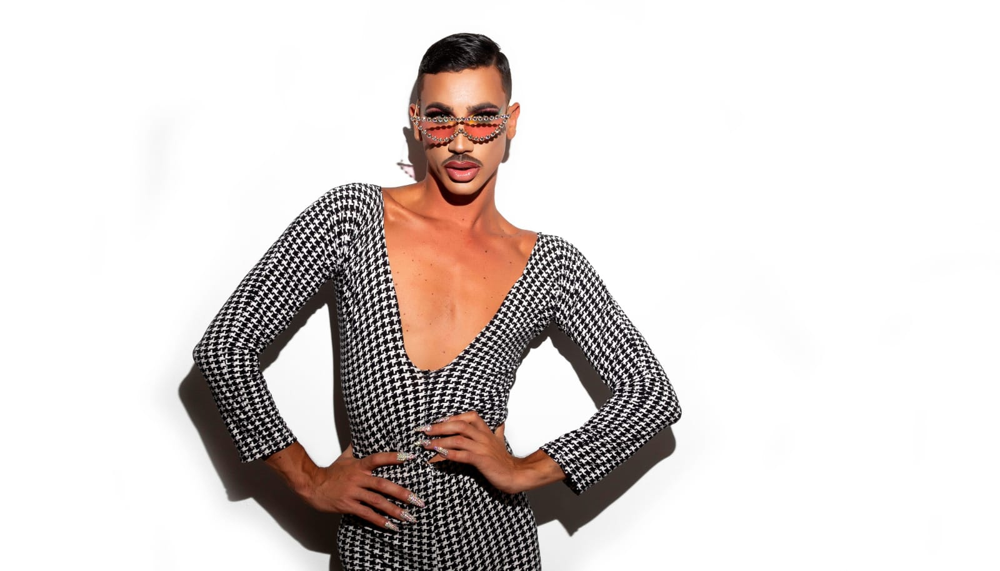
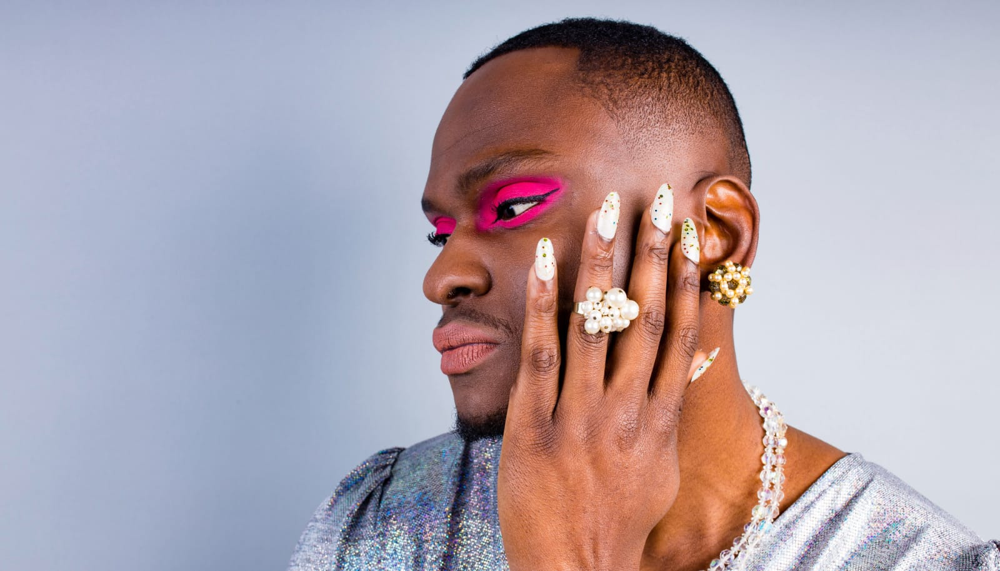

 

## From Early Awareness to Self-Discovery
Long before I could articulate it, I sensed I was different. As a child, navigating the world came with the realization that I didn't quite fit the mold society had set for boys. For a long time, I believed that hiding my true self, especially my gay identity, was crucial for acceptance. I thought that if I could just 'act straight,' I would blend in, avoiding the judgment and exclusion that seemed otherwise inevitable.

## It's More Than Just Acceptance
However, a simple yet profound insight shifted my entire perspective: "people's issue with gay men is actually their issue with femininity and, by extension, with women." This realization made me see that my efforts to conform were not just about masking my sexuality; they were about distancing myself from anything deemed 'feminine,' under the mistaken belief that femininity was somehow lesser, weaker. It dawned on me that the negativity I feared was not just a problem for gay men but also reflected how society often fails to give femininity and women the respect they deserve.

## The Shared Struggle
This insight broadened my understanding of gender dynamics. It's not just about gay men; it's about how society treats anyone who deviates from traditional gender norms. Women, in particular, bear the brunt of this bias. They are often criticized for their femininity—the very thing I was taught to hide—or for stepping too far into 'masculinity.' It's a double-edged sword: women are penalized for being too feminine or not feminine enough, revealing deep-seated misogyny intertwined with homophobia.

 

## Reflections on Masculinity and Acceptance
My experience as a gay man led me to realize how society dictates gender norms. The 'masculinity' I thought was necessary for acceptance is actually a societal construct, burdened with limiting expectations for all genders. Discovering that fitting into these norms was the key to social acceptance was both freeing and challenging.

## Healing and Moving Forward
Embracing my authentic self, I've come to appreciate the role I inadvertently play in challenging these outdated norms. Each step towards authenticity is a step towards healing—not just for myself but for anyone who's felt pressured to conform to a narrow definition of 'manly' or 'womanly.' It's a journey of unlearning, of peeling back the layers of gender expectations to reveal the rich diversity of human identity.

As we navigate our paths, let's challenge the biases that equate femininity with weakness and penalize both women and men for deviating from prescribed roles.

