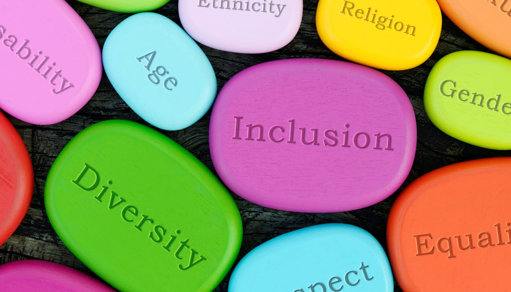

 

## Early Days in DC

In 2011, I moved to DC with my partner at the time, searching for employment. After a month of job hunting, I landed a position at a digital agency in Northern Virginia. The excitement was undeniable; I was about to leave my penny-pinching days behind and step into the professional world. Fueled by youthful optimism, I imagined a workspace buzzing with collaborative energy, light-hearted office pranks, and a culture of mutual respect and equal opportunities. Little did I know, reality was about to teach me a couple of valuable lessons.

## The Sinking Realization

### Racial Dynamics

Let's talk about the experience of the engineers on my team, where we all shared the commonality of being minorities. Many were immigrants, with a significant portion from India. Our VP had a habit of using "big words" in meetings, but it didn't stop there. After dropping a word like "ubiquitous," he'd often add, "Oh, you probably don't know what that means," and carry on without pausing for explanation. This wasn't just showing off; it felt like a deliberate attempt to create a divide, suggesting he was somehow more knowledgeable. These comments, disguised as jokes, really showed there was some underlying racism going on. Far from fostering a team spirit, it introduced an unwelcome tension. Some team members would give a nervous chuckle, but for others, including me, the discomfort lingered long after the meetings concluded.

### Facing Misogyny

And then there was our extraordinarily talented female colleague, facing a level of sexism that felt like a throwback to a much less "woke" era. Despite her knack for seamlessly managing, designing and developing, she was often met with remarks from the VP that were so outdated, they almost seemed like they were from another century. I particularly remember the time she asked for constructive feedback on her client presentations and was told to "just sit there and look pretty," a comment that completely shocked me. Seeing her maintain her professionalism despite such disrespect was yet another reminder of how often these incidents occur, and how we, tend to let them slide without taking action.

### Overwork Culture

The work environment was incredibly toxic, often requiring us to work late into the night. The VP's intimidation tactics kept us in a constant state of stress, prioritizing productivity over our well-being. We even resorted to subtle tactics just to leave on time, like leaving our coats near the door to sneak out without catching the VP's eye. Account managers, in particular, bore the brunt of this, always cautious to leave without being noticed. If they were spotted, the VP would pull them back in, finding some pretext to add more work on them. It was a silent routine that emphasized the prevalent anxiety in our office.

### Wage Disparities

A glaring issue that stood out was the unequal pay across the board in our workplace. It became apparent that wages were low not just for immigrants, but for everyone in the office. Especially for the immigrant workers, even with employer sponsorship, their salaries were surprisingly low. They were incredibly talented, yet their compensation did not reflect this, often justified by their sponsorship status. Conversations with a friend in HR, while not diving into specifics, confirmed the widespread rumors about the disproportionately low wages. Witnessing this was my first encounter with unfair work compensation in the workforce. While I was aware of my entry-level status, it was clear that other, more experienced workers had legitimate expectations for fair compensation.

## Advocating for Change

Looking back now in 2024, over a decade later, there has been some progress as the corporate world grows more aware of and less tolerant towards such toxic workplace behaviors. But the harsh reality is that remnants of these practices still linger in pockets of Corporate America. We must all remain proactive and call out this unacceptable conduct whenever we encounter it.

For those facing hostile work environments, I recommend building connections with your colleagues, creating a supportive network, and engaging in open conversations about diversity, equity, and inclusion issues. It's crucial to document everything related to your concerns for future reference. While HR departments primarily serve the company's interests, they still serve as the first line to file your complaint. If your concerns remain unaddressed, don't hesitate to seek advice from external advocacy groups, professional organizations committed to workplace rights, or even legal counsel to understand your options better. 

Remember, change often starts with the courage to speak up, even in the smallest of meetings or one-on-one conversations.

### But I want to hear your perspectives...
What is your stance on this persistent pay gap issue in the workforce, including for visa workers? Have you faced or witnessed similarly overt discrimination and hostilities in your own professional environments? 

