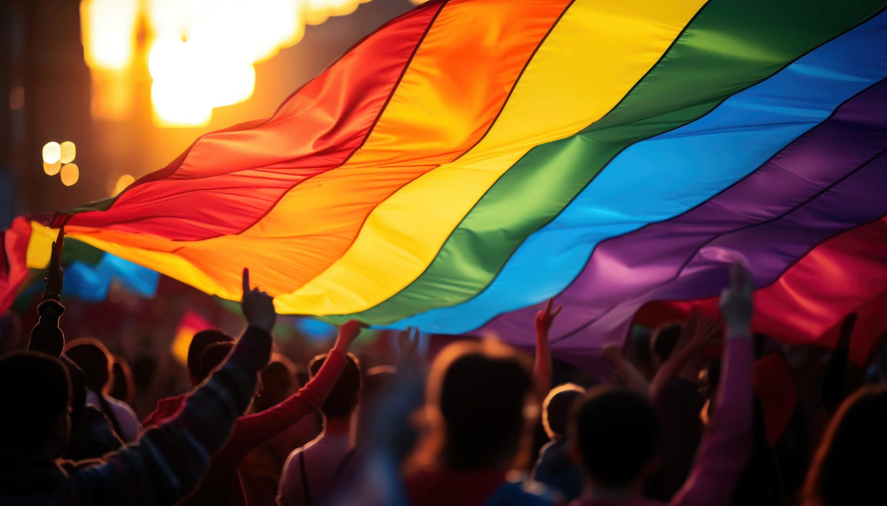
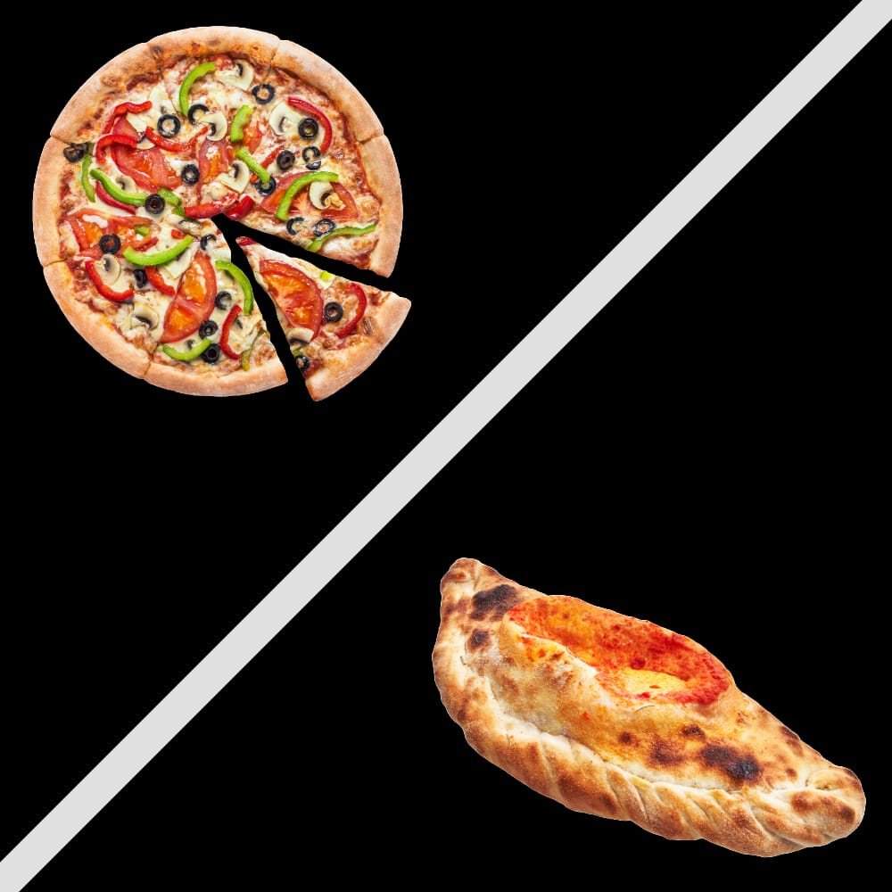
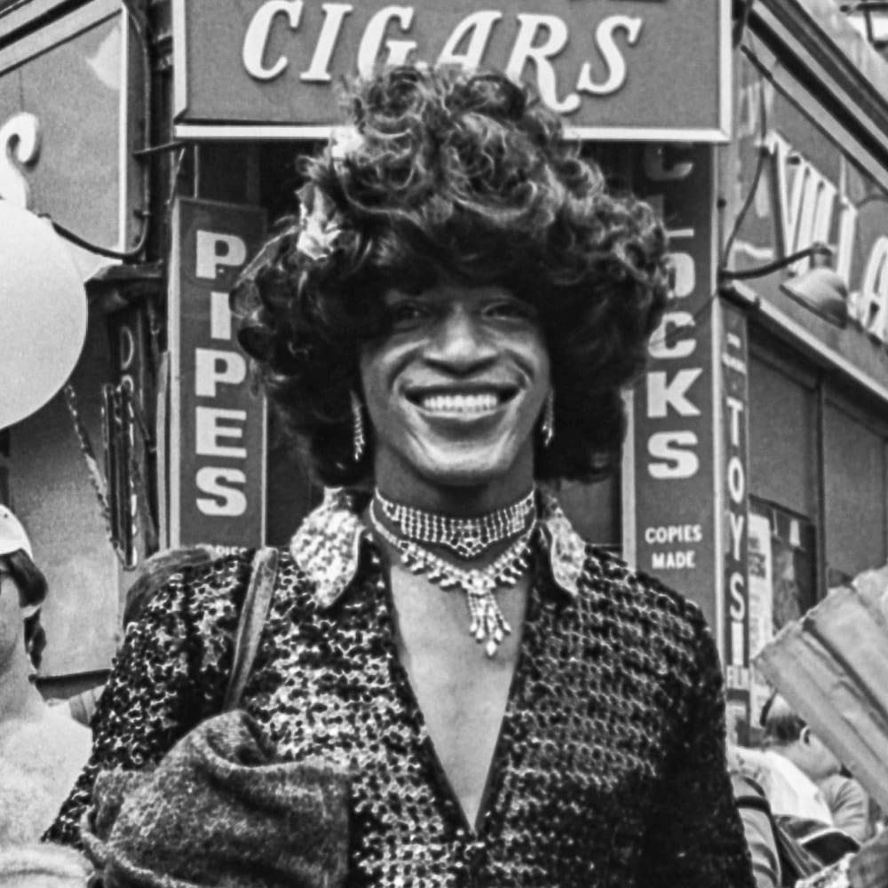

 

The LGBTQ+ community is a brilliant spectrum, each shade representing a distinct identity, experience, and story. Yet, in this array of colors, some hues seem less vibrant, less acknowledged. This brings us to a surprising observation — the hesitance of some cis gay men to fully champion the 'T' in LGBTQ+. So, let's talk about the identity, history and empathy. 

  

    <h2>What is Cis vs. Trans</h2>
    
First off, let's break down the basics with the least amount of jargon possible, shall we? Being cisgender means your gender identity matches the sex you were assigned at birth. Transgender, in contrast, signifies a mismatch between one's gender identity and the sex assigned at birth, similar to wearing a pair of mismatched socks – it's unexpected, yet it uniquely represents who you are.

    
In simpler terms:

    <ul>
      <li><strong>Cisgender:</strong> Like ordering a pizza and getting a pizza.</li>
      <li><strong>Transgender:</strong> Like ordering a pizza and getting a calzone instead – unexpected but equally wonderful.</li>
    </ul>
  

  

    <figure>
      
    </figure>
  

## Understanding Gender
Now, gender itself isn't a one-size-fits-all hat; it's more like a galaxy with a vast array of expressions, identities, and experiences. We find not just planets of masculinity and femininity but a whole cosmos of non-binary, genderqueer, and beyond. It's a spectrum, not a binary switch.

  

    <h2>The LGBTQ+ Rights Movement</h2>
    
In the early days, we were all marching together against the common oppressors. Didn't matter if you were gay, lesbian, trans, or whatnot – we were united in this collective struggle.

    
But then things started happening for the gays and lesbians, like marriage equality. And I'm not gonna lie, the trans community's specific battles got overshadowed in the process. But when you're caught up in your own fight, other people's struggles can kinda fade into the background.

  

  

    <figure>
      
      <figcaption class="mt-2">Marsha P. Johnson</figcaption>
    </figure>
  

## Reasons for a Lack of Support from Some Cis Gay Men
So, understanding where some cis gay men are coming from when it comes to not fully embracing trans issues is a complicated dynamic, but let's break it down:

* **Historical Backing and Representation:** Trans icons like Sylvia Rivera and Marsha P. Johnson were out there on the front lines from day one. But as time went on, their contributions almost got muffled by the louder narratives around cis gay and lesbian rights. It's like their voices got drowned out in the crowd. This lack of representation in historical narratives and leadership positions has perpetuated a cycle where trans voices are underrepresented in political and social spheres, impacting the level of support and recognition they receive.

* **Perceived Competition for Rights:** There's this weird perception that supporting trans rights might somehow undermine or compete with the rights we've already fought so hard for as gay men. As if there's only so much equality to go around, and we've got to protect our slice. But c'mon, dividing ourselves like that ain't gonna help anybody. This perspective overlooks the interconnectedness of LGBTQ+ rights, where advancements for one group can bolster the movement as a whole.

* **Sexuality vs. Gender Identity:** Here's the thing – being gay is about who you're attracted to. Being trans is about your gender identity. They're two totally different experiences that just happen to overlap under this 'LGBTQ+' umbrella. Sometimes there's a disconnect in fully understanding that distinction between sexual orientation and gender identity, and how both are integral aspects of the LGBTQ+ community.

* **Internalized Marginalization:** When you've been oppressed for so long, it's almost like those negative beliefs and biases start seeping in, you know? You might find yourself turning those same judgments against others who are different, even if you're both part of the same broader community. It's a vicious cycle, but recognizing that internalized stuff is the first step. This is particularly complex within the subset of cis white gay men, who, while marginalized for their sexuality, may still hold societal privileges that minority gay men do not. This dynamic can sometimes lead to a lack of empathy or solidarity with groups facing different or compounded forms of discrimination, such as the trans community.

## Beyond Labels
And now, my two cents – labels, schmabels. In the grand scheme of things, what does it matter if someone's gay, straight, trans, or a fabulous mix of identities? We're all navigating this wacky, wonderful life in search of happiness, love, and a bit of dignity.

## Let Us Remember

The LGBTQ+ community, in all its glorious diversity, is stronger together. The 'T' in LGBTQ+ isn't just a letter; it represents real people, with dreams, fears, and the same craving for acceptance that binds us all. So, let's extend a hand (or a fabulous, glittery glove) to all our siblings under the rainbow. After all, in unity, there's strength, in diversity, beauty, and in understanding.

