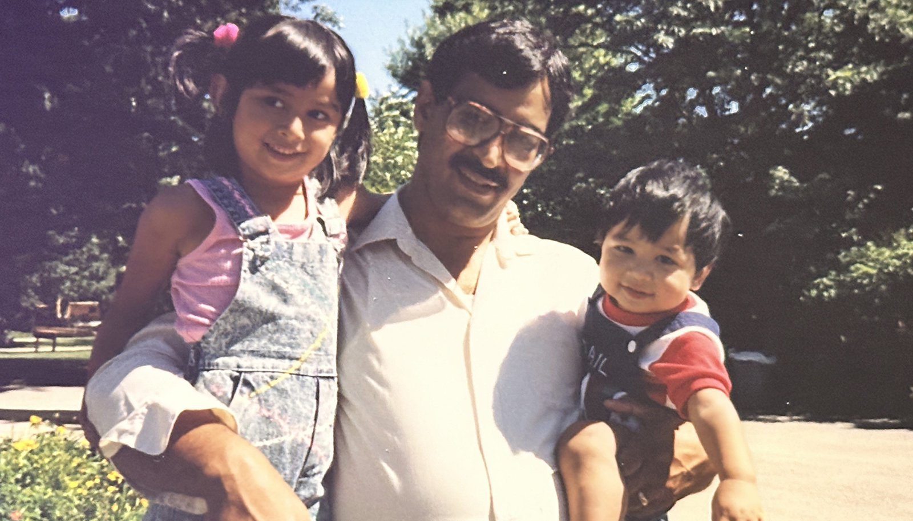
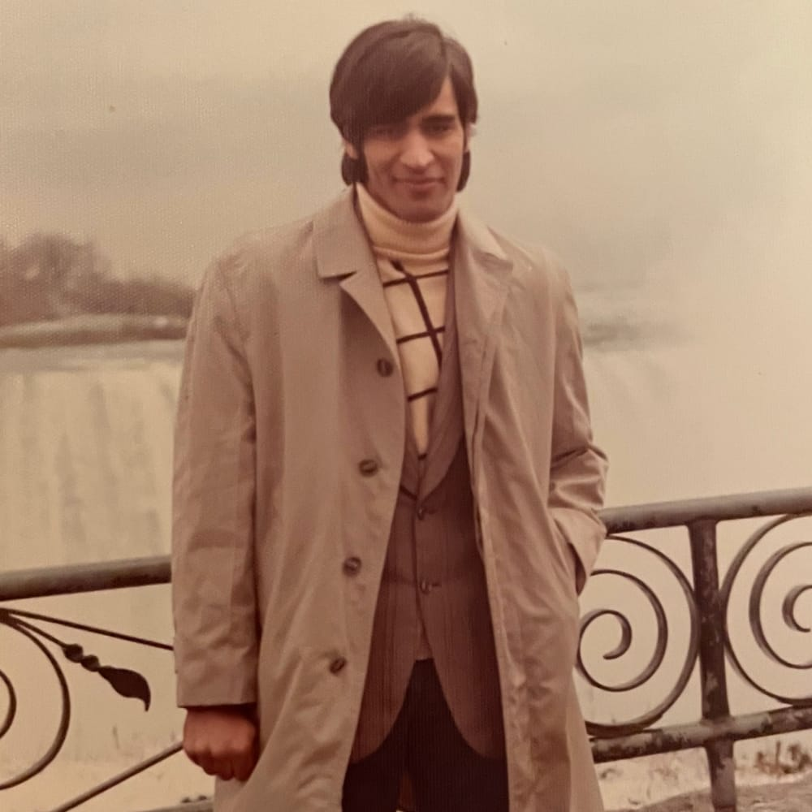

 

Four years ago, the world shut down. As streets emptied and doors closed, my dad's heart quietly followed suit. It was April 2020, and as a menacing virus held us in its grip, the opportunity to publicly honor his life slipped away. Now, with time to reflect and process, I am ready to share the words that have matured in the quiet spaces of my mind, unspoken since that surreal spring day.

  

    <h2 class="md:mt-0">A Giant Among Men</h2>
    
My dad was a man of few words but many inches, standing over six feet tall—a quiet giant with a presence that was as subtle as it was significant. He was more introvert than extrovert, yet his towering figure commanded attention without so much as a word. While he might have seemed intimidating to some, those who knew him understood the gentleness of his spirit.

  

  

      
  

## A Mentor

My dad managed a skating rink, a place where we spent countless afternoons together after school. To help me earn a little money and learn the value of work, he would generally assign me to the snack bar and the skate shop. One vivid memory stands out from those days: while working at the skate shop, a customer offered $200 for my skates, which were actually valued at only half that. I rejected the offer simply because I liked the aesthetic of those skates—and I was just a kid. Later, when I told my dad about it, he used it as a teaching moment. He explained the principles of smart decision-making and seizing opportunities, helping me see the broader implications of my choices. His advice has been invaluable, providing lessons that continue to influence my life.

## A Master Chef 

Beyond the skating rink, my dad's magic extended into the kitchen. He was a culinary wizard, renowned among relatives as the best cook. With an uncanny ability to concoct delicious meals from a mere glance at the refrigerator's contents, he would whip up dishes that comforted us. Whether it was the complex flavors of Persian cuisine or a simple, impromptu stir-fry, he shared his love through every dish he crafted. Meals at our house were not just food for us; they were expressions of his love for his family.

## A Supporter and Builder

He wasn't just my father; he was a homework helper, problem solver, a chef, and builder, always there to support both me and my sister. He had a knack for skillfully crafting things like decks, fixing household items, and constructing interiors that made our home more functional and welcoming. His dedication to improving our lives through these practical acts of service showed his deep love and commitment to our family's well-being.

Despite his illness weakening his physical strength, it never diminished his spirit. He persevered in fixing, building, and improving, driven by a deep desire to ensure that my mom and our family were well taken care of. Each project he undertook was more than just maintenance; it was his way of securing my mom's comfort and minimizing any future challenges she might face in retirement.

## The Unspoken Eulogy

If I had stood before you all those years ago, with the weight of his absence fresh on my shoulders, I would have said this:

> Look around you, see the faces of those he touched, feel the space his absence has carved into our lives. My dad was a man of few words because his life spoke volumes. In his silence, there was a reservoir of wisdom, in his height, a towering example of kindness. We are all buildings in a skyline he helped shape, cities of memories he constructed with steady, humble hands.

As I write this, I realize that perhaps the true eulogy lies not in the words spoken at a funeral, but in the quiet moments of reflection that follow us through the years, the lessons we carry forward, the gentle imprint of his life on ours.

Thank you, Dadu, for every sacrifice, for every lesson taught not through words but through deeds. Your impact is a loud echo through the halls of my life. Here's to you—the greatest man I ever knew.

