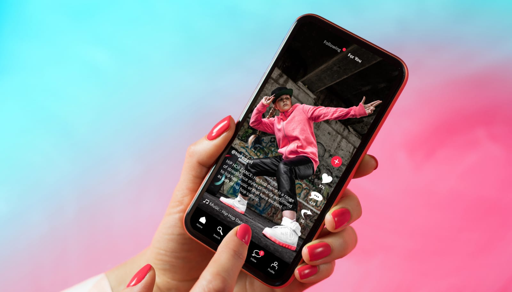

 

## The Precarious Future of TikTok

As discussions of a TikTok ban intensify in Congress, with significant momentum toward legislation, the stakes are high. For many, including myself, TikTok has become more than just an app—it's a crucial digital connection. The uncertainty of its future prompts a crucial question: what will happen next?

## A Personal TikTok Journey

I turned to TikTok during some tough times, right after losing my dad and as the pandemic lockdowns began in 2020. The platform, with its endless stream of dances and quick videos, became a little pocket of happiness in my own home. It was more than just a way to pass time; it connected me to the wider world when even simple tasks felt daunting.

TikTok wasn't just a distraction during the lockdown. As the world started to open up again, I found myself exploring new parts of the app. I moved from watching dance clips to diving into skincare routines. Searching for the best skincare tips became my new obsession, all thanks to the advice from TikTok's skincare doctors. It was less about vanity and more about finding a little control in a world that felt totally unpredictable.

However, TikTok offered more than just skincare tips. It became an invaluable learning tool, presenting a wealth of content aimed at self-betterment. From practical life hacks that simplified daily tasks to insights into different ways of life, including my own culture, TikTok provided a platform for growth and discovery. The app wasn't just informative; it also brought a lot of joy and laughter through its mix of comedic content, news updates, and touching human stories, making the journey of self-improvement both enjoyable and enlightening.

## The Flip Side

But it wasn't all smooth sailing. Using TikTok so frequently, with its quick, eye-catching clips delivering dopamine hits, began to erode my attention span. Suddenly, settling down to watch a full movie or even focusing during long meetings at work felt unusually challenging. Despite these challenges, the benefits I've gained from TikTok—both as entertainment and an educational resource—make it a valuable part of my daily life.

## The Bigger Picture
As Congress raises concerns about data privacy breaches and the potential spread of propaganda, TikTok stands at a pivotal moment with its 170 million American users. A potential ban could significantly alter the digital landscape. Unlike Instagram's Reels and other similar platforms, TikTok offers a superior content discovery experience and a diversity that others can't match. It allows users to curate feeds based on personal interests, independent of social circles—a powerful feature difficult to replicate on platforms that prioritize connections over content.

## Concluding Thoughts

As discussions about a potential TikTok ban intensify, it raises important questions about the role of government in regulating global technology platforms. What could this mean for our access to information, cultural dialogue, and innovation in the digital space?

TikTok has been more than just an app for many of us; it's been a source of learning, laughter, and connection during some challenging times. If this is the end for TikTok, its impact will be remembered for breaking down barriers and bringing people together. What are your thoughts on the potential ban?

