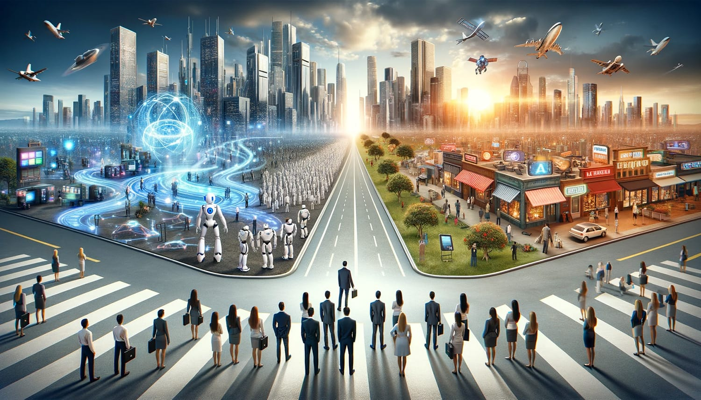

 

  

    Welcome back to 'Code & Quirks,' the sanctuary where the logical rigors of coding intertwine with the untamed thoughts of a millennial developer journeying through the intricacies of technology and life's unpredictable narratives.
  

  

    As we stand at the crossroads of an AI-driven era, the pace at which artificial intelligence evolves sends ripples through our professional lives, prompting both awe and anxiety. The question that looms large is: As AI continues to advance, what does the future hold for our jobs?
  

  <h2 class="text-3xl">The Tech Layoff Wave</h2>
  

    Recent headlines are awash with news of tech layoffs, a stark reminder of the volatility in the sector many of us call home. Companies that once seemed invincible now face the daunting task of navigating through economic downturns, leading to job cuts that have left many of us pondering our future in this industry.
  

  <h2 class="text-3xl">The Economic Divide</h2>
  

    Amidst this turbulence, the economic landscape continues to shift, with inflation gnawing at the edges of our hard-earned salaries. The chasm between the wealthiest 1% and the rest widens, casting a shadow over the dream of a balanced society where hard work and innovation are rewarded.
  

  <h2 class="text-3xl">Looking Ahead: Potential Outcomes</h2>
  

    As we peer into the horizon, several potential outcomes emerge, painting a picture of what the future may hold:
  

  <ul class="list-disc ml-8 mb-8">
    <li class="mb-4"><strong class="text-xl">The Rise of Gig Economy 2.0:</strong> The gig economy, characterized by short-term contracts and freelance work, could evolve into a more dominant employment model. This shift could offer flexibility and a multitude of opportunities for those willing to adapt, though it may also lead to less job security and benefits.</li>
    <li class="mb-4"><strong class="text-xl">Specialization and Continuous Learning:</strong> As AI takes over routine tasks, there will be a growing demand for specialized skills that AI cannot easily replicate. Continuous learning and upskilling will become not just beneficial but essential for staying relevant in the job market.</li>
    <li class="mb-4"><strong class="text-xl">The Emergence of New Job Roles:</strong> Just as the industrial revolution created jobs that were previously unimaginable, the AI revolution is likely to spawn new roles that we can't yet foresee. These roles will likely revolve around AI oversight, ethical considerations, and more creative and strategic positions that require a human touch.</li>
    <li class="mb-4"><strong class="text-xl">The Collaboration of Human and AI:</strong> Rather than viewing AI as a threat, the future might hold a more collaborative relationship between humans and AI. This synergy could enhance our capabilities, making us more efficient and freeing us up to focus on complex problem-solving and innovative thinking.</li>
  </ul>

  

    While the future may seem daunting, history has shown us that with change comes opportunity. By embracing the unknown with curiosity and resilience, we can navigate the evolving landscape, finding new ways to blend our unique human skills with the capabilities of AI. The future is not written in stone; it's up to us to carve out our path, leveraging the quirks of our millennial mindset to adapt, innovate, and thrive in the face of change.
  

  

    As we continue this journey together, I invite you to share your thoughts, fears, and hopes for the future. How do you see AI shaping our professional lives? What strategies are you considering to stay relevant in this new era? Let's embark on this exploration together, finding solace and strength in our shared experiences and diverse perspectives.
  

