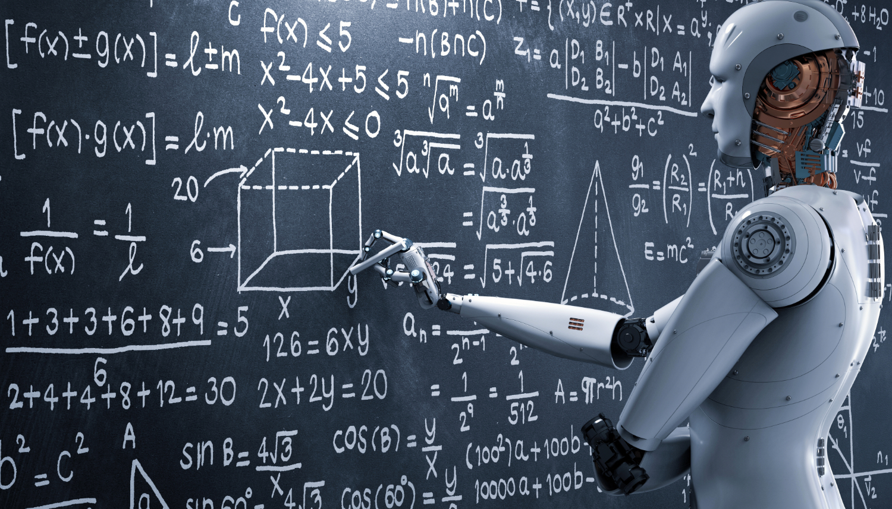

As an AI-driven era dawns, its rapid evolution is reshaping the job landscape, leaving many of us millennials pondering our future. I'm a 35-year-old techie, and like many in my generation, I find myself caught between awe at AI's potential and anxiety about what it means for my career.

## The Tech Layoff Wave
  
It's hard to ignore the wave of tech layoffs making headlines recently. Companies that once seemed untouchable are now cutting jobs, leaving many of us questioning our place in this industry we call home. The volatility is palpable.

## The Growing Economic Divide
  
Adding to the uncertainty is the widening gap between the wealthy elite and the rest of us. Inflation chips away at our hard-earned salaries while the top 1% grows richer. It's a stark reminder that the dream of a society where hard work and innovation are rewarded seems increasingly out of reach.

## Peering into the Future
  
As I gaze ahead, I see a few potential paths unfolding:

- **The Rise of Gig Economy 2.0:** Short-term contracts and freelance gigs could become the norm, offering flexibility but also less stability.
- **Specialization and Lifelong Learning:** With AI handling routine tasks, there will be a premium on specialized skills AI can't easily replicate. Continuously upskilling will be crucial for relevance.
- **Entirely New Job Roles:** Just as the industrial revolution created unimaginable jobs, the AI revolution may spawn roles we can't yet foresee – likely centered on AI oversight, ethics, creativity, and strategic thinking requiring a human touch.
- **Human-AI Collaboration:** Rather than pitting us against AI, the future could involve a symbiotic partnership where we enhance each other's capabilities.

While the path ahead seems daunting, history reminds us that change breeds opportunity. By approaching the unknown with curiosity, resilience, and adaptability, we can navigate this landscape. We'll find new ways to harmonize our unique strengths with AI's capabilities and pave our own path forward.

