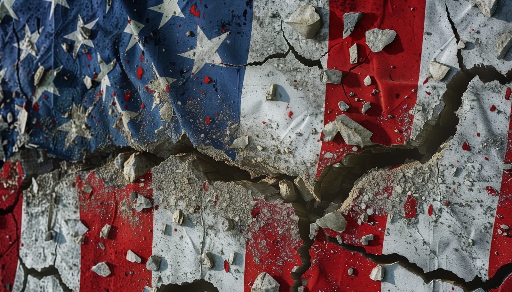

 

## The Sound of Static
Ever tried changing the channel back in the 90s, only to find the same show playing on every station? Living in today's America feels pretty similar. You've got a remote (supposedly your democratic voice), but it doesn't seem to work the way it used to. Let's take a walk through today's America, where it seems like every answer to our biggest questions is a resounding 'no.'

## The Great American Letdown
### The 'No' Symphony
Can we get affordable housing? No. Have job security? No. Raise the minimum wage? Also no. Each 'no' adds up, and it feels like we're being left out in the cold. While corporate profits reach sky-high levels, the average Joe's wallet is on a never-ending shrink—thin and getting thinner.

### Funding the Unfunded
Public assistance programs like SNAP and child care subsidies are experiencing budget cuts, even as we continue to fund less essential projects. It's a clear misalignment of priorities, showing a disconnect between immediate needs and where the funds are actually going.

### The Planet and the Profit
And let's not even start on environmental issues. "Stop killing the planet?" Big No. Apparently, the planet doesn't have a lobbying group powerful enough to compete with the giants. It's a stark reminder that in the board game of American politics, some players wield more power than others, and Mother Nature holds no aces.

### Digital Dystopia
On a lighter note, we've got our tech—our phones, our apps. Yet even the simple joy of watching cat videos is under threat. Censorship, surveillance, and the overwhelming sense that Big Brother is not just watching you but also deciding which videos you get to see. It's like someone's holding a remote control over your life.

## But, Are They Really Listening?
The big guys say they're listening. But if a tree falls in a forest and only the lumber company hears it, does it make a sound? The disconnect between the people and the policymakers grows wider, and while they say it's our voice that matters, sometimes it feels like they're only reading the subtitles.

## What's Next? 

It's ironic. The land of the free feels increasingly like it's only free for the fee-paying few. As we inch closer to what some might call "late-stage capitalism," I can't help but wonder: are we setting the stage for a major plot twist? Uprisings, revolutions, or maybe just a collective sigh loud enough to shake the powers that be?

## Conclusion 
So, as we reflect on the current trajectory of American life, what do you think? Are we steering towards a revival, or are we losing our way? Every shift begins with individual insights. Let's consider what these changes mean for us and for future generations. As we consider the state of our nation, it's vital to pause and ponder what each of us can do to shape a better tomorrow.

