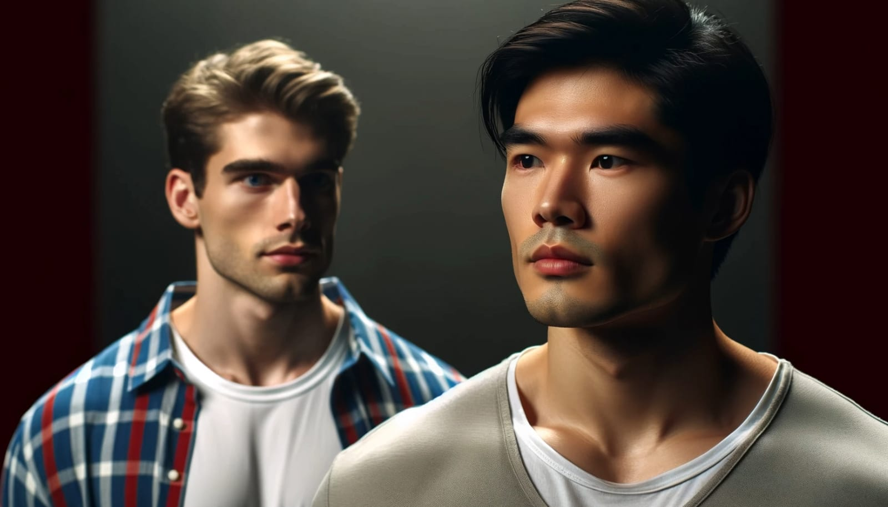
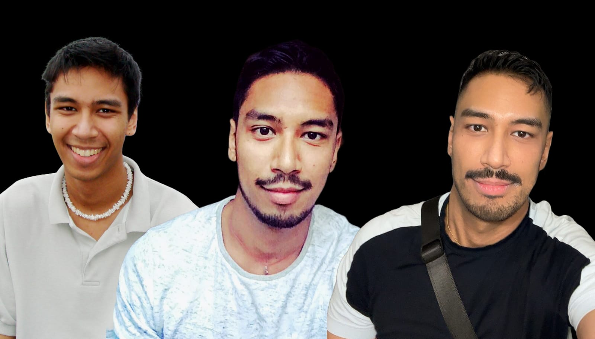

 

A recent TikTok video by Kevo ([@ktvvill_](https://www.tiktok.com/@ktvill_/video/7362471610420317445)) cast a spotlight on the delicate issues of validation, racial fetishization, and self-esteem within the gay Asian community. Watching his story prompted me to reflect on my similar experiences. His discussion sheds light on how we often find ourselves caught in cycles of seeking validation, yet he hints at an even tougher reality: the environment we are a part of not only complicates our efforts to break these cycles, it often actively supports them.

  

      <blockquote class="tiktok-embed" cite="https://www.tiktok.com/@ktvill_/video/7362471610420317445" data-video-id="7362471610420317445"> <section> <a target="_blank" title="@ktvill_" href="https://www.tiktok.com/@ktvill_?refer=embed">@ktvill_</a> We asian men needs to embrace a better narrative than this and even though this asian man thinks that he was giving me a compliment, it was a far far far cry from it. <a title="asian" target="_blank" href="https://www.tiktok.com/tag/asian?refer=embed">#asian</a> <a title="gay" target="_blank" href="https://www.tiktok.com/tag/gay?refer=embed">#gay</a> <a title="selflove" target="_blank" href="https://www.tiktok.com/tag/selflove?refer=embed">#selflove</a> <a target="_blank" title="♬ original sound - Kevo" href="https://www.tiktok.com/music/original-sound-7362471637532756741?refer=embed">♬ original sound - Kevo</a> </section> </blockquote> 
  

    

      <h2>It Starts With Us, But It's Not Entirely Our Fault</h2>
      
Kevo's story unpacks the complex issues of attraction and self-worth that are all too familiar within our community. But the real takeaway is that these problems are deeper than any video can fully explain. Having experienced similar struggles from Michigan to San Francisco, I've confronted the isolating effects of racial and appearance biases firsthand. These experiences drive home a tough truth: even though we need to own our part in these cycles, the overwhelming societal and cultural pressures make it incredibly hard to hold onto our self-worth.

  

## My Journey to Self-Acceptance

Back in 2006, at 18, I ventured into the gay community in Michigan full of hope but quickly finding myself facing a tough reality. As a gay Asian man who didn't meet the usual standards of attractiveness, I often faced racial slurs and harsh comments about my looks. This left me feeling isolated and underappreciated.

During my college years, I threw myself into changing my appearance. I tried out new styles and spent hours at the gym, all in an effort to be seen differently. Yet, despite my efforts, I always felt like I fell short compared to my white counterparts. It seemed like they effortlessly received affirmation and acceptance, even if they didn't fit the traditional standards of attractiveness.

Thankfully, I found comfort and genuine acceptance among my straight friends. They valued me for who I was rather than how I looked, which was incredibly refreshing. This acceptance played a crucial role in rebuilding the confidence I had lost over the years.

## A New Chapter in San Francisco

By the time I moved to San Francisco in 2013, I had developed a newfound sense of self-assurance. I wasn't focused on dating; instead, I threw myself into making friends and enjoying life with an enthusiasm that the younger me could never have summoned. During this period of personal growth and exploration, I ran into a comment that made me pause and reflect.

A friend—a conventionally attractive white man with whom I occasionally hooked up—offhandedly remarked that Asian men were "interchangeable" to him. He suggested it was easy for him to find other Asian partners if one didn't meet his expectations. His words hit me hard. For a moment, I thought I was different, that he saw me as more than just another face in the crowd. This made me link my self-worth to his shallow view.

At the same time, I noticed a troubling pattern within my own community. In social settings, whenever I engaged in casual conversation with individuals—often not just white but universally deemed attractive or pursuable by other Asian men—I frequently felt sidelined by them. It seemed there was an unspoken competition for attention, driven by underlying fears and insecurities. These interactions weren't just awkward; they highlighted deeper issues of rivalry and distrust among us — challenges that shouldn't exist among people who face similar societal pressures.

This realization made me reassess my relationships and the values I held. I began questioning not just the dynamics of my personal interactions but also the broader societal norms that supported them. So, I chose to distance myself from those who held such views and focused on building connections based on respect and genuine appreciation.

Yet, even though I've moved past seeking approval from white men, I find myself grappling with self-acceptance. In the gay community, it's often your looks that define you more than your personality does, and honestly, it's exhausting.

 
*Three Stages of the Author (Age 19, 26, 35)*

## Understanding and Overcoming Hidden Biases in Relationships

Despite my progress in building healthier relationships, the journey isn't straightforward. Recently, I reconnected with a friend I hadn't spoken to in over a decade. He's a local politician, a white man who seemed to share my values about family and respect, and he has done some great work for his community over the years. We went out for a few months, and on paper, everything looked perfect. Yet, I didn't feel that spark. My friends thought maybe getting intimate might change things, so I gave it a shot. Unfortunately, the experience left me feeling used rather than closer to him. It wasn't just awkward; it was enlightening.

During our intimate moments, I sensed that he harbored stereotypes about Asian men being submissive—expectations that he might not even realize he had. These seemed to influence his behavior, making him more assertive than attentive, crossing boundaries I wasn't comfortable with. 

It felt like he was not fully aware or considerate of my feelings and limits, which made me feel powerless and disregarded. It was like seeing a different side of him, one that didn't align with the respectful man I knew. This shift was confusing and deeply hurtful. Although not intentionally malicious, it was clear that he didn't understand how his assumptions and actions were impacting our interaction. This was a painful reminder that even well-meaning individuals can unconsciously enact damaging behaviors.

This experience was a wake-up call. It showed me that even those who seem to understand and respect you can unknowingly act on deep-seated biases. It drove home the importance of having clear, open conversations about what we expect from each other—something I thought we had understood but clearly hadn't nailed down.

## Tying It All Together

Kevo's video and my own experiences highlight a tough reality: it's hard to hold onto our self-worth when both the world and our own community might not always back us up. This issue goes deeper than just fighting off stereotypes from outside; it's also about dealing with the competition and division that too often creep into our own interactions.

We're fighting not just to change how others see us, but also how we see ourselves. While personal growth and self-acceptance are key, they're just part of the journey. As we tackle these challenges, we need to consider: Who really defines our worth? Is it possible for us as a community to not only face down external stereotypes but also break through the barriers we set up among ourselves?

