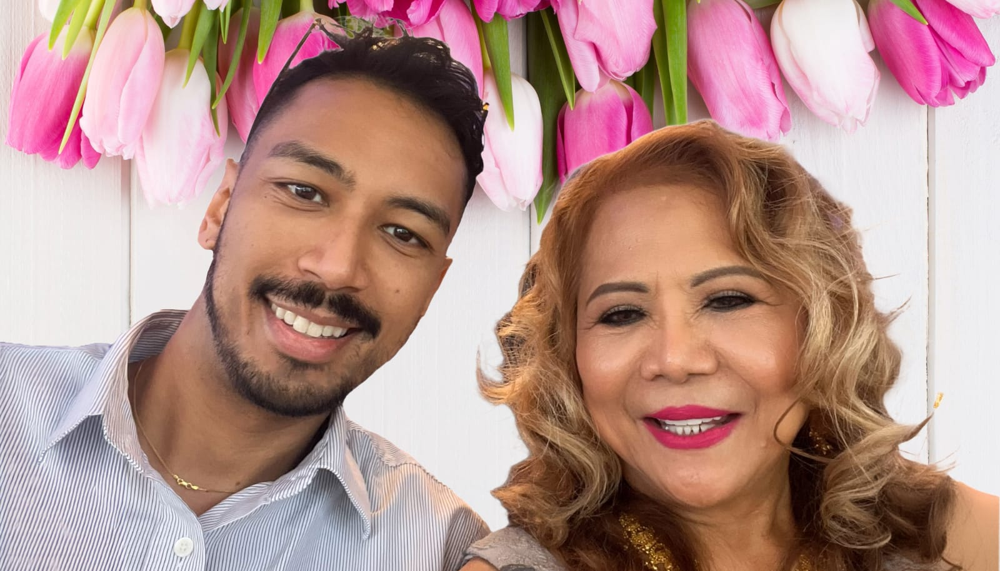

 

**[Quick heads-up: This is basically a Mother's Day rant. No lessons or reveals—just me, sharing how I'm feeling right now.]**

Mother's Day is supposed to be about flowers and feel-good cards, but for me, it's turned into a mirror reflecting all the complex, messy feelings about where I'm at in life right now. I love my mom to bits—she's been my unwavering support through everything. But as I'm here in Michigan, I can't help but feel like I'm in a life pause while everyone else's is on play.

## Home Isn't Just Where the Heart Is
It's been about a year since I moved back to Michigan. I came to be the son my mom could lean on after we lost my dad. Family ties mean the world to me, and I wouldn't change my decision for anything. But while my family is integrated into my daily life, there's this nagging feeling that I'm not living the life I envisioned for myself. 

## The Quiet Life vs. City Vibes
I used to live in places where life buzzed 24/7. The energy of city life, especially within the vibrant gay community, was electrifying. There were always new people to meet, places to explore, and spontaneous adventures. Now, back in my hometown, everything moves at a leisurely pace. The gay scene here is, well, subdued, and sometimes I feel like I'm living on a completely different wavelength.

## My Business, My Battleground
I left the corporate world to start my own business, chasing freedom and the thrill of being my own boss. While I'm proud of what I've built, the slow pace of success is testing my patience. I'm craving new challenges to reignite my ambition and excitement. I'm considering returning to a 9-5 job, not to give up on my business, but to explore new fields and gain fresh perspectives that could benefit my entrepreneurial journey.

## Where Have All My Passions Gone?
Remember hobbies? I used to have those. Photography, hiking, hitting every new restaurant with friends. Now, I struggle to figure out what I even enjoy anymore. I've been trying new things, sure, but nothing sticks. It's like I'm waiting for something to click again, to feel that rush of genuine interest.

## Dating: A Comedy of Errors
Dating here is another story. It feels like navigating a minefield, except every step is a misstep. The dating pool in the gay community here isn't just small; it's like a puddle. Every glimmer of a connection fizzles out by the end of the first date—if it even gets that far without turning bizarre.

## A Shout into the Void
As I wrap up this post, I recognize there might not be much by way of solutions or insights here—just a true-to-life rant about where I stand today. Sometimes, writing is less about imparting wisdom and more about sharing the raw edges of our lives. Wait, isn't that a bit of wisdom right there? And honey, today is definitely one of those days. If you’ve made it this far, thank you. Your sticking through my ramblings means more than you know.

