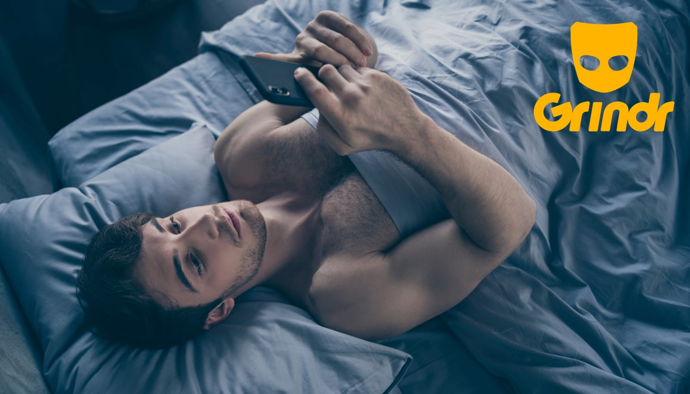
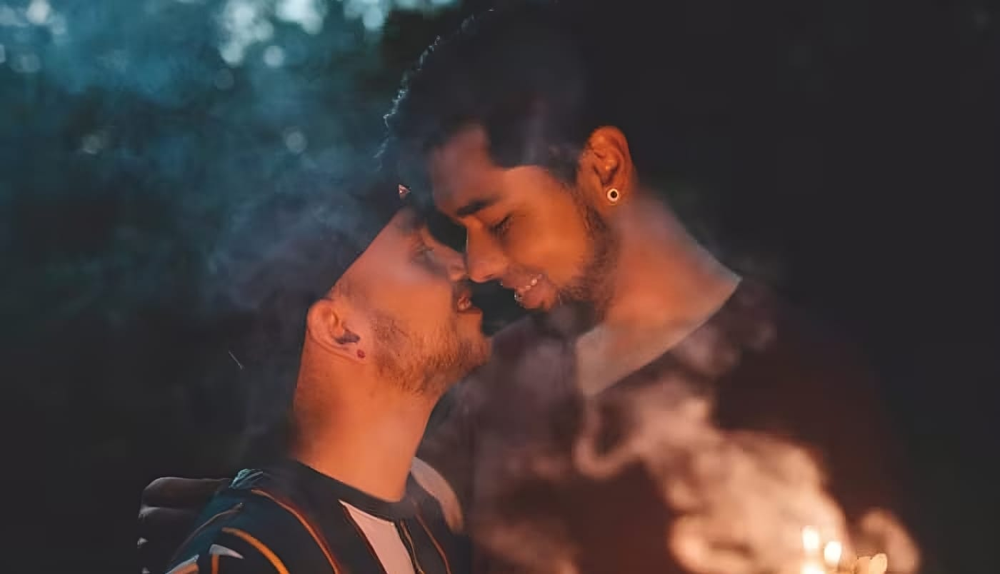

 

In a world designed with straight people in mind, everyday activities like going to coffee shops or grocery shopping often feel tailored to heterosexual interactions. For gay individuals, this heteronormativity creates a perpetual sense of uncertainty. The cute person you see—are they gay or straight? The meet-cute moments that seem to happen for straight people are elusive and rare for us. This constant guessing game leads many of us to seek refuge in digital spaces, like Grindr, hoping to find connection in an otherwise isolating world.

## Madness? No, Am I Going Mad?

Tap, tap, tap. My phone screen lights up with profiles, a sea of faces and torsos, endless possibilities. But it's always the same. I open Grindr, looking for something, anything—companionship, friendship, love, connection. Instead, I find a loop. A maddening, frustrating loop.

I tap, I chat, I hope. Maybe this time it will be different. Maybe this time I'll find someone who wants more than just a hookup. But no, it's always the same. The conversations start with promise of "sup" but fizzle out. The profiles that seem interesting lead to dead ends. The faces blur together, and I'm left feeling more alone than before.

I delete the app, determined to break the cycle. I tell myself I don't need it. I can find connection elsewhere. But where? The coffee shop, the grocery store, the gym—all straight spaces. All places where I can't be sure who is gay, who is interested, who is even open to a conversation. So, I reinstall the app. The loop begins again.

Tap, tap, tap. Maybe this time will be different. Maybe this time I'll find what I'm looking for. But no, it's always the same. The app is a black hole, sucking me in, giving me just enough hope to keep me coming back, but never delivering on its promises.

 

## Seeking Connection Beyond the Apps

I've spoken to friends about this dilemma. Many use Grindr strictly for hookups, finding solace and camaraderie in gay sports leagues or other group activities. However, I'm not inclined towards group sports; I prefer one-on-one interactions or small, intimate gatherings. Some people suggest, "Why not just be friends with straight people?" But my life is already surrounded by straight people—at work, in my family, and in most social settings. It's tiring always being in a space that doesn't fully reflect my identity.

Even when my friends and I go to coffee shops, they often open Grindr just to see if there are other gay people around. It's become such a habit that even in gay spaces like bars and clubs, people still turn to Grindr instead of talking directly to those around them. The app has become a crutch, a way to connect without the risk of face-to-face rejection, but it also perpetuates the cycle of isolation and superficial interaction. With limited spaces available, it's even harder to grow past this dependency and build on genuine, in-person interactions.

Even suggestions to try other dating apps like Tinder haven't worked for me either. Despite its flaws, Grindr has yielded the best results so far, albeit not without its disappointments. These apps, designed to maximize corporate profit, often prioritize quantity over quality, leaving users like me in a constant state of yearning.

## Finding Balance and Connection

The search for genuine gay spaces—those elusive third places—remains a challenge, especially for those of us not living in major cities or predominantly gay neighborhoods. In these environments, where community and connection are more naturally integrated into everyday life, meet-cute moments are more attainable. For the rest of us, the question lingers: How do we find balance and connection in a world not designed for us? Is the lack of these spaces, combined with Grindr's focus on hookups, why so many gay individuals struggle to find meaningful relationships despite wanting them?

What do you do to feel connected to the community? Do you open Grindr in the coffee shop like the rest of us? Have you found some secret club we don't know about? Do you have a magic radar that helps you find other gays in straight spaces? Share your experiences and let's explore ways to create more inclusive, welcoming environments for all.

