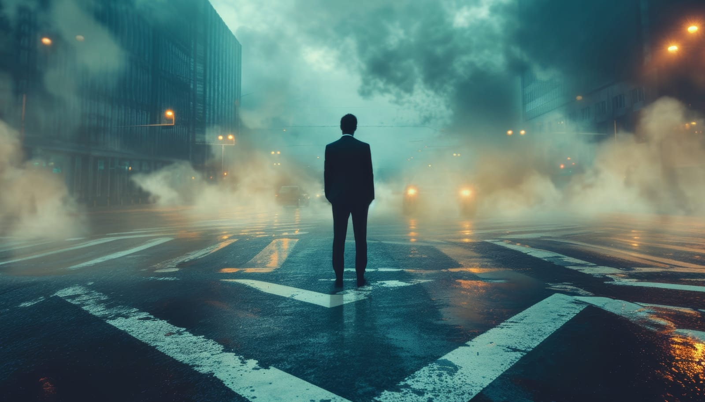

 

Have you ever felt like a walking contradiction? Like, you embody two opposing qualities simultaneously, making it hard to understand yourself, let alone explain it to others? Well, that's me in a nutshell. As I reflect on my life, I realize that these contradictions might be the reason I'm perpetually single and constantly searching for balance.

## The Neediest, Not Needy Person

I crave attention but don't want to be smothered. I enjoy my independence yet find myself longing for connection. It's a delicate dance between wanting to be noticed and needing my space. For instance, I thrive on the freedom to manage my time and tasks, but if no one checks in on me, I feel lost. It's as if I'm in a constant tug-of-war with myself, never quite finding the sweet spot.

## The Independent, Codependent Person

Living on my own terms has been liberating. I've grown accustomed to handling everything solo, from business decisions to personal chores. But here's the catch: while I revel in this autonomy, I also deeply care about others and have a lot of love to give. The thought of integrating someone into my meticulously organized life feels daunting. Yet, the desire to share my journey with someone special is ever-present.

## The Emotionally Available, Unavailable Person

Emotions are another battlefield. On one hand, I'm in touch with my feelings, sensitive to the nuances of my inner world. On the other hand, there are things I should care about but don't, and vice versa. It's a bizarre mix of being deeply emotional yet detached at times. This paradox makes it challenging to navigate relationships, as my emotional responses can be unpredictable even to me.

## The Single Yet Relationship-Seeking Paradox

I enjoy the freedoms of single life, but at 35, the loneliness can be overwhelming. The prospect of trying new things and stepping out of my comfort zone beckons me. Yet, there's a part of me that resists change, clinging to the familiar routines of singlehood. This push-and-pull makes the idea of a committed relationship both enticing and terrifying.

## The Lover Boy with Contradictory Tendencies

Here's where it gets even more complex. I love to go out, drink, flirt, and have fun. The nightlife appeals to my spontaneous side. However, when I care about someone, I transform into the biggest loverboy. It's like switching between two personas – the carefree socializer and the devoted partner. Balancing these tendencies is a perpetual struggle, leaving me confused about what I truly want.

## A Leo's Dilemma

Perhaps being a Leo adds another layer to this complexity. Known for our need for admiration and our fierce independence, it's no wonder I'm grappling with these contradictions. Leos are often seen as confident and self-assured, but we also crave validation and love. Navigating these dualities is part of my journey, and it's a path filled with introspection and growth.

## Final Thoughts

So, what does all this mean? Am I destined to be single forever, or is there hope for finding balance? Reflecting on these questions, I realize that our dependency on technology might play a role in this struggle. In an age of instant gratification, we often set unrealistic expectations for ourselves and others, seeking perfection and immediate satisfaction.

During our 20s and 30s, we experience significant personal growth and shifting priorities. It's normal to feel conflicted as we navigate these changes, seeking stability while craving new experiences. Are these struggles a universal part of growing up, or do they stem from the unique pressures of our tech-driven world? Share your thoughts and experiences in the comments. 

