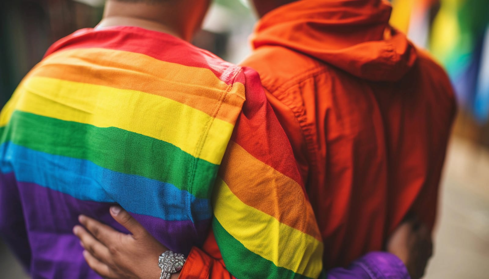
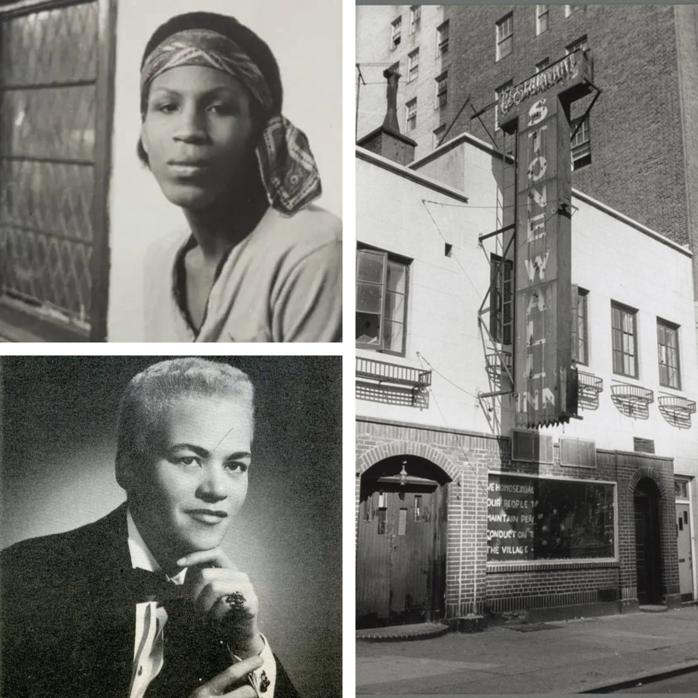

 

As May draws to a close, we bid farewell to AAPI Heritage Month and roll out the rainbow carpet for Pride Month! This unique transition is the perfect time to honor and celebrate the diverse spectrum of identities within our communities. While we spotlight the experiences of those who are both Asian and gay, we also recognize and celebrate the beauty of all identities and the richness they bring to our shared world.

## A Moment of Celebration

Let's talk about celebrating with all the colors of the rainbow! For me, diversity isn't just a buzzword; it's a vibrant mix of experiences, challenges, and joys. With representation in media and society on the rise, it’s crucial to keep the momentum going by acknowledging the unique perspectives everyone brings. For those of us who are both Asian and gay, this intersectionality adds an extra layer of richness to our stories. Community is everything; it offers a sense of belonging and support, helping us find our place and thrive in spaces that embrace all aspects of our identities.

## Celebrating Our Diverse Identities

As we celebrate Pride Month, it's important to appreciate the unique cultural and personal stories everyone brings. In particular, let's highlight the voices of Asian and gay individuals, whose experiences lie at the intersection of multiple identities. Here are some great ways to celebrate and uplift this community:

1. **Listen and Learn**: Immerse yourself in the diverse stories and experiences shared by Asian and gay individuals. Whether through social media, books, or conversations, listening is a powerful way to understand and support.
2. **Support Representation**: Amplify the voices of Asian and gay creators, artists, and activists. Follow, share, and celebrate their work to help amplify their messages.
3. **Celebrate Culture**: Enjoy the rich cultural heritage of the AAPI community. Savor traditional foods, dance to the music, and admire the art, recognizing the beauty they contribute to our broader society.

## The Importance of Pride Month

But why do we celebrate Pride Month in the first place? Let's take a trip back to the 19th and 20th centuries when being gay was pretty much illegal. You could be arrested and banned from ever working with the government. The FBI kept lists of known homosexuals and used them to find and arrest others. Gay people created safe havens where they could hang out and be themselves, and one such spot was the Stonewall Inn in New York.

On June 28, 1969, the Stonewall Inn got raided by the police. Patrons were lined up, IDs checked, and if their clothes didn’t match their gender, they were arrested. But this night, the crowd had enough. Among them was Stormé DeLarverie, a drag king, who reportedly shouted, "Why don't you guys do something?" Some say the first brick was thrown by Zazu Nova, a trans sex worker. However it started, it turned into a full-blown riot with hundreds of working-class queer folks throwing pennies, bottles, and rocks. The riot lasted for several days.

That rebellion was the spark that lit our community’s fire, making us realize our power as an organized force. A year later, the first Gay Pride March was held on Christopher Street, and now, every June, we hold pride parades around the world to remember the riot and celebrate the power of community.

 

## So, What is Pride All About?

For me, Pride is about supporting and uplifting one another within the broader LGBTQ+ community. It means recognizing the unique intersection of identities, celebrating diversity, and honoring the struggles and triumphs we've all faced. It’s about listening, learning, and appreciating each other's journeys. But let's not forget, it's also about having fun, finding love, enjoying a good connection, and celebrating our sexuality in all its wonderful forms. As we move from AAPI Heritage Month to Pride Month, let's take a moment to honor and uplift the entire LGBTQ+ community with respect, joy, and a genuine sense of connection.

**Happy Pride and Happy Celebrating!**

