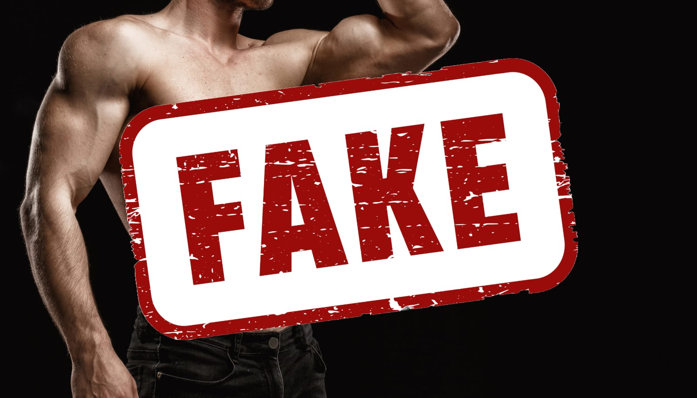

 

You know that feeling when something seems just a little...off? I was on Facebook recently and joined a travel gay group. A lot of the posts begin with pictures of guys looking for travel buddies or friends in different areas. It became obvious to me when certain pictures looked like friends of mine or acquaintances I knew that it wasn't actually them in the photos. 

The group extends internationally, so people abroad may not be exposed to the real local identities behind some profiles that appear on Instagram and other platforms. And it had me thinking about my own past experiences with catfishing...

## Navigating Identity in a Less Accepting Era

Let's get the embarrassing part out of the way first: Yes, I briefly catfished people when I was 18. Yikes; I know. Please let me explain...

Being a closeted gay Filipino-Iranian teen in the early 2000s wasn't exactly a walk in Progressive-Ville. Oh, how I wanted the chance to explore this vital part of myself without judgment or shame! Alas, our community didn't quite embrace that whole "love is love" deal back then.

So, like many desperate young gays, I turned to the internet - those glorious, unmoderated cesspools of AIM chatrooms, manhunt.net messages, and personal ads. Ahh, memories of exchanging "ASL" (Age, Sex, Location) messages with randos from across the globe.

My eager disclosures of "18/M/Michigan" were often met with a deafening silence or outright insults about my looks and ethnicity. It stung. Those soul-crushing blows to my self-esteem as a new gay just looking for a connection? I haven't forgotten.

## Why I (Briefly) Catfished

So yeah, in a moment of desperate loneliness and validation-seeking, I decided to catfish. I scoured the internet for pics of hot white guys, poached some model-esque photos, and passed them off as my own. I know, I know - very cringeworthy stuff.

But hear me out: For a short period, it was...nice. Nice to hear compliments and flirtatious banter, even if it wasn't directed at the real me. As a kid who had faced constant rejection and marginalization for my ethnic background, it felt like a temporary respite.

Of course, I soon realized catfishing was wrong and horribly misguided. But in that period of my life, it stemmed from a place of insecurity, not malice. I was a lonely teenager starved for human connection and stuck in an environment that praised conformity over authenticity.

Some catfishers (not all), I'd wager, are coming from that same desperate place of seeking validation - even if it's artificial and ill-advised. It doesn't make it right, but it provides some context to beyond just nefarious motivations.

## The Winding Road of Self-Acceptance

After that mortifying phase, my journey continued with lots of soul-searching, questionable dates, and enough failed romantic entanglements to write a comedic memoir. Through years of working on myself, I am slowly arriving at a place of genuine self-love.

These days, I only catfish people by sending them thirst traps of Danny DeVito. Hey, you're welcome.

In all seriousness, embracing my identities as a gay man of mixed Asian-Middle Eastern descent is still a long, messy process. I'm still trying to overcome internalized biases, a lack of role models, and near-constant microaggressions about not being "really" Asian or queer enough.

But I'm here, I'm queer, and I absolutely celebrate who I am today - with zero apologies. Every part of my story, including those cringeworthy younger years, shaped the person I eventually became.

## Final Thoughts: More Empathy, Less Judgment

So while I don't condone catfishing, I do think we could all benefit from a little more empathy. Before writing someone off as simply cruel or manipulative, consider that they may be acting from a place of pain or insecurity. Sometimes, people adopt fake personas as a form of escape or self-protection.

That doesn't make it right, but it's food for thought. Personal growth is rarely a straight line, and we all have regrettable missteps along the way. At the end of the day, a little more compassion and understanding could go a long way - for both the catfishers and those feeling duped.

As for me, I'm damn proud of the journey that brought me here. The struggles were real but ultimately made me wiser, stronger, and more alive. And I wouldn't have it any other way.

