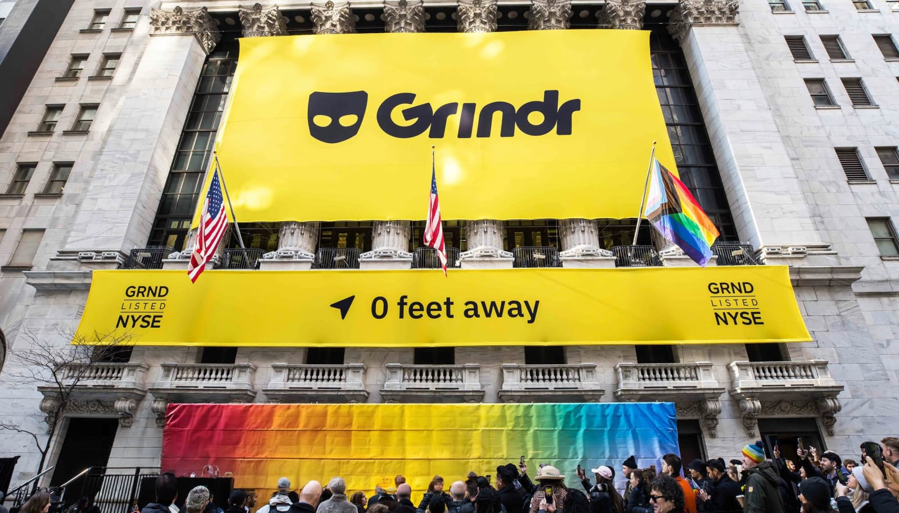

 
<figcaption>Photo by CNBC: Grindr's debut on the New York Stock Exchange</figcaption>

Grindr going public just two years ago and being available for investment on the New York Stock Exchange is a significant shift. This event, celebrated as a positive, pro-LGBTQ milestone, actually has larger implications for how we view and express our sexuality today.

## A Dramatic Shift in Cultural Attitudes

Grindr's IPO shows how cultural attitudes are changing. What used to be a hidden part of the LGBTQ community is now out in the open. The app has become ubiquitous, as seen during Eurovision 2024 when the Grindr notification sound played, and everyone in the room laughed because they recognized it. This moment shows how important Grindr has become in our lives, blending our private lives with the public and financial world.

## Objectification, Financialization, and Shifting Foundations

Grindr is now making money from our sexual interactions. The private moments we share on the app are generating profit for investors we don't even know. While Grindr has helped many queer people connect, it now relies on outside money, making our time on the app feel like work. Our time, money, and positive experiences on the app all add to someone else's wealth. This shift isn't just about keeping Grindr operational; it's about making our personal interactions into financial assets.

Since Grindr went public, the platform has changed significantly. When one group owns a large part of the dating-app market, it restricts our online interactions. Grindr and similar platforms are no longer just social tools; they are business ventures with their own goals and profits. This raises concerns about maintaining access and the integrity of our digital spaces. 

Two years after the IPO, Grindr has had a big financial and cultural impact. With a 33% revenue growth in 2023 and more growth in 2024 [^1], the app now has 13.7 million monthly active users and about 1 million paying users [^2]. This financial success shows Grindr is a viable business but also highlights the growing commercialization of queer spaces and experiences.

While financial success might seem like a good thing, it raises concerns about turning intimacy and community into business. As a private company, Grindr was designed to make money but could prioritize user experience and long-term growth. 

Now, as a public company, the focus has shifted to satisfying shareholders, which changes how the app is used and viewed. This shift means more aggressive monetization strategies, potential compromises in user experience, and increased pressure to deliver short-term financial results, impacting the integrity and accessibility of our digital spaces.

## Navigating the Shifts in Dating Apps

The impact of Grindr's financial and operational changes is reflected in the personal experiences of its users. For me, Grindr was one of the first dating and hookup mobile apps I used back in 2011. The experience then was different but similar to now. I was still grappling with feelings of unattractiveness and struggling to find love. I turned to Grindr, a new app at the time, as an alternative outlet. Initially, I didn't have much luck and shifted my focus to hookups instead. Ironically, this change in mindset led me to one of my long-term partners.

## Early Days: Navigating a New World

In 2011, the landscape of dating apps was still in its infancy. People, not just within the LGBTQ+ community, were just beginning to explore online dating. The way we engaged with these platforms was a collective learning experience, much like navigating dating in real life. It felt raw and unpolished, yet full of potential.

## Fast Forward to Today: A Shift in Mindset

Over the years, dating apps have transformed how we think about relationships and intimacy. They've trained us to believe that we have endless options at our fingertips, that finding a date or a hookup is just a swipe or tap away. This mindset has made it harder to form genuine connections. If a relationship isn't perfect, we think there's an infinite pool of potential partners waiting for us, but that's not how the world truly works.

## Exploring Other Apps: The Tinder Experience

I've tried various apps, including popular ones like Tinder, which offer different interfaces and experiences. However, using Tinder was often frustrating. Swiping left or right yielded few matches, and even those rarely led to meaningful conversations. The app's design seemed more focused on keeping users swiping rather than fostering real connections. This constant swiping created a cycle of brief dopamine hits from matching with someone, but it didn't translate into actual engagement or relationships.

## Returning to Grindr: A Familiar Ground

Despite trying other platforms, I always found myself returning to Grindr. It has a larger user base of gay men compared to other apps, which made it easier to find people to connect with. Yet, even Grindr has its challenges. The app's culture has shifted towards hookups, making it difficult to find people interested in dating or forming friendships.

## The Hookup Culture: A Shared Struggle

I remember flirting with a guy on Grindr, expressing my interest in dating or friendship. He responded that he was only looking for hookups, explaining that after many attempts to find dates, it seemed impossible. He wanted something deeper but found it exhausting and often met with flakiness or short conversations that led nowhere, so he gave up trying. His experience resonated with me. It's increasingly hard to meet someone with intentions of dating or more. Our anxiety, nerves, and mental health issues, often exacerbated by social media and technology, seem to shield us from human interaction, creating an endless loop of seeking deeper connections but settling for hookups out of frustration. Hooking up is also easier because there is a formula to it: "Hey, Looking," "Top, Bottom, Vers," "Pics," "Host or Travel," "Let's meet," while dating or friendship requires more work.

## The Endless Search for Connection

Grindr, whether used for dating, friendship, or hookups, is designed to keep users engaged and continuously seeking new connections. The app operates on the principle that the more profiles you see and interact with, the higher your chances of finding what you're looking for. This creates a cycle where users crave more profiles and more interactions, hoping to increase their odds of making a successful connection.

The app trains us to desire a constant influx of new profiles. The logic is simple: the more people you contact or contact you, the greater your chances of finding a match, whether it's for a hookup, a date, or a friendship. 

## Monetization Strategies and Their Impact

Grindr's evolving monetization strategies make the search for connection more complicated. From using the free version with ads to paying for Grindr Xtra and Unlimited, I've seen how these strategies have changed. Grindr Xtra removed ads and offered more profile access and filtering options, while Unlimited added features like being hidden online and seeing everyone who viewed your profile.

After the IPO, Grindr introduced the "Boost" feature. Before this, traveling to a new city usually meant a spike in profile views because being "fresh meat" drew attention. Now, even with the top-tier plan, I barely see new views in new cities unless I pay extra for Boost. This feels unfair, as visibility should be included in the top plan.

These tactics exploit our need for connection. Loneliness and boredom might push us to pay more for attention, a need intensified by social media. Companies like Grindr understand this and use it to their advantage. While Grindr has added new features to existing tiers, it's telling that the extra cost feature targets our need for attention. This highlights a larger issue of how our digital interactions, driven by the desire for connection, are commodified by those who know how to exploit our vulnerabilities.

## Reflections and Future Directions

While financial success might seem like a good thing, it raises concerns about turning intimacy and community into business.

As a private company, Grindr was designed to make money but could prioritize user experience and long-term growth. Now, as a public company, the focus has shifted to satisfying shareholders. This shift means:

* More aggressive monetization strategies
* Potential compromises in user experience
* Increased pressure to deliver short-term financial results

These changes impact the integrity and accessibility of our digital spaces, affecting how we interact and connect with each other on the app.

[^1]: [^1] [Grindr's fiscal year 2023 revenue growth of 33%](https://investors.grindr.com/overview/default.aspx).
[^2]: [^2] [Continued growth into 2024 with 13.7 million monthly active users and 1 million paying users](https://investors.grindr.com/overview/default.aspx).

