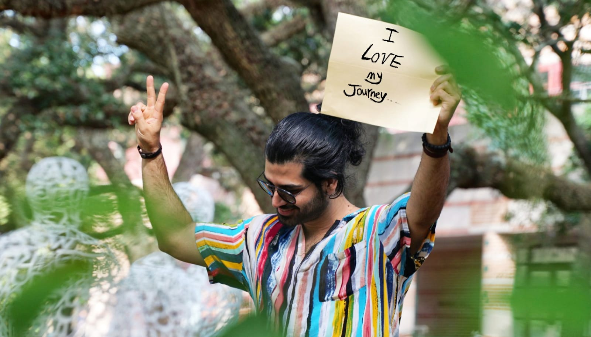
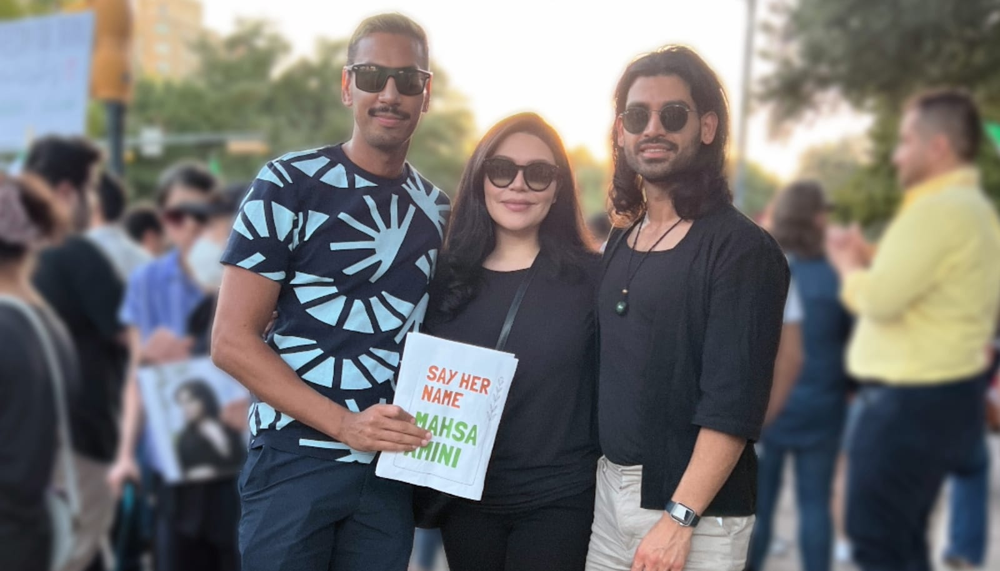
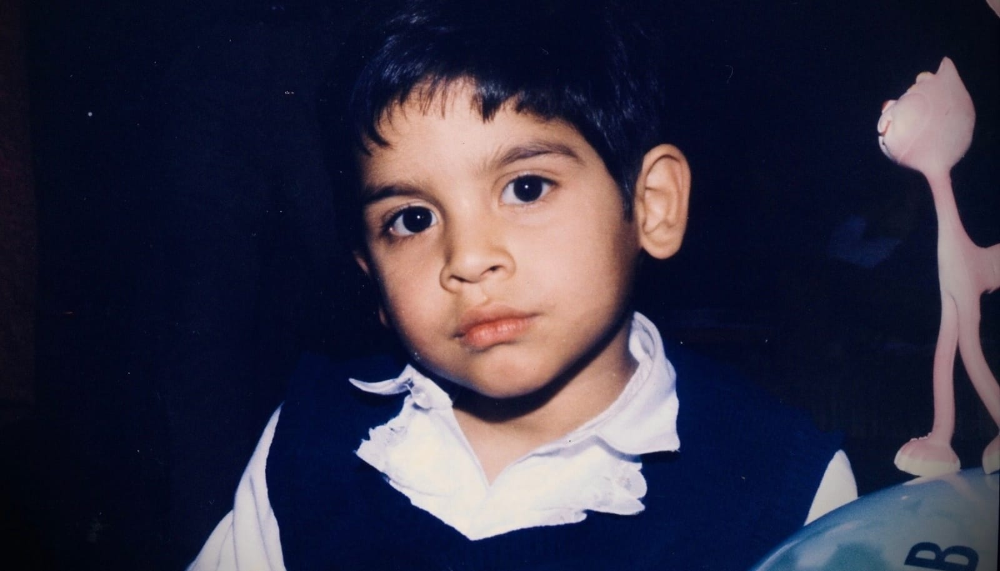
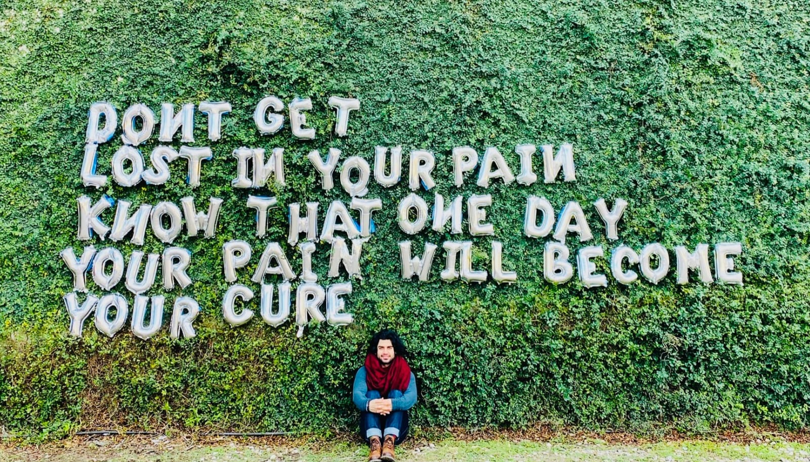
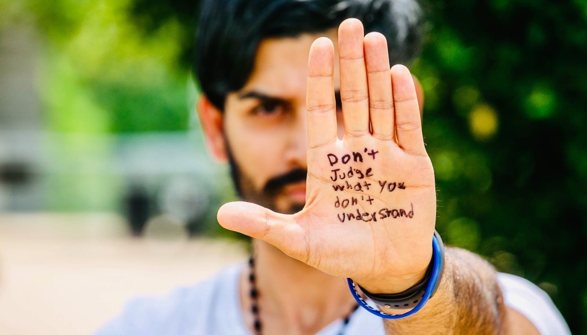
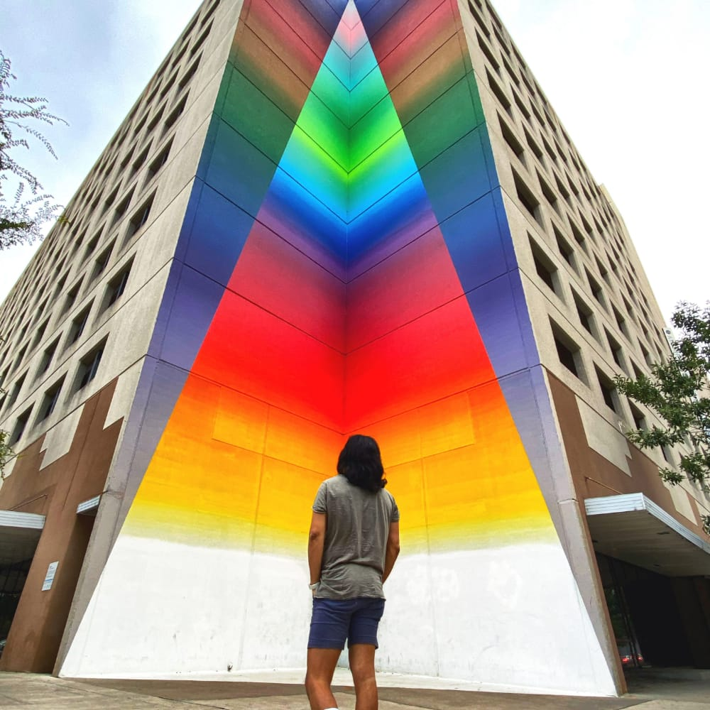
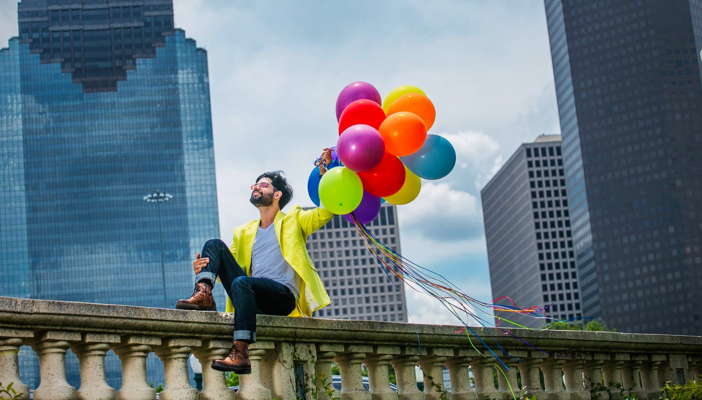
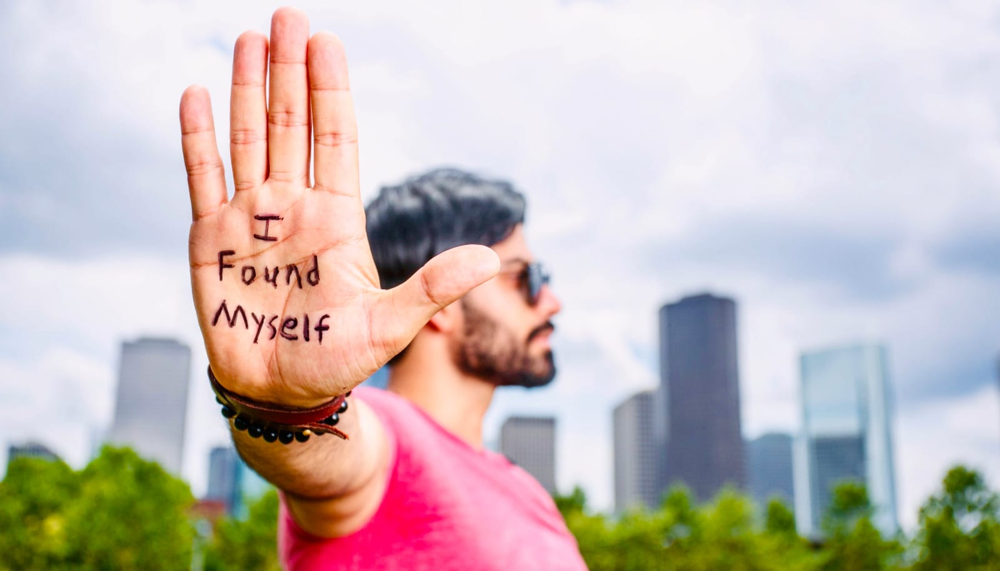

 

Growing up in the US with the freedom and acceptance of Western society, it's easy to take for granted the liberties that come with being able to express one's identity openly. For many, like myself, who have roots in places where these freedoms are not afforded, understanding the harsh realities faced by those who share our heritage is both eye-opening and heart-wrenching. My dad's side of the family is Iranian and <a target="_blank" href="https://www.bahai.org/">Bahá'í</a>, having escaped Iran in the 70s due to religious persecution. 

My journey led me to meet Fares (pronounced Fah-Res) in 2022, a man whose story is strikingly similar yet starkly different from mine. Fares grew up in Iran, a Bahá'í and gay, facing unimaginable challenges. This is his story.

## Meeting Fares in Austin, 2022

Meeting Fares at a <a target="_blank" href="https://www.britannica.com/topic/Woman-Life-Freedom">Woman Life Freedom</a> event (a protest focused on advocating for women's rights and social justice in Iran) in 2022 was like looking into a mirror reflecting an alternate reality. We were both Bahá'í, both Iranian, and both gay – yet our lives had taken vastly different paths. While I enjoyed the relative acceptance of Western society, Fares faced direct persecution and discrimination in Iran. Our conversation unveiled the depth of the challenges he endured and the resilience he embodied.

 

## Fares' Life in Iran

**Shaun:** Fares, can you tell us about the struggles you faced growing up in Iran as a Bahá'í and a gay individual?

**Fares:** Until about nine months ago, I never had the luxury of thinking about what I truly wanted. I was struggling professionally and seeking guidance from friends and mentors who often asked, "What does Fares really want?" This question brought tears to my eyes because no one had ever asked me that before. Growing up as a Bahá'í in a Muslim-dominated country meant that I never had the privilege to pursue my interests in education. I was always curious about philosophy and the purpose of life, but as a Bahá'í, I couldn't attend public universities or study what I wanted. Instead, I had to attend an underground university with limited degree options, the best being civil engineering. Additionally, I couldn't be myself as a gay individual. The fear of persecution and societal rejection forced me to hide a significant part of who I am.

### Daily Life and Religious Challenges

**Shaun:** Can you describe what a typical day was like for you during your childhood?

**Fares:** From a young age, I felt different. Religion is a major part of life in Iran, and being the only Bahá'í in a Muslim-dominated school made me feel like a black sheep. During obligatory prayers, I was excused and had to stay in the classroom while everyone else went to pray. This made me a target for exclusion and discrimination. My religious studies teacher once spread nasty rumors about Bahá'ís, which led to my classmates avoiding me. My best friend even changed seats. These experiences made me feel socially excluded and abandoned.

**Shaun:** How did you manage the difficulties you encountered at school?

**Fares:** I didn't realize at the time, but my parents didn't know how to handle the challenges I faced. They had their own struggles and traumas, so they couldn't guide me properly. I often skipped school, feeling anxious and nervous, and used the excuse of wanting to study at home. In reality, I wasn't comfortable around my classmates. I felt strange and didn't understand the feelings I had around them. To cope, I threw myself into studying, trying to excel in everything to feel a sense of control and accomplishment.

**Shaun:** What impact did the exclusion and discrimination have on you socially?

**Fares:** Growing up in the Bahá'í community, especially <a target="_blank" href="https://www.britannica.com/event/Iranian-Revolution">after the revolution</a>, we were very secluded from the larger society. My parents were often wary of letting me attend birthday parties or social events hosted by my Muslim classmates, fearing for my safety because I was different. This led to further isolation, both from the broader community and within my own Bahá'í circle.

 

### Educational Barriers

**Shaun:** As you grew older, did the situation improve or become more challenging?

**Fares:** As I got older, especially in high school, life became more challenging. The pressure to excel and prepare for the entrance exam to university was immense. Unlike in the U.S., in Iran, you have only one chance a year to take this comprehensive exam, which determines your future. For boys, failing the exam meant mandatory military service. Additionally, despite being deprived of many rights as Bahá'ís, we were still required to serve in the military.

**Shaun:** Can you tell me about the barriers you faced in pursuing your education as a Bahá'í?

**Fares:** During my high school years, the application forms for university included a list of religions, but Bahá'í was not an option. We had to leave the field blank, which was a clear indication to the authorities of our religious affiliation. This was a deceptive tactic by the government. Many Bahá'ís who applied found their results marked with errors or were ultimately denied admission. Some were even allowed to study but were denied their degrees upon graduation. This strategy gave the appearance of fairness to the international community while still discriminating against Bahá'ís.

**Shaun:** How did the exclusion from public universities affect your career aspirations?

**Fares:** The <a target="_blank" href="https://www.bihe.org/">Bahá'í Institute for Higher Education (BIHE)</a> was established in response to the exclusion of Bahá'ís from public education and professions. After the revolution, Bahá'ís were fired from official jobs and denied basic rights like marriage licenses, passports, insurance, and public schooling. For a long time, there was nothing—no opportunities, no recognition. My parents couldn't even officially register their marriage until I was 15. Despite being a top student, I couldn't attend gifted schools because of my religion. The societal exclusion extended to every aspect of our lives. While I could attend public grade school, attending public universities was not possible due to my religion. I had to attend an underground university with limited degree options.

 

### Identity and Intersectionality

**Shaun:** How did your identity as a gay individual complicate your life further?

**Fares:** My journey was further complicated by my sexual orientation. Growing up as a gay Bahá'í in Iran added another layer of exclusion. I realized this right after I moved to Austin and started my healing journey. These stemmed from childhood traumas, such as witnessing my brother's accident, which left him paralyzed and shifted my parents' attention away from me. Additionally, during puberty, I knew I felt different but did not know exactly why, which further isolated me. I was already marginalized as a Bahá'í, and now I had to navigate my emerging identity in a conservative society.

**Shaun:** When did you first start to understand your sexual orientation?

**Fares:** At 17, I first encountered the concept of homosexuality when I saw a picture of two men's wedding on the front page of Yahoo!, which sparked something in me. I sought answers in Bahá'í writings, only to find that while the existence of homosexuality was acknowledged, it was not supported. The guidance I found suggested seeking professional help to "fix" it. This internal conflict created a heavy burden that I carried into my university years and beyond.

**Shaun:** How did you seek answers about your identity?

**Fares:** Throughout all this, I continued to struggle with my identity. I was expected to conform to societal norms, pretending to be interested in girls, while internally grappling with my feelings. Even within the Bahá'í community, where I should have felt safe, I had to hide my true self. The culture of Iran made it acceptable not to be in a relationship until you were ready to settle and build your family. Relationships outside of marriage were taboo, and even if people were in such relationships, they were discreet, and nobody knew. This provided some cover for me, but it also meant I had to continue hiding my sexual orientation.

**Shaun:** What strategies did you use to handle the secrecy around your identity?

**Fares:** Growing up in a well-known Bahá'í family meant living under constant fear of being watched. We were always cautious, even during phone calls, fearing surveillance. This made it impossible for me to discuss my feelings openly, even within the Bahá'í community. The danger and scrutiny from both the government and my own community forced me to hide my true self. Instead, I focused on my education, pushing aside my struggles with sexuality.

**Shaun:** Given these challenges, how were you able to navigate your journey and eventually learn more about your identity?

**Fares:** Desperate for answers, I sought help in Tehran. I met with various psychologists and psychiatrists, using fake names out of fear that my records could be used against my family and community. Despite the immense stress, none of the therapists I saw were homophobic. They acknowledged my feelings but couldn't offer a solution beyond affirming my identity. One even suggested shock therapy, which I thankfully avoided.

**Shaun:** That must have been difficult, so what happened next?

**Fares:** During this time, I felt immense pressure. I tried everything, even forcing myself to watch straight porn, which was difficult to access due to government censorship. In my dreams, I attempted to have sex with women, only to wake up feeling more confused and distressed. By 23, I accepted that I was gay but knew I couldn't act on it due to the danger.

 

### Career and Educational Barriers

**Shaun:** At 23, you must have finished university. What happened next transitioning into your early career?

**Fares:** As I was finishing my degree at BIHE, the pressure became unbearable. I found an internship, but the hiring manager rejected me after learning about my Bahá'í background, saying, "Why did you waste five years of your life for a degree that no one is going to accept?" This rejection compounded my feelings of hopelessness about my education, career, and sexuality.

**Shaun:** How did these pressures and responsibilities impact your personal and family life?

**Fares:** Just as I was starting a master's program at BIHE, my father was arrested, and I had to quit to take care of my family and his business. I started an immigration process, which took two and a half years. When I was finally approved to go to Vienna, I felt a mix of relief and guilt, not wanting to leave my family behind.

## Leaving Iran: New Beginnings

**Shaun:** What was the process like for you when you decided to leave Iran?

**Fares:** In Vienna, I experienced a profound sense of relief. For the first time in my life, I could rest. I slept for months, exhausted from the years of stress and fear. During this time, I realized the immense burden I had been carrying. My parents, despite their own challenges, encouraged me to pursue my dreams, believing I would find happiness and fulfillment in the long run.

**Shaun:** What challenges did you face while seeking asylum in the U.S.?

**Fares:** When I applied for asylum in the U.S., it was based on religious persecution. The process required me to prove that my personal life was in danger due to my religion. I didn't disclose my sexuality because I wasn't ready to bring it up and it wasn't relevant to my asylum case. I was focused solely on surviving and finding a safe space to breathe and exist.

**Shaun:** How did you navigate your new life in the U.S.?

**Fares:** Upon arriving in the U.S., my priority was to establish stability. I got admitted to the University of Houston and started a master's program in petroleum engineering. Despite achieving what I had dreamed of—having my own home, having a job, and pursuing higher education—I still felt unfulfilled. At 26, I finally decided to explore my sexuality. I downloaded dating apps and began navigating the gay community, which was entirely new to me.

### Discovering the Gay Community

  

**Shaun:** What were your initial experiences like when exploring the gay community in the U.S.?

**Fares:** When I first started exploring the gay community, I was excited. I thought the hardest part was accepting myself, and once I did, I believed there would be a welcoming community waiting for me. However, my first visit to a gay bar in Houston was shocking. The atmosphere was filled with catty personalities, and I felt like I didn't fit in. The dating apps brought more disappointments and failures, leading to confusion about boundaries and friendships within the community.

  

  

      
   

  

**Shaun:** How did your first experiences with dating go?

**Fares:** My first experiences with gay dating were confusing and disheartening. I met my first date at a place called Boheme in Houston. He seemed interested. After leading me on, he eventually ghosted me, disappearing without any explanation. At that time, I didn't understand the concept of ghosting or flaking in dating. I was seeking meaningful conversations and serious relationships, which made me seem high-maintenance in the gay dating world. This experience pushed me to come out to my cousins, hoping for support and understanding.

**Shaun:** Were you able to find support and friendship within the gay community?

**Fares:** I tried making friends and even considered befriending couples to avoid complications. However, this led to weird and uncomfortable experiences. For example, one couple I trusted ended up sending mixed messages about their intentions, making me feel more isolated. I also faced challenges with friends who were flaky and unreliable. I continued to explore the gay community with some help. One friend explained that in the gay world, sleeping with someone doesn't necessarily mean a relationship. This was a revelation for me, as I was still figuring out the norms and dynamics of gay relationships.

**Shaun:** How did these experiences shape your understanding of your identity?

**Fares:** Feeling lost, I called a gay friend from Houston. He told me that everyone knew me as the sweetest and purest guy but noted that I lacked confidence. This conversation was a turning point. Around the same time, I was having conversations with my MBA friend from Rice about job interviews and opportunities, especially during the wave of rejections I faced due to COVID-19. These experiences pushed me to come out, as I felt that in every aspect of my life, even professionally, I was constantly judged and evaluated. The pressure to "fake it to make it" was overwhelming, and I decided I was done with faking aspects of my identity and would no longer let anyone put me down. This led to my decision to come out publicly.

### Coming Out: Family and Beyond

**Shaun:** How did your family react when you came out to them?

**Fares:** The first cousin I came out to was very understanding. She hugged me and said they had been waiting for me to come out. This was the first time someone truly saw and accepted me for who I am. It was a huge relief. However, her conservative views on dating didn't align with the reality of gay dating in the Western world. I then came out to other cousins, each with varying degrees of Western influence and understanding, but none fully grasped the complexities of gay dating.

**Shaun:** How did you deal with family pressures regarding your identity?

**Fares:** Throughout my journey, I constantly faced pressure from family members. For example, my grandmother would make comments about my appearance, suggesting I cut my hair or shave my beard. These comments, though well-intentioned, added to the struggle of asserting my identity. I had to fight for every aspect of my existence, from my appearance to my life choices.

**Shaun:** What was it like coming out to your mother?

**Fares:** My mother was particularly challenging. She initially told me to seek medical help to "fix" my sexuality, which I had already attempted. I realized that more exposure and information could help future generations. In Iranian culture, family values the image of a successful, high-achieving son, even if I was suffering internally.

**Shaun:** How did your father respond to your coming out?

**Fares:** My father initially misunderstood my situation. When I came out to him, he thought I was transgender, partly due to my long hair and his limited exposure to the LGBTQ+ community. His only prior encounter was with a trans person at a family wedding years ago. He messaged me on Viber, calling me "Golgasaar," which means "flower boy," and said he still loved me. He suggested I start the transition process, thinking I was trans. When I clarified that I was gay, he was relieved but confused. It took time to explain my sexual orientation, as everything in Iran regarding LGBTQ+ information is heavily filtered.

**Shaun:** It sounds like there was some confusion around being trans and being gay. Can you speak more on trans rights in Iran?

**Fares:** In Iran, being trans is legally recognized, and the government allows gender reassignment surgery. However, there is a social stigma, and many trans people don't lead happy lives. Unfortunately, many gay individuals are pressured into transitioning due to a lack of education and support. Homophobic doctors often push gay individuals towards surgery, mistaking their sexual orientation for gender dysphoria.

**Shaun:** What motivated you to come out publicly, and what was the reaction?

**Fares:** I decided to come out publicly for both personal and social reasons. Personally, each person I told increased my confidence. Publicly, I wanted to raise awareness and provide visibility for Iranian LGBTQ+ individuals. My coming out led to a mix of support and negative reactions. Despite this, I felt liberated.

### Faith and Spirituality

**Shaun:** How do you view the role of religion in your life now?

**Fares:** I see religion as a template for the masses, not tailored to outliers. For me, religion should help elevate consciousness, but it can also impose rigid standards that don't fit everyone. I aim to find balance by drawing wisdom from various spiritual teachings and focusing on personal growth.

**Shaun:** How has your relationship with the Bahá'í faith changed?

**Fares:** I no longer fully identify as a Bahá'í. While I still hold many principles and values from my upbringing, I consider myself spiritual rather than religious. I want to live authentically without the hypocrisy. This disconnect was partly because practicing a gay lifestyle is not accepted within the Bahá'í community.

## Embracing True Identity

**Shaun:** Do you have any final thoughts you would like to share about your journey?

**Fares:** Yes, I've been reflecting on my identity. I embrace a spiritual but non-religious stance, rejecting strict labels and identifying as a soul on a journey. My focus is on personal growth, self-acceptance, and employing the laws of attraction. While I'm still searching for a place where I fully belong, I've found peace in embracing my true identity and living authentically. My journey is ongoing, filled with lessons about resilience and the importance of being true to myself.

## Celebrating Resilience and Community

Fares' story highlights the unique challenges that people with diverse backgrounds face. While some of us can freely express our identities, others endure immense hardships just for being themselves. Meeting Fares showed me the incredible strength it takes to survive in such difficult situations and emphasized the need for empathy and understanding.

We might not fully understand what others go through, but we can recognize our own privileges and offer support to those who need it. If you're in a situation like Fares', know that you're not alone. There is a community ready to listen and help you through tough times. Your story matters, and sharing it can make you stronger.

