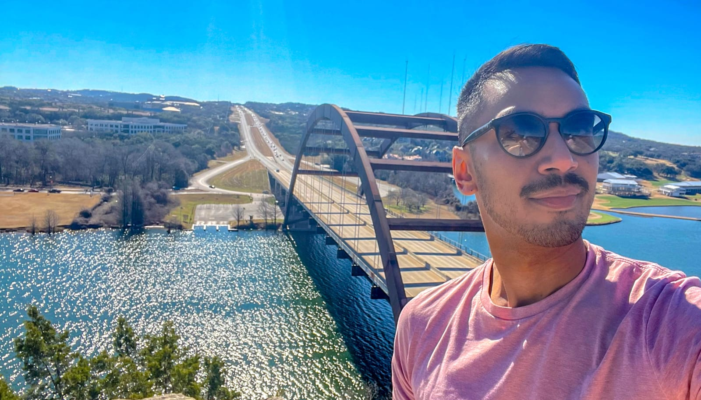

 

## A New Beginning in Austin

As I entered my thirties, I found myself at a crossroads. After two years of caregiving for my father during his battle with colon cancer, followed by his passing in April 2020 amid the pandemic, I was left grappling with a sense of disorientation and loss. The bustling life I once knew in San Francisco felt worlds away from the quiet, reflective space I now inhabited.

Needing a change and searching for a fresh start, I set my sights on Austin, Texas. My decision was influenced by past visits, the city's reputation for endless summer, and the hope of reconnecting with some relatives who lived there. I also hoped to reignite connections with a married couple from San Francisco who had recently moved to Austin. Little did I know that this move would bring a series of unexpected trials and self-discovery.

## The Snowstorm Debacle

One of my first significant challenges in Austin came in February 2021 during a massive snowstorm. East Austin, where I had chosen to live for its walkability, was transformed into a winter wonderland. Unfortunately, the storm knocked out the power, leaving me without heat or water for an entire week.

My aunt and uncle, who lived relatively close and had full power and water, didn't reach out to check on me. I had to take the initiative to contact them, but even then, their response was lackluster. My cousin, despite having a capable F350 truck that could have easily navigated the snow, was deemed too risky to use by his mother. Ironically, I later found out that my cousin continued to go to work during the storm, showing a clear disregard for my well-being.

I ended up staying with a new friend I had met just the weekend before. It was a surreal experience, like a grim form of camping, where I was at the mercy of my host's schedule and had to make do with the clothes I had worn for days.

Despite these difficulties, I tried to build stronger connections with my relatives through activities they enjoyed, like fishing. Unfortunately, these efforts often felt one-sided, and I never truly felt welcomed or supported. I mean, who knew that trying to bond over bait and tackle could be so... fishy?

## The Friend-Finding Struggle

Navigating social connections in Austin proved to be a profound challenge. I had hoped to connect with the LGBTQ+ community but found it frustratingly difficult. Many newcomers seemed to fit right in, while I felt like an outsider.

One memorable night made my outsider status painfully obvious. I introduced a white friend to a group I'd known for a while, expecting us both to be welcomed with open arms. Instead, it felt like I'd stumbled into the wrong party. My friend became the center of attention, basking in praise and adoration, while I was left on the sidelines, practically invisible.

Now, before anyone jumps to conclusions about jealousy, let me clarify: this wasn't a one-off incident. It seemed to be part of a recurring pattern. Was it race? Attraction? Or just a cosmic joke? I'm still trying to figure that out. But it felt like a mix of these elements subtly shaped the social dynamics of that night.

When I confronted the group about their behavior, the fallout was immediate and intense. Those friendships ended abruptly, and I was left grappling with a harsh reality check about social norms and biases. It was a tough lesson: sometimes standing up for yourself can cost you friends, but staying silent only lets the hurt fester.

So, while I was trying to discern whether I was dealing with subtle racism or just bad social timing, it became clear that fitting in was more complicated than I'd hoped. It's a reminder that social dynamics aren't always straightforward and that finding a place where you're genuinely seen and valued can be a challenging journey.

## Reconnecting with Old Friends

In addition to navigating new connections, I hoped to rekindle a friendship with a married couple from San Francisco who had recently moved to Austin. We had shared many great times before, and I saw this move as an opportunity to renew our bond. The woman in the couple, known for her vibrant personality and knack for making friends, particularly within the LGBTQ+ community, seemed like a good anchor in this new city.

Initially, they were welcoming and open to me being part of their lives in Austin. However, as time went on, it became evident that our expectations and needs were mismatched. While they embraced new changes and sought fresh, exciting experiences after their move, I was struggling with my own issues and wasn't as engaging or fun as I might have been in the past.

My grief and personal challenges made it difficult for me to fully connect and integrate into their circle, and they seemed to be looking for different dynamics and interactions. It became clear that, despite our past camaraderie, our present needs and expectations were different. This realization was disheartening, like watching the cool kids from a distance, even though I thought I would fit right in.

Their evolving social circle and my own struggles meant that the deep, mutual connection I had hoped for was elusive. It was a reminder that while past friendships can offer a sense of continuity, real connections often require more than just shared history; they need mutual understanding and alignment in the present.

## Racial and Social Divides

Despite Austin's liberal reputation, I soon discovered that its social spaces felt predominantly white, revealing a deeper racial and socioeconomic divide. This became painfully clear when a darker-skinned Latino friend was introduced to his white boyfriend's friends, and one of them made a racist remark about my friend's accent. This incident wasn't just a moment of thoughtless insensitivity—it highlighted a broader issue: the city, despite its progressive image, often struggles with true inclusivity.

The remark was a sign that, beneath the surface, there's a limited understanding of diversity. Many people in Austin, while outwardly accepting, may not have the exposure needed to genuinely appreciate different cultures and experiences. This lack of exposure creates a narrow view of what diversity really means and can lead to misunderstandings and biases.

For me, this realization deepened my feelings of isolation and made me question my place in a city that seemed to fall short of its progressive ideals. The divide between ethnic groups and the challenges of connecting with a community that often seemed set in its ways left me feeling like an outsider. It became clear that while Austin might present itself as inclusive, there's still a significant gap between its ideals and its everyday reality.

## Reflecting on Growth and Moving Forward

After two years in Austin, I left with a mix of disappointment and growth. The difficulties I faced, from strained family relationships to the struggle for social acceptance, were challenging. Yet, they also provided invaluable lessons about myself and my journey.

I learned that personal growth often comes from facing adversity head-on. My experiences in Austin were not just about the city or its people but about my own evolution. I realized that finding one's place can be a complex, messy process, but it is also an opportunity for profound self-discovery.

As I move forward, I carry with me the lessons learned from my time in Austin. I understand now that life is not always straightforward and that the journey to self-discovery is often fraught with challenges. But through these trials, we find our strength, resilience, and ultimately, a deeper understanding of who we are.

My search for my raison d'être continues, but I am more balanced now, equipped with the insights gained from navigating a new city and confronting personal struggles. The journey may be ongoing, but it is one of growth, reflection, and the pursuit of a more meaningful existence. 

