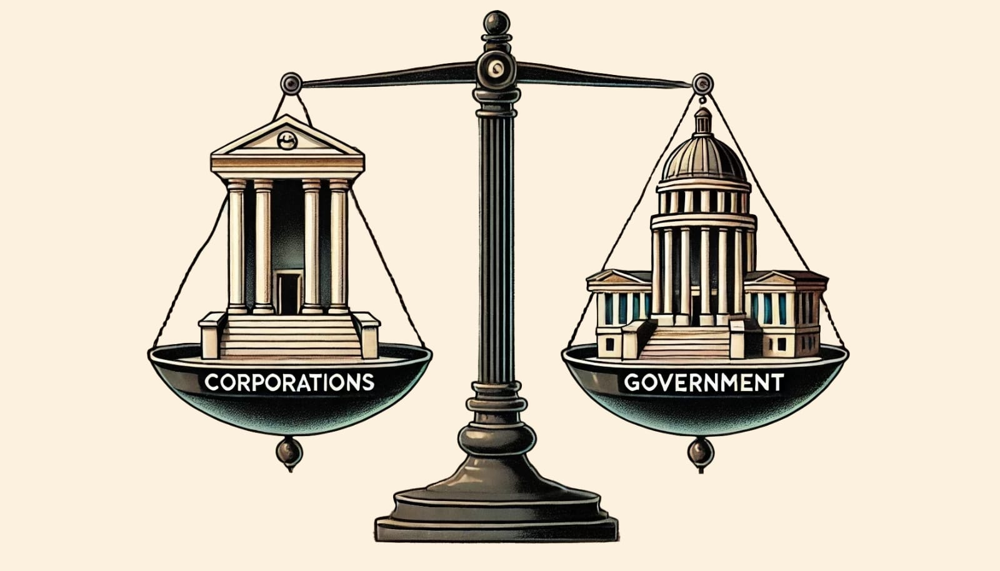
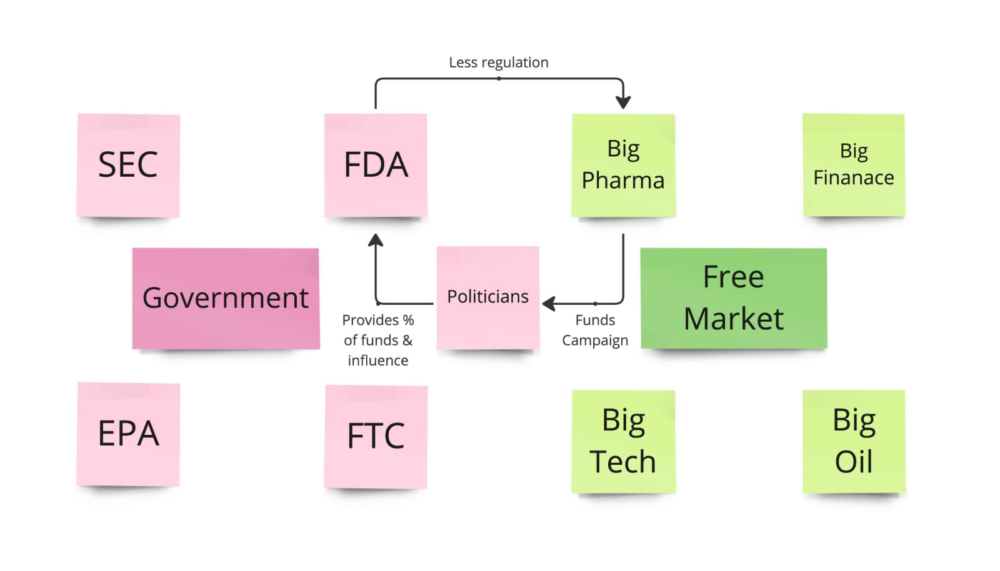

When economists and political experts suggest that big corporations have too much influence over government decisions, they might be onto something. The government, the free market, and everyday citizens—let's just say they have a complex relationship.

## Government vs. Free Market: It's Complicated

The relationship between the government and the free market is a bit tricky. Ideally the government is supposed to balance things out and prevent any one part from getting too powerful. This isnt just talk; the founding fathers had the idea of maintaining control.

On hand the government is also tasked with overseeing the market through agencies like the FDA, FCC and FEC. You can think of these agencies as referees in a match between corporations and the public interest. Their role is to ensure that big companies don't trample on smaller ones or consumers for that matter.

## Citizens United v. FEC: The Game-Changer

In 2010, we got hit with **Citizens United v. FEC**. This Supreme Court decision didn't just move the goalposts - it pretty much changed the whole damn sport. Before this, corporations and unions had limits on how much they could throw at political candidates. After? The Court decided corporations should have the same free speech rights as individuals. Translation: they could now spend as much as they wanted on political campaigns.

Suddenly, your friendly neighborhood CEO had the same rights as you, but with a bank account on steroids. The result? Politicians started perking up their ears more to the cash-heavy corporations bankrolling their campaigns and less to us average Joes they're supposed to represent.

## Politics in Big Pharma's Pocket

Let's break it down with Big Pharma as our example. These guys are funding politicians left and right. Then those same politicians end up overseeing agencies like the FDA, which is supposed to keep Big Pharma in line. See the problem?

Even more concerning is the fact that Big Pharma isn't influencing politicians; it's also footing almost half the bill for the FDA. This means that the research the FDA relies on to regulate Big Pharma often has ties to the very industry it's meant to oversee.

## Bailouts: Not Just Dumb Luck

And those government bailouts for big companies? Not a coincidence, folks. When corporations have their fingers in the political and regulatory pies, they can make sure they've got a safety net if things go south. It's like playing Monopoly with a stack of Get Out of Jail Free cards - if you've got the cash to buy 'em.

## Any Way Out of This Mess?

The catch is that the only way to truly resolve this situation is by reversing the Citizens United ruling. However, reversing a Supreme Court decision is not as simple as pressing the undo button. It would necessitate an amendment to the Constitution, a challenging task, particularly since the ones who would need to endorse it are the same politicians who profit from the existing system.

And here's a fun fact: both major parties are in on it. Republicans, Democrats - they might get funded by different industries, but the song remains the same: corporations are pulling the strings. What we've got isn't a battle of ideas anymore; it's a battle of industries.

## The Bottom Line

Next time the topic of Democrats versus Republicans comes up remember it's more like a feud between Corporation A and Corporation B. As for us we're just along for the ride.

How can we impact change? By keeping ourselves informed, being vigilant, and consistently asking questions. Ultimately, democracy should prioritize the people, not solely those with wealth.

