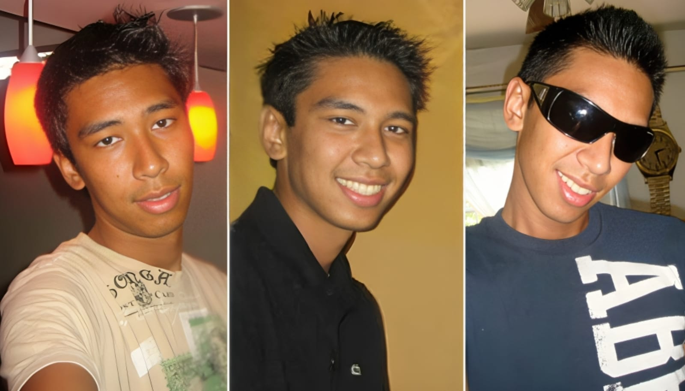
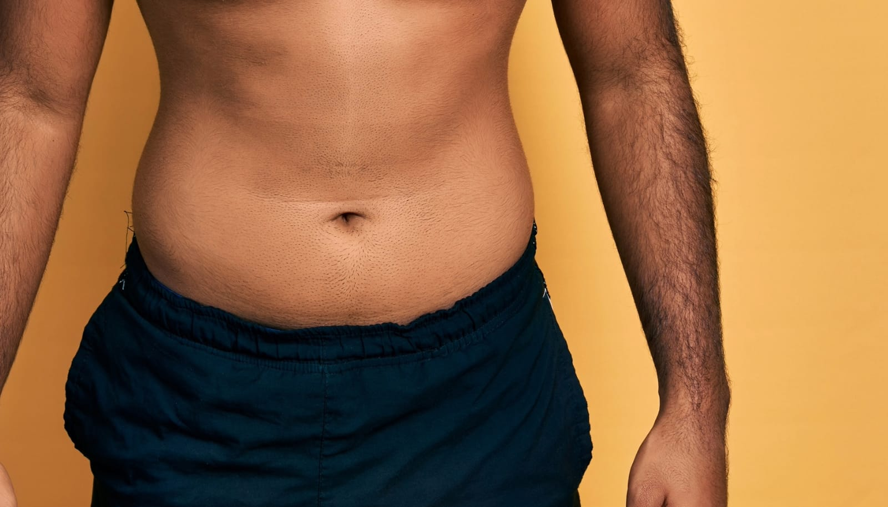
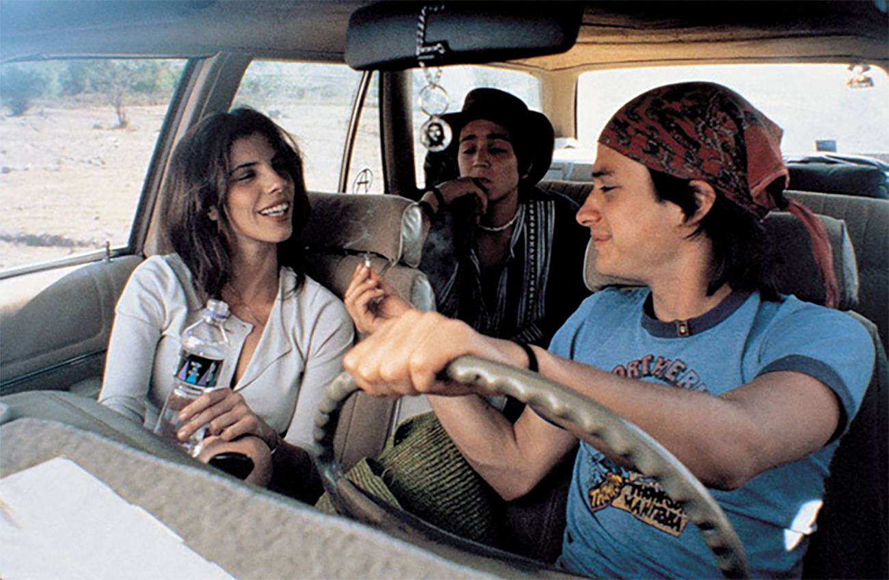
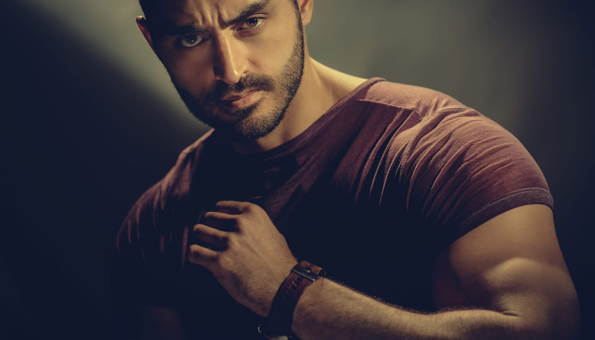
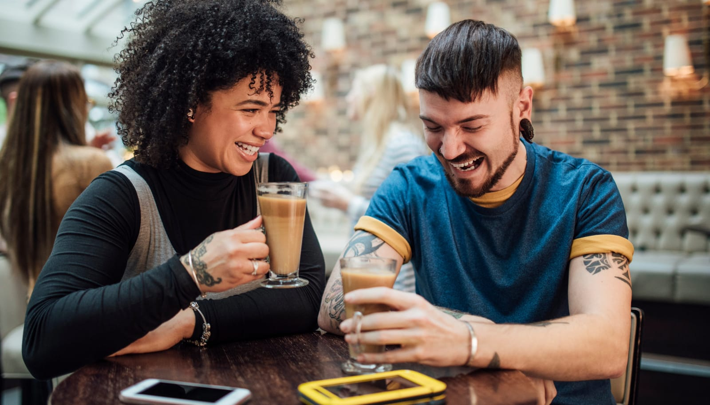

## Early Days: Chat Rooms and Isolation

At 18, I was a young gay man trying to find my place in a world that didn't seem ready for me. It was the early 2000s, and being openly gay wasn't as accepted as it is today. My only connection to the LGBTQ+ community was through chat rooms—a digital refuge where I could explore my identity anonymously.

Being Asian added another layer of complexity. My ethnicity wasn’t celebrated in these spaces. Beauty standards often excluded people who looked like me, making me feel invisible even within the community I hoped would accept me.

## The Chlorine-Tinged Encounter

My first real-life encounter with another man was anything but a fairy tale. I met a closeted Middle Eastern man in a local chat room. Our online conversations were vague, but he suggested meeting up, and I agreed out of curiosity and a longing for connection.

He came over when my parents were out, parking his van discreetly in front of the house. I remember feeling nervous as I got in, unsure of what was about to happen. Without much conversation, he bluntly asked me to go down on him. I was startled by how direct he was, but in the moment, I felt pressured to comply, even though I was uncomfortable.

As I started, I immediately noticed the strong taste and smell of chlorine, which he casually explained was from a recent trip to the wave pool—a summer favorite at the time. His "size" surprised me, as it was smaller than I expected. At that age, I didn't have much to compare it to, but it seemed noticeably different. He made a comment suggesting we were the same, which only heightened my insecurity in the moment, though I later realized that wasn't true. That experience left me questioning a lot about myself and shaped how I initially viewed intimacy.

The experience was awkward and impersonal. There was no affection, no connection—just a mechanical act that left me feeling empty and used. It significantly impacted how I viewed intimacy and my self-worth in those early years.

## College Life: The Invisible Closet

Entering university, I remained firmly in the closet. The campus environment wasn't particularly welcoming to openly gay students, and I didn't see anyone who looked like me living authentically. I immersed myself in academics and joined the honors program, spending most of my time in the student lounge with a group of straight, nerdy friends who shared my interests in science and technology.

Despite forming meaningful friendships, there was a part of me that remained unfulfilled. The university's rich cultural diversity meant I was surrounded by people from various backgrounds, but many held traditional values that didn't support LGBTQ+ identities. This made it even more challenging to express who I truly was.

## The Armenian Hipster and “Y Tu Mamá También”

One day, I crossed paths with an Armenian guy who could easily be labeled a hipster—into indie films, alternative music, and vintage fashion. He invited me over to his parents' house to watch a movie. His parents were hospitable but had their quirks, much like my own immigrant family.

We went to his room, and he closed the door, dimming the lights. He put on “Y Tu Mamá También,” a film I'd never seen but would come to appreciate for its raw portrayal of sexuality and friendship. As the movie progressed to its more intimate scenes, he made his move.

He leaned in closer, his hand brushing against mine. Without words, we began to explore each other—hesitant touches becoming more assured. We kissed, and for the first time, I felt a genuine connection. However, when things started to progress toward something more physical, I pulled back. It was a step I wasn't comfortable taking at the time, a boundary I wasn't ready to cross.

Later, I found out that this was his usual method of initiating intimacy—a specific movie, a dark room, and subtle advances. It made me question the authenticity of our connection. Was I just another encounter in his routine? Nonetheless, the experience was a step forward in understanding my own desires and limits.

## The Bollywood Prince and the Bedroom Window

At 19, I met someone who seemed almost too good to be true. He was from a wealthy Indian family, had the looks of a Bollywood star, and drove a brand-new BMW. He introduced me to Bollywood cinema, and we bonded over the over-the-top stories and music.

We were both in the closet, but his situation was more restrictive due to his family's prominence. One night, he asked me to come over but insisted I sneak into his room by climbing a tree to his second-floor window. He didn't want anyone to see me entering the house.

The request felt degrading. Climbing a tree in the dead of night, risking injury or worse if caught, was too much. I declined, explaining that I deserved to be treated with more respect. The relationship fizzled out after that. It was crazy the lengths some would go to hide their true selves, and I wasn’t willing to compromise my dignity.

## Embracing the Hipster Scene

Feeling disconnected from both the mainstream gay community and my cultural circles, I found solace among the hipsters. They were an eclectic group that embraced individuality and shunned conventional norms. While I may not have fit the hipster mold perfectly, they accepted me without question.

We spent our days in coffee shops discussing art, music, and philosophy. I experimented with fashion—skinny jeans, vintage tees, and the occasional beanie. It was a phase where I could express myself more freely, even if I was still figuring out exactly who I was.

Looking back, I realize I adopted the hipster persona more as a shield than a true reflection of myself. It allowed me to navigate social circles without exposing the vulnerabilities I felt inside.

## Reflecting on the Journey

My undergraduate years were filled with awkward moments and enlightening experiences. Each encounter taught me something valuable about myself and the world around me. But it wasn't always easy—far from it. Navigating the gay community as a non-white person came with layers of rejection, and the constant push and pull of trying to feel accepted often felt unfair.

I faced rejection within the gay community due to ethnic preferences, grappled with cultural expectations that conflicted with my identity, and struggled to find genuine connections. These challenges forced me to keep learning about myself and evolving, driving me toward a deeper understanding of who I am.

Yet, even today, it's still not easy. Being gay in any capacity is difficult, especially if you don't fit into the mold of a white, cisgender gay man. While I continue to grow and accept myself, I acknowledge that the journey isn't straightforward, and it can be incredibly frustrating to feel like you're constantly fighting for acceptance.

Looking back, I see those years as crucial steps in my journey. They weren't always pleasant, but they shaped me into someone who understands the importance of authenticity, respect, and self-love. Even though the road remains challenging, I know that growth is ongoing, and that's what keeps me moving forward.

