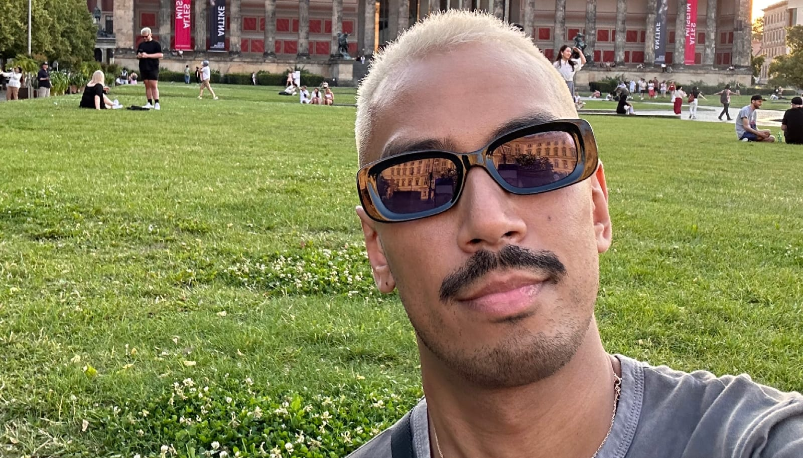

## Rejection: A Heavy Weight

Rejection isn't new. It's not something exotic or unfamiliar. It shows up often, uninvited, and takes up too much space in my mind. It lingers, making itself comfortable until it feels like it's part of me, refusing to leave and letting its presence be constantly felt.

How many times can you take the hit before you're just done? I wish I knew. Ethnicity, personality, being fetishized, timing—I've felt the sting of rejection in all these ways, and I'm left wondering if there's something fundamentally wrong with me. It feels like every door I knock on remains closed, and I'm stuck in a loop of hope and disappointment. I keep asking myself if there’s a secret code I’m missing, some unspoken rule that everyone else knows but me. Each new rejection feels like confirmation that I’m somehow not enough, that I’m destined to be on the outside looking in.

When I'm looking for a partner, I can't find one. When I'm not looking, the ones who show interest are the ones I have no desire to be with. It's exhausting—this constant mismatch of timing, chemistry, and, sometimes, even desire itself. It makes me question whether I'm meant to find someone at all. I try to remind myself that it's not about worth, that it's about compatibility, timing, and all the little details that make a relationship work. But when you're in the middle of it, it's hard to separate the rejection from your sense of self.

## The Dance of Hope and Letdown

I recently started seeing someone. Someone I met before, and we became friends first. We had fun—dancing, laughing, sharing stories—and at some point, it clicked. We decided to try a date. The first date was good, even exciting. The second was just as fun, but there was this sense of him holding back, like he was measuring me, keeping something in reserve. It felt like he was assessing whether I was worth the risk, and part of me understood that. After all, aren't we all just trying to protect ourselves from getting hurt?

And I was okay with that. I could be patient. I told myself not everything has to move fast. Relationships take time, and I wanted to respect that. But then, before the third date, he dropped it: the friend-zone speech. And suddenly, I'm holding myself together again, trying not to let this hit go deep. Trying to act unfazed, like I've got armor on. I told myself it was better to know now rather than later, but that didn't make the sting any less real.

The truth is, I don't. I'm not fine, not even a little. It hurts. Not because I thought he was the one, but because it's just another rejection piled onto an already heavy stack. I hate feeling this way. I hate that I'm back to questioning myself, wondering why I wasn't enough—not for him, but for anyone. It feels like a pattern I can't break, a cycle that keeps repeating no matter how hard I try to change. I wish I could just shrug it off, but every rejection chips away at my hope a little more, making it harder to believe that someday, someone will see me as enough.

## The Tiredness of Trying

I think that's why I'm writing this. It's all too fresh right now. I want to scream and cry and stop caring, but it's hard when you're so tired of trying. I'm not crying over this guy. Not really. I'm crying because I'm exhausted from putting myself out there and hitting a wall, over and over. It's the buildup of every failed connection, every moment I've felt like I wasn't wanted. It's the exhaustion that comes from giving so much of yourself and getting so little in return.

People always say rejection is part of life. I know that. But it's different when it's your heart getting tossed around like a toy nobody wants. When you keep hoping that maybe this time, you'll be the one that gets picked. When you put on your best face, try to be open, try to be vulnerable, only to be turned away again. It makes you wonder if it's worth it—if putting yourself through all this pain is ever going to lead to something good.

And I don't know how to end this story because I honestly don't know what else to do. I wish I could tie it all up in a neat bow and tell you I've figured it out. But I haven't. Maybe that's the hardest part—accepting that there are no easy answers, no guaranteed happy endings. I want to believe that it will all be worth it one day, but right now, all I feel is tired.

Maybe that's okay. Maybe being at a loss is the only honest way to be right now. I'll keep getting up, even though I'm tired. Because what else is there to do? I'll keep hoping, even if that hope feels fragile and worn out. I'll keep putting myself out there, even if the world keeps pushing me back. Maybe one day, it will be different. Maybe one day, someone will see me and decide that I am enough. Until then, all I can do is keep trying, keep hoping, and keep getting up. Because even though I'm exhausted, I'm not ready to give up yet.

