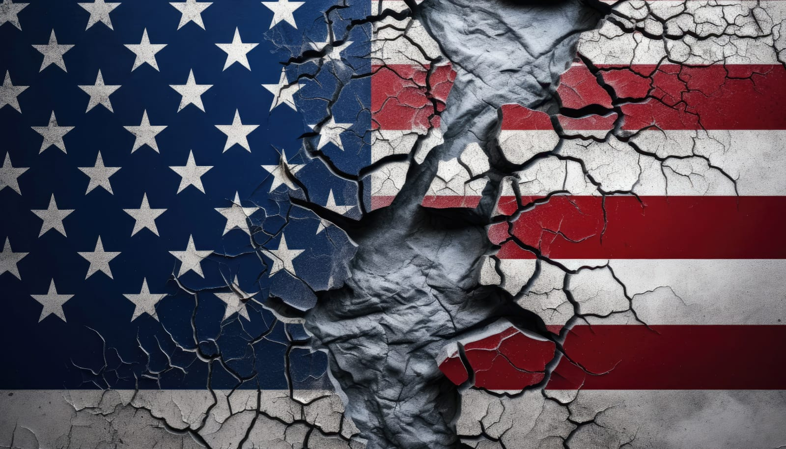

## Feeling Lost After the Votes

It's been a few days since the election, and a heavy weight sits on my chest. I've felt disappointment and anger before, but nothing compares to this profound sense of heartbreak.

Yesterday, I struggled to understand why this hurt so much. After some thought, I realized that the election results feel like a rejection of everything I've ever been taught about how to live.

## Questioning Lifelong Principles

All my life, I've valued kindness, generosity, and empathy. These principles have guided my actions and interactions. Seeing over half the country support someone who embodies the opposite feels like a betrayal.

It's unsettling to witness the endorsement of deceit, selfishness, and cruelty. Supporting them seems to invalidate the importance of being truthful, ethical, and compassionate.

## The Disillusionment with Society

It's disheartening to think that many believe those who thrive on division can unite us. Division benefits those who profit from our rage, not the common good.

This isn't about a simple disagreement over preferences. It's about fundamental values. It feels like being told that decency and understanding have no place in the real world.

## The Impact on Minority Communities

As a member of the LGBTQ+ community, this election feels personal. It signals that rights and acceptance can be easily disregarded. It's unsettling to think that progress can be rolled back, affecting not just me but many others who have fought hard for recognition.

The fear isn't just theoretical; it's a real concern about safety, acceptance, and equality. Supporting leaders who undermine these rights sends a message that some lives matter less.

## Understanding the Election Outcome

So why did the election turn out this way? Several factors played a role:
* **Economic Uncertainty:** Many voters are grappling with job insecurity and rising living costs. Promises of economic revival resonate deeply.
* **Misinformation:** The spread of false information has polarized society. Social media algorithms often reinforce existing beliefs, creating echo chambers.
* **Cultural Backlash:** Some feel threatened by rapid social changes, leading to a desire to return to "simpler times."

But understanding these factors doesn't lessen the sting. It raises questions about empathy and whether fear has overshadowed compassion.

## The Myth of the "Good Old Days"

The slogan "Make America Great Again" begs the question: when exactly was this golden era? For many, now is the greatest time because of the strides we've made toward equality.

Suggesting a return to the past ignores the injustices that existed. It's troubling to think that making some feel special requires stripping others of their rights.

## The Illusion of Economic Justification

Some argue it's about the economy, as if that excuses everything else. Overlooking harmful rhetoric for potential financial gain sends a message that marginalized groups are expendable.

Saving a few cents at the pump isn't worth compromising our integrity. Prioritizing profit over people diminishes the very fabric of our society.

## A Call for Accountability

We had the chance to stand for something better—to embrace fairness and the greater good. Yet, many chose a different path.

To those who claim to value the ideals we were taught as children—kindness, honesty, respect—yet support actions that contradict them, we need answers.

## Seeking Understanding

This isn't about politics; it's about humanity. It's about the kind of world we want to leave for the next generation.

Me and millions like me deserve an explanation. How do we reconcile these contradictions? How do we move forward when the values we hold dear seem so easily cast aside?

