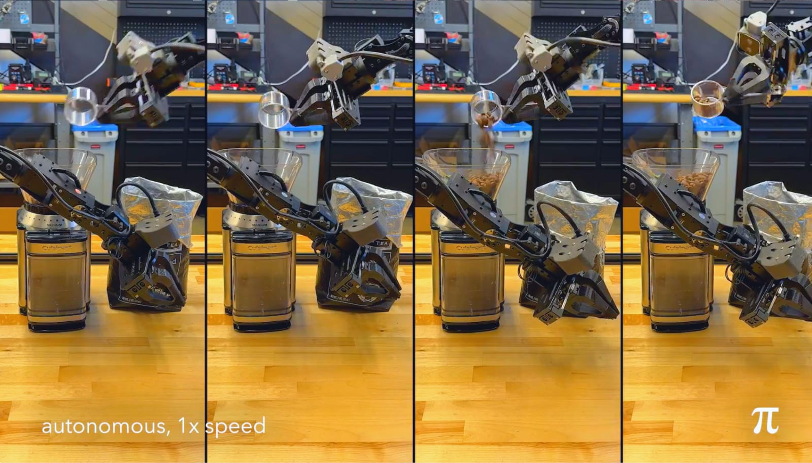

*Screenshot taken from a video by Physical Intelligence.*

## What Makes π0 Different?

The world of robotics is filled with one-trick ponies. You've got robots that pack boxes, make coffee, others that vacuum floors, and some that flip burgers. π0 laughs at that. It isn't designed to specialize—it's built to generalize. Physical Intelligence's new creation aims to do it all, and it's doing so with a level of autonomy and adaptability that's inching closer to Artificial General Intelligence (AGI) for the physical world.

## Why π0 Matters

π0's "flow matching" is a game-changer. It doesn't fumble or hesitate like traditional robots. Instead, it moves with the fluidity of a seasoned professional in any task it attempts. Think about what this means:
* Safely handles fragile items like eggs.  
* Folds laundry with professional-level precision.  
* Easily manages complex or delicate tasks.

And it's not just about household chores. This tech has implications for industries from logistics to healthcare. π0 is not just performing tasks; it's understanding them.
 
### Capabilities and Features of π0

<table>
  <thead>
    <tr>
      <th width="170">Capability</th>
      <th>Description</th>
    </tr>
  </thead>
  <tbody>
    <tr>
      <td>Vision</td>
      <td>Understands complex visual data</td>
    </tr>
    <tr>
      <td>Language</td>
      <td>Processes text prompts</td>
    </tr>
    <tr>
      <td>Motion</td>
      <td>Executes physical actions with precision</td>
    </tr>
  </tbody>
</table>

### Training Process

<table>
  <thead>
    <tr>
      <th width="170">Stage</th>
      <th>Description</th>
    </tr>
  </thead>
  <tbody>
    <tr>
      <td>Pre-training</td>
      <td>Vision-Language Models (PaliGemma)</td>
    </tr>
    <tr>
      <td>Robot Integration</td>
      <td>Combines real-world and proprietary data</td>
    </tr>
    <tr>
      <td>Embodied Learning</td>
      <td>Hands-on practice through physical tasks</td>
    </tr>
    <tr>
      <td>Fine-Tuning</td>
      <td>Specialization for task-specific scenarios</td>
    </tr>
  </tbody>
</table>

### Real-World Applications

<table>
  <thead>
    <tr>
      <th width="170">Task</th>
      <th>Example</th>
    </tr>
  </thead>
  <tbody>
    <tr>
      <td>Folding Laundry</td>
      <td>Smoothly folds clothes</td>
    </tr>
    <tr>
      <td>Packing Groceries</td>
      <td>Efficiently organizes and packs items</td>
    </tr>
    <tr>
      <td>Bussing Tables</td>
      <td>Cleans and organizes dining spaces</td>
    </tr>
    <tr>
      <td>Handling Fragile Items</td>
      <td>Safely manages delicate objects</td>
    </tr>
    <tr>
      <td>Making Coffee</td>
      <td>Prepares your morning brew perfectly</td>
    </tr>
  </tbody>
</table>

### Key Differentiators

<table>
  <thead>
    <tr>
      <th width="170">Feature</th>
      <th>Benefit</th>
    </tr>
  </thead>
  <tbody>
    <tr>
      <td>Flow Matching</td>
      <td>Ensures smooth, human-like motions</td>
    </tr>
    <tr>
      <td>Reflex Speed</td>
      <td>Executes up to 50 commands per second</td>
    </tr>
    <tr>
      <td>Generalist AI Brain</td>
      <td>Adapts to multiple tasks seamlessly</td>
    </tr>
  </tbody>
</table>

## The Secret Behind Its Success

π0 is built on vision-language models (VLMs). It uses Google's PaliGemma, but what Physical Intelligence has done with this foundation is where things get interesting. They've created a system that processes commands and executes tasks with human-level reflexes. We're talking 50 commands per second. In robotic terms, that's like going from a flip phone to a modern smartphone overnight.

## From Simulation to Real-World Impact

Physical Intelligence didn't stop at theoretical excellence. They've made π0 learn the hard way—by doing. It has been trained through:

*	Pre-training on vision-language datasets.
*	Hands-on practice with real-world robots.
*	Embodied learning, where it refines its skills through real interactions.

This isn't a lab toy. π0 is prepared for the chaos of real life, from slippery plates to stubborn shirt collars.

## A Future Where Robots Think for Themselves

The idea of robots that think and adapt in real time is thrilling—and a little unnerving. π0 is one of the first steps toward a future where machines might not need constant human input. It's already showing signs of independent strategy, like shaking off food scraps from dishes before stacking them.

What happens when robots no longer need to be told what to do? When they can plan multiple steps ahead or learn from their own mistakes without intervention?

## My Thoughts on π0 and the Road Ahead

π0 excites me, but it also makes me pause. We're entering a new relationship with technology, one where machines don't just follow orders but engage with the world as we do. The implications are enormous.

On one hand, this tech can revolutionize industries. On the other, it raises questions about our own roles. What happens to the human workforce when machines adapt faster than we do? Are we ready to share our spaces with something that doesn't just assist but autonomously decides how best to help?

And then there's the trust factor. Sure, π0 can fold a shirt better than I ever could. But how much autonomy are we willing to give machines? At what point do they stop being tools and start becoming collaborators?

## The Bigger Picture

Physical Intelligence isn't just building a robot—they're redefining what it means to interact with machines. The leap to AGI is a bold one, and π0 shows that we're closer than ever to a world where robots are as versatile as humans in physical tasks.

This isn't science fiction anymore. It's happening. And while I'm ready for a robot to handle my laundry, I'm also keenly aware of the challenges ahead. From ethics to safety, the journey toward widespread robotic integration will be as complex as the machines themselves.

