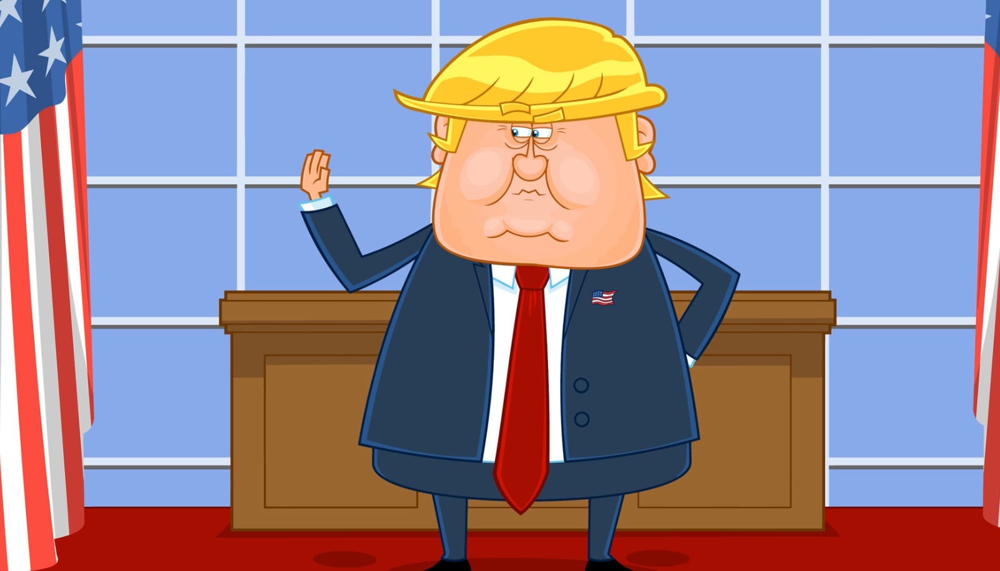

## The Presidency Ahead

We're fucked. Or at least, that's how many feel about Donald Trump's return to the White House in 2025. For others, it's a moment of celebration—finally, someone to "drain the swamp" and deliver on promises. But many of the people cheering didn't look closely at what they voted for.

Now, it's "FAFO" in action—F*** Around and Find Out. Choices made during the election are starting to show their consequences, and it's clear not everyone saw them coming. Trump's sweeping proposals on labor laws, healthcare, immigration, and more will bring big changes. Whether these changes improve the country or create more problems depends on how prepared people are to face what they voted for.

## 1. Labor Laws

### National Right-to-Work Expansion
  * Change: Expand right-to-work laws nationally.
  * Causation: Reduces union influence by allowing employees to opt out of paying union dues while benefiting from union negotiations.
  * Consequence: Weakens unions, resulting in lower wages, fewer benefits, and less job security for workers.
### Redefinition of Independent Contractors
  * Change: Broaden the definition of independent contractors.
  * Causation: Reclassifies many workers as contractors instead of employees, reducing employer obligations.
  * Consequence: Workers lose access to benefits such as health insurance, overtime pay, and legal protections, creating job insecurity.
### Overtime Pay Rollback
  * Change: Remove requirements for employers to pay additional wages for hours worked beyond the standard workweek.
  * Causation: Allows employers to avoid higher wage costs.
  * Consequence: Employees may be overworked without fair compensation, particularly affecting low-income workers.
### Weakened NLRB Oversight
  * Change: Reduce the power of the National Labor Relations Board.
  * Causation: Limits the NLRB's ability to oversee workplace disputes and enforce labor protections.
  * Consequence: Easier for employers to engage in unfair practices and more difficult for workers to unionize or resolve grievances.

## 2. Education

### Elimination of DEI Programs
  * Change: Remove diversity, equity, and inclusion initiatives.
  * Causation: Ends efforts to promote inclusivity in schools.
  * Consequence: Marginalized students feel less supported, reducing academic success and well-being.
### Patriotic Education Mandates
  * Change: Emphasize patriotic education in schools.
  * Causation: Downplays historical injustices and systemic issues.
  * Consequence: Skews historical understanding and stifles critical thinking.
### School Choice Expansion
  * Change: Expand school choice and voucher programs.
  * Causation: Redirects public funds to private and charter schools.
  * Consequence: Public schools lose funding, widening resource disparities.
### Federal Education Funding Cuts
  * Change: Reduce federal funding for programs like Title I and special education.
  * Causation: Diverts resources to other priorities.
  * Consequence: Larger class sizes and fewer services for low-income students.

## 3. Healthcare

### Affordable Care Act Repeal
  * Change: Repeal or weaken the ACA.
  * Causation: Ends subsidies and insurance mandates.
  * Consequence: Millions of low-income Americans lose coverage, and protections for preexisting conditions are jeopardized.
### Medicaid Privatization
  * Change: Shift Medicaid to state-controlled block grants.
  * Causation: Reduces federal oversight.
  * Consequence: States cut coverage, leaving vulnerable populations without access to care.
### FDA Deregulation
  * Change: Simplify drug and treatment approval processes.
  * Causation: Encourages quicker market entry for new products.
  * Consequence: Risks the approval of unsafe or ineffective treatments.

## 4. Climate and Energy

### Increased Fossil Fuel Production
  * Change: Expand oil and gas drilling on public lands.
  * Causation: Removes restrictions to boost energy production.
  * Consequence: Harms ecosystems, delays renewable energy, and worsens climate change.
### Withdrawal from International Climate Agreements
  * Change: Exit agreements like the Paris Accord.
  * Causation: Reduces U.S. involvement in global climate efforts.
  * Consequence: Weakens global climate goals and U.S. credibility.
### EPA Regulation Rollbacks
  * Change: Roll back environmental protections on emissions and pollution.
  * Causation: Reduces burdens on industries.
  * Consequence: Increases pollution and impacts vulnerable communities.

## 5. Immigration

### End Birthright Citizenship
  * Change: Deny citizenship to children of undocumented immigrants born in the U.S.
  * Causation: Aims to deter unauthorized immigration.
  * Consequence: Creates legal challenges and potential stateless individuals.
### Increased Detention Policies
  * Change: Expand detention of undocumented immigrants.
  * Causation: Strengthens enforcement mechanisms.
  * Consequence: Raises human rights concerns and strains resources.
### Mandatory E-Verify
  * Change: Require employers to verify immigration status for all hires.
  * Causation: Aims to reduce unauthorized employment.
  * Consequence: Risks errors, discrimination, and administrative burdens.

## 6. Social Policies

### Abortion Restrictions
* Change: Enforce federal limits on abortion access.
* Causation: Aligns with conservative anti-abortion priorities.
* Consequence: Increases unsafe practices and disproportionately affects low-income women.
### Ban on Gender-Affirming Care
* Change: Prohibit medical treatments for transgender minors.
* Causation: Reflects conservative opposition to gender-affirming care.
* Consequence: Increases mental health struggles for transgender youth.
### Gun Control Resistance
* Change: Block stricter gun control measures.
* Causation: Prioritizes gun ownership rights.
* Consequence: Leaves rising gun violence unaddressed.

## 7. Economic Policies

### Universal Tariffs on Imports
* Change: Impose broad tariffs on foreign goods.
* Causation: Protects U.S. industries by discouraging reliance on imports.
* Consequence: Raises consumer prices, disrupts global supply chains, and risks trade wars.
### Corporate Tax Cuts
* Change: Further reduce taxes for corporations.
* Causation: Encourages business investments and growth.
* Consequence: Increases federal deficits while widening income inequality.
### Reindustrialization Subsidies
* Change: Provide government subsidies to revive U.S. manufacturing.
* Causation: Bolsters domestic production.
* Consequence: Risks inefficiency, neglects emerging industries, and inflates costs.
### Cuts to Social Safety Nets
* Change: Reduce funding for programs like SNAP and unemployment insurance.
* Causation: Aims to curb federal spending.
* Consequence: Increases poverty and food insecurity, especially during economic downturns.

## 8. Foreign Policy

### Reduced NATO Involvement
* Change: Decrease U.S. financial and military commitments to NATO.
* Causation: Aims to shift burden to European allies.
* Consequence: Weakens global alliances and emboldens adversaries like Russia.
### Stricter Sanctions on Adversaries
* Change: Impose tougher sanctions on countries like China, Iran, and North Korea.
* Causation: Uses economic pressure to change behavior.
* Consequence: Increases global tensions and risks civilian harm in targeted countries.
### Strengthening Ties with Israel
* Change: Deepen support for Israel in Middle Eastern policy.
* Causation: Aligns with longstanding conservative foreign policy goals.
* Consequence: Alienates Arab nations, risks peace initiatives, and heightens regional instability.
### Reduced Foreign Aid
* Change: Cut funding for international assistance programs.
* Causation: Reduces federal spending.
* Consequence: Weakens U.S. influence and allows rival powers to fill gaps.

## 9. Technology and Regulation

### Repeal of Section 230 Protections
* Change: Remove legal immunity for tech platforms over user content.
* Causation: Holds platforms accountable for moderation decisions.
* Consequence: Risks over-moderation, stifles free speech, and complicates content management.
### Deregulation of Cryptocurrency Markets
* Change: Reduce government oversight of cryptocurrency.
* Causation: Encourages innovation in blockchain and digital finance.
* Consequence: Increases fraud risks and market instability.
### Expansion of Broadband and 5G Infrastructure
* Change: Prioritize private partnerships for digital infrastructure.
* Causation: Leverages private sector efficiency.
* Consequence: Risks leaving rural and low-income areas underserved.

## 10. Military and National Defense

### Increased Military Spending
* Change: Boost funding for defense programs and advanced weapon systems.
* Causation: Strengthens national security.
* Consequence: Diverts resources from domestic programs and risks over-militarization.
### Privatization of Veterans' Healthcare
* Change: Shift veterans' medical services to private-sector providers.
* Causation: Aims to increase efficiency and reduce costs.
* Consequence: Reduces accountability for care quality and raises costs for veterans.
### Expansion of the Space Force
* Change: Allocate additional funding to military operations in space.
* Causation: Prepares for potential conflicts in space.
* Consequence: Risks militarizing space and neglecting other pressing defense priorities.

## 11. Social Security and Retirement

### Raise Retirement Age
* Change: Increase the eligibility age for Social Security benefits.
* Causation: Adjusts to longer life expectancies and reduces program costs.
* Consequence: Delays access to benefits, impacting workers in physically demanding jobs.
### Private Investment Options for Social Security
* Change: Allow individuals to invest Social Security funds in private accounts.
* Causation: Promotes individual control over retirement savings.
* Consequence: Exposes retirees to market risks and potential losses.
### Limit Cost-of-Living Adjustments (COLA)
* Change: Reduce annual benefit increases tied to inflation.
* Causation: Lowers program costs over time.
* Consequence: Erodes purchasing power for retirees during periods of high inflation.

## 12. Criminal Justice and Policing

### Increased Federal Law Enforcement Funding
* Change: Allocate more resources to police departments.
* Causation: Aims to enhance public safety.
* Consequence: Risks over-policing marginalized communities.
### Harsher Penalties for Violent Crimes
* Change: Enforce mandatory minimum sentences.
* Causation: Deters crime through stricter punishments.
* Consequence: Contributes to mass incarceration and disproportionately impacts minority populations.
### Rollback of Bail Reforms
* Change: Reinstate cash bail requirements.
* Causation: Seeks to reduce repeat offenses.
* Consequence: Keeps low-income individuals in jail pre-trial, perpetuating inequality.

## 13. Housing and Urban Development

### Cuts to Affordable Housing Programs
* Change: Reduce funding for Section 8 and other public housing initiatives.
* Causation: Decreases federal spending.
* Consequence: Increases homelessness and housing insecurity.
### Relaxation of Zoning Regulations
* Change: Loosen zoning and environmental restrictions for new developments.
* Causation: Encourages private housing development.
* Consequence: Risks prioritizing profit-driven projects over affordable housing.
### Homeownership Incentives
* Change: Expand tax benefits for homebuyers.
* Causation: Supports homeownership over renting.
* Consequence: Disproportionately benefits higher-income families.

## 14. Agriculture and Rural Development

### Increased Subsidies for Large Farms
* Change: Expand financial support for major agricultural producers.
* Causation: Stabilizes food supply chains.
* Consequence: Marginalizes small-scale farmers and reduces crop diversity.
### Environmental Rollbacks for Farming
* Change: Loosen restrictions on pesticide use and water management.
* Causation: Reduces costs for farmers.
* Consequence: Harms local ecosystems and long-term agricultural sustainability.
### Higher Tariffs on Agricultural Imports
* Change: Impose tariffs on foreign agricultural products.
* Causation: Protects domestic farmers.
* Consequence: Raises food prices and risks retaliatory tariffs on U.S. exports.

## 15. Technology and Innovation

### Government AI Investment
* Change: Increase funding for AI and cybersecurity development.
* Causation: Strengthens defense capabilities and supports technological innovation.
* Consequence: Risks over-surveillance and privacy violations, benefiting large tech corporations while sidelining smaller players.
### Intellectual Property Enforcement
* Change: Strengthen international protections for U.S. intellectual property.
* Causation: Pressures global partners to adopt stricter IP regulations.
* Consequence: Increases costs for foreign consumers, leading to trade disputes and barriers for smaller firms.
### Reduction in Green Tech Investments
* Change: Shift focus away from renewable energy development.
* Causation: Prioritizes fossil fuels and traditional energy sectors.
* Consequence: Slows the U.S. transition to sustainable energy and diminishes global competitiveness in emerging green industries.

## 16. Law and Order

### National Anti-Riot Legislation
* Change: Criminalize participation in protests that turn violent.
* Causation: Seeks to deter civil unrest.
* Consequence: Risks chilling free speech and suppressing political dissent.
### Increased Domestic Surveillance
* Change: Expand surveillance of political groups and activists.
* Causation: Frames activism as a potential security threat.
* Consequence: Undermines civil liberties and raises ethical concerns over government overreach.
### Federal Forces in Local Policing
* Change: Deploy federal agents to cities for crime control.
* Causation: Strengthens federal response to urban violence.
* Consequence: Erodes trust between local communities and law enforcement, creating jurisdictional conflicts.

## 17. Transportation and Infrastructure

### Public-Private Partnerships
* Change: Prioritize private investment in infrastructure projects.
* Causation: Reduces federal spending on roads, bridges, and transit systems.
* Consequence: Risks higher tolls and reduced access for low-income communities.
### Cuts to Public Transit Funding
* Change: Reduce federal support for public transportation.
* Causation: Redirects resources to other priorities like rural projects and highways.
* Consequence: Limits mobility options for urban residents and worsens traffic congestion.
### Expansion of Energy Pipelines
* Change: Build more oil and gas transport infrastructure.
* Causation: Boosts domestic energy distribution.
* Consequence: Sparks environmental protests and risks harm to Indigenous lands and ecosystems.

## Final Thoughts

Trump's agenda encapsulates a high-stakes gamble on deregulation, privatization, and economic nationalism. While his supporters may view these policies as a return to American strength, the broader implications signal potential upheavals in civil rights, environmental protections, and social safety nets.

The real test of these policies won't be in their immediate implementation but in their long-term impact on the social and economic fabric of the nation. Whether these shifts unite or divide, uplift or suppress, remains a question Americans will answer in their actions, their voices, and their votes.

