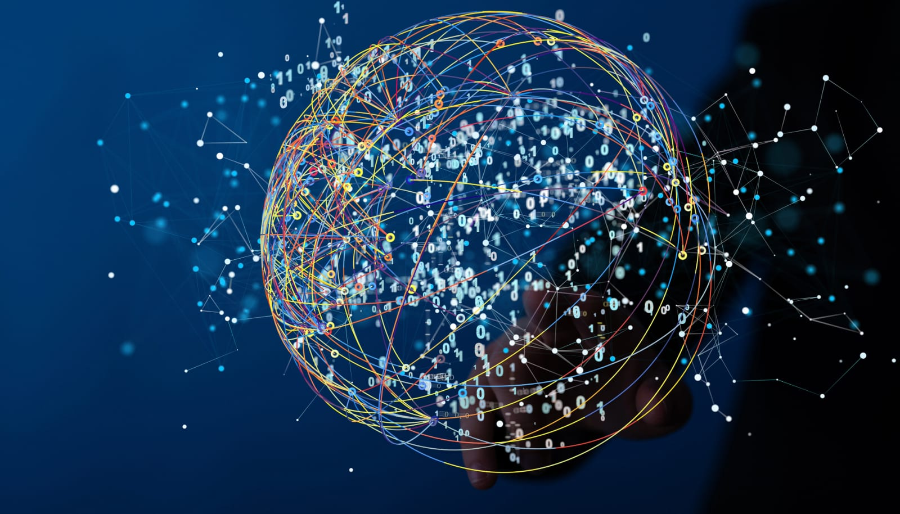
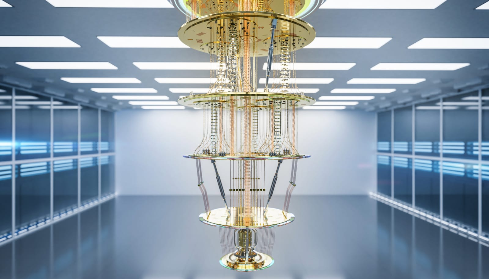
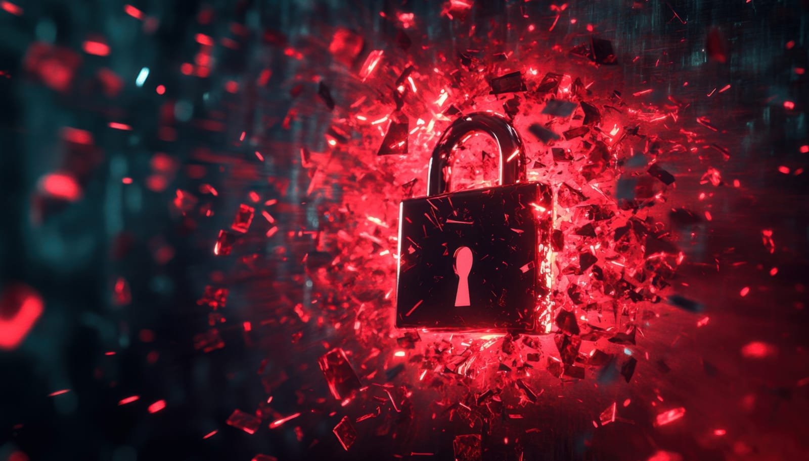

## The Tech You Use Today Wasn't Built for What's Coming

Microsoft has done something no one expected: it created a new state of matter.

And in doing so, it may have pushed quantum computing from theory into threat.

It's called a "topological state." This isn't science fiction—it's physics. 

And if it works the way researchers say, it could tear through the encryption that protects your data, your money, and everything you've ever backed up to the cloud.

## What Makes Quantum Computers Different

Traditional computers use bits—tiny switches that flip between 1 and 0. Those 1s and 0s form everything from selfies to spreadsheets.

Quantum computers use qubits. Qubits aren't either 1 or 0. They're both at once. That's called **superposition**.

Qubits can also link with each other across space using **entanglement**, which makes them useful for solving complex problems with many variables—fast.

Google's quantum computer, Project Willow, solved a math problem in five minutes that would take a classical supercomputer 10 septillion years. That's a 1 with 25 zeros. And no, that's not a typo.

  

    <svg viewBox="0 0 400 300" xmlns="http://www.w3.org/2000/svg">
      <rect width="100%" height="100%" fill="#EAE0C8" />
      <circle cx="100" cy="150" r="25" fill="#0072CE" />
      <circle cx="300" cy="150" r="25" fill="#FF6700" />
      <line x1="125" y1="150" x2="275" y2="150" stroke="white" stroke-width="5" />
      <text x="90" y="210" font-size="18" fill="black">0</text>
      <text x="295" y="210" font-size="18" fill="black">1</text>
      <text x="120" y="260" font-size="20" fill="black">CLASSICAL BIT</text>
    </svg>
  

  

    <svg viewBox="0 0 400 300" xmlns="http://www.w3.org/2000/svg">
      <defs>
        <radialGradient id="grad1" cx="50%" cy="50%" r="50%">
          <stop offset="0%" stop-color="#0072CE" />
          <stop offset="100%" stop-color="#00A8E8" />
        </radialGradient>
      </defs>
      <rect width="100%" height="100%" fill="#EAE0C8" />
      <circle cx="200" cy="150" r="80" fill="url(#grad1)" stroke="white" stroke-width="2" />
      <g stroke="white" stroke-width="1">
        <path d="M200,70 C230,80 230,220 200,230" fill="none" />
        <path d="M200,70 C170,80 170,220 200,230" fill="none" />
        <ellipse cx="200" cy="150" rx="60" ry="10" fill="none" />
        <ellipse cx="200" cy="150" rx="60" ry="30" fill="none" />
        <ellipse cx="200" cy="150" rx="60" ry="50" fill="none" />
        <ellipse cx="200" cy="150" rx="60" ry="70" fill="none" />
      </g>
      <text x="90" y="155" font-size="18" fill="black">0</text>
      <text x="300" y="155" font-size="18" fill="black">1</text>
      <text x="165" y="260" font-size="20" fill="black">QUBIT</text>
    </svg>
  

## So Why Hasn't This Broken the Internet Yet?

Because qubits are unstable.

They lose information if they're disturbed—by heat, noise, or even the act of being measured. Running a quantum computer is like trying to keep a house of cards standing during a wind tunnel test.

Until now, this made quantum computing more theoretical than practical.

Microsoft's new chip, **Majorana-1**, changes that. It uses a particle called the **Majorana**, which is its own antiparticle. These particles exist in a **topological state**—a newly discovered state of matter that resists interference and holds quantum data more reliably.

The chip only has 8 qubits today. But it's designed to scale to over 1 million. That's the level researchers say is needed to start solving big real-world problems—like drug discovery, climate modeling, and high-frequency financial simulation.

It also happens to be more than enough to break the encryption that keeps your digital life secure.

## Why This Breakthrough Is a Security Problem

Everything you do online is protected by encryption.

Encryption works by scrambling data using formulas that take time to solve. Classical computers would need thousands or billions of years to break these formulas by brute force.

Quantum computers could break them in minutes.

That means:

- Your banking logins
- Your cloud backups
- Your email passwords
- Your medical records
- Your crypto wallet keys

All become vulnerable.

The NSA calls this threat **Y2Q**—the quantum equivalent of Y2K. Except this time, the threat is real, and the clock is ticking faster than anyone planned for.

## What Happens If We're Not Ready

If encryption falls, it's not just about personal data leaks.

- Smart homes and smart cars could be hijacked.
- Businesses could lose control of trade secrets or user data.
- Government systems could be breached.
- Cryptocurrencies could collapse.

Everything digital depends on some form of cryptography. And quantum computing goes straight through it.

Security teams are now racing to build **quantum-resistant encryption**—methods that can survive attacks from quantum computers. But building and adopting these new systems takes time, and time is running out.

## So Where Do We Go From Here?

Quantum computing isn't science fiction anymore. It's real hardware, solving real problems.

The upside is massive—faster innovation, better healthcare, cleaner energy.

But the risk is real too. If we don't upgrade the systems we rely on daily, the cost won't be theoretical.

If you're in tech, legal, finance, or health, start asking how your systems are preparing.

If you're a regular user, keep an eye on the services you trust with your data.

Quantum computing will change everything. The only question is whether we're ready when it does.

