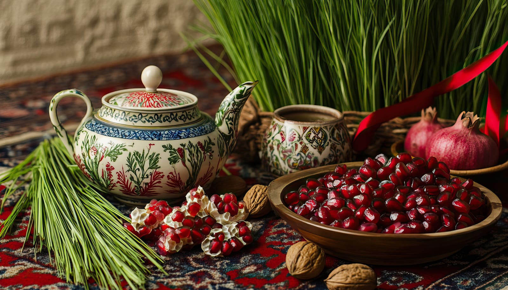
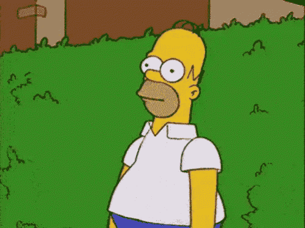

## A New Year, A New Me?

Naw Ruz, the Persian New Year, is a celebration of renewal.  
It marks the first day of spring and brings a sense of new beginnings.

This year, it hits different.  
Not because I threw a party or did something traditional.  
It matters because I'm starting over in a way that feels personal and overdue.

After a few years of feeling stuck (disconnected from my identity, my culture, and myself), I'm finally moving again.  
This Naw Ruz isn't about going back.  
It's about building something new from where I am now.

## When I Started to Disappear

  

    
There was a time when I felt fully alive.  

    
I had close friends, fulfilling work, and space to be myself (driven, playful, openly gay, connected).

    
That version of me slowly faded when I moved back to Michigan to take care of my dad.  
    I don't regret that choice at all.   
    But I stopped prioritizing myself, and that shift didn't reverse overnight.

    
My days were focused on caregiving and holding things together.   
    I let go of the parts of myself that made me feel free and creative.   
    Even after my dad passed, I stayed in that holding pattern.

    
I wasn't moving forward. I was going through the motions.

  

  

    <figure>
      
    </figure>
  

## The Austin Experiment

After the funeral, I needed a big change.  
I moved to Austin (a new city with new energy) and thought it might bring something back to life in me.

But it didn't feel right.

I tried to build a new routine.  
I tried to meet people, date, be social, be "on."  
But I wasn't in a good place.  
I was still grieving, still guarded, and people could feel that.

The energy I carried into rooms wasn't open.  
It was heavy, and I didn't always realize it until later.

Austin didn't bring me back.  
Instead, it made me feel more out of place.

After two years, I left feeling worse than when I got there.

## Stuck in the Familiar

I came back to Michigan again.  
It felt safe and familiar.  
But the comfort started to feel like being stuck.

My mom, while supportive, doesn't share my cultural background.  
My sister has her own family and does her best to keep parts of our Iranian traditions going.  
But without my dad, things feel different.

We don't celebrate Naw Ruz like we used to.  
No big gatherings. No community events.  
He was the one who made those happen.

Without him, it's quiet.  
And without Iranian friends or community around me, I've started to feel disconnected from that part of myself.

Being home hasn't felt like being whole.

## Choosing Columbus

Now I'm getting ready to move to Columbus.  
It's not a huge move, but it feels big for me.

Every time I've visited, something clicked.  
The energy felt right.  
The friends I have there show up for me.  
It feels like a place where I can build something new.

I want to be active again.  
I want to create, meet people, date, build real connections.  
I've missed feeling that spark.

Leaving family is never easy, but this time it doesn't feel like running.  
It feels like choosing myself.

## Redefining Naw Ruz

Growing up, Naw Ruz was always about bringing people together.  
My dad made sure of that.  
He didn't wait for someone else to plan something; he did it himself, every year.

Since he passed, those celebrations haven't happened.  
And for a while, I didn't want them to.  
It didn't feel right without him.

But this year, something small shifted.  
A friend gifted me the items for a haft-seen.  
It wasn't something I planned, but I set it up anyway.  
Quietly. On my own.  

And it felt like something real.  
Not a big moment.  
Not a party.  
But a promise (to myself) to keep going.

This year, Naw Ruz isn't about what I've lost.  
It's about what I'm choosing.

I'm not waiting for the energy to come to me.  
I'm stepping into it one piece at a time.

