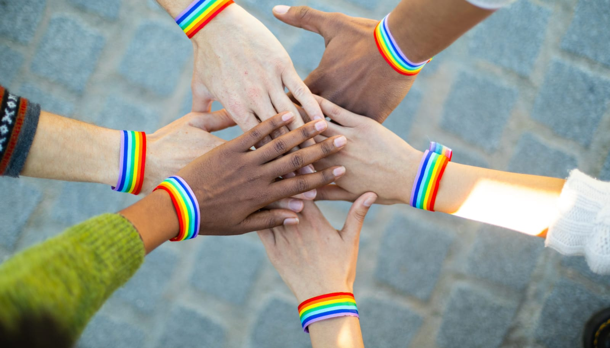

## The Post-Pride Reality

Every year, the same thing happens. Pride rolls around and certain voices in the community emerge to remind everyone about the importance of Pride. About how Pride is protest. About taking it seriously.

These lectures often come from people who have spent the rest of the year making it clear that certain voices don't matter in gay spaces.

Being told what to care about by people who have consistently excluded you hits differently.

## The History Weapon

"You need to know your history."

This phrase gets thrown around like a weapon. As if having complicated feelings about Pride means you don't understand Stonewall. As if questioning current community dynamics means you're ungrateful for past struggles.

But here's the thing about history. The people lecturing about it often tell selective versions.

They cite Stonewall but ignore figures like Marsha P. Johnson or Sylvia Rivera. They talk about marches but leave out the protests led by people of color. They celebrate marriage equality but never mention the ongoing fight for trans healthcare or racial equity in the same spaces.

Other stories get erased or minimized.

## The Pick-Me Accusation

Express any ambivalence about Pride or the gay community and you get labeled. You're trying to be different. You're a pick-me. You don't understand what's important.

The term "pick-me" refers to someone accused of seeking approval from outsiders by distancing themselves from their own group. In this case, it's used to silence anyone questioning why Pride feels exclusionary or why certain spaces feel unsafe for them.

This dismisses the possibility that your feelings come from real experiences. That your hesitation stems from being repeatedly marginalized within the very community that claims to champion inclusion.

There are legitimate reasons to have complicated feelings about the gay community. Ask before you assume.

## The Marriage Milestone

When marriage equality passed, many of us expected the gay community to turn inward. To address internal issues. To examine who gets centered and who gets sidelined.

White, cisgender gay men became the faces of the marriage movement. Meanwhile, issues affecting Black, Asian, and Latino queer people, like housing discrimination, police harassment, or immigration, barely got addressed. Those priorities stayed sidelined even after marriage passed.

Instead, we got more of the same conversations. More focus on the same priorities.

For many in positions of influence within gay spaces, marriage equality was the finish line. Once they had access to the institution they wanted, the work felt complete.

But that wasn't the complete picture for everyone.

## What We Actually Share

Strip away the political rhetoric and community performance. What do gay men actually have in common?

We have sex with men. That's it.

Everything else varies. Our backgrounds. Our values. Our experiences of discrimination. Our visions for the future.

This diversity isn't bad. But pretending we're one unified group creates problems.

Different people need different things. 

Different people face different obstacles. 

Different people have different goals.

## The Help Dynamic

The pattern repeats itself. Certain community members ask for support, solidarity, participation in their causes and priorities.

But when you need something? When you face challenges that don't fit their narrative? When you ask for reciprocal support?

The energy shifts. Your issues become secondary. Your experiences get minimized.

You're expected to show up for their fights. They're absent for yours.

## The Future Question

Those in positions of influence love discussing the past. They're less interested in examining the present or planning the future.

What does the gay community look like moving forward? Who gets to shape that vision? Are we building spaces that center queer youth of color? Are we acknowledging that trans people face different struggles than cis gay men? How do we address harm when it happens within our own spaces?

These questions threaten existing dynamics. So we get more history lessons instead.

## The Usefulness Factor

There's a pattern many people recognize. Your value in the gay community spaces often correlates with your usefulness to white gay men's goals.

For example, you might get invited to join a campaign photo because you bring diversity to the image. But when you raise concerns about racism on dating apps or lack of POC leadership, suddenly you're "being divisive."

When you want leadership roles, when you challenge problematic behavior, when you center different priorities, the welcome disappears.

The more they get what they want, the less useful you become to them.

## Different Goals, Different Paths

The reality is clear. Gay men are looking for different things from community.

Some want marriage rights and gay bars to stay open. That's enough for them.

Others need more. They want to address racism in dating culture. They want diverse leadership. They want community that goes beyond shared sexual orientation.

These goals often conflict. Acknowledging this allows people to focus their energy where it aligns with their values.

## Personal Boundaries

You don't have to help people who won't help you.

You don't have to participate in spaces where your presence is tolerated but not valued.

You don't have to accept lectures from people who have consistently marginalized you.

Setting these boundaries isn't divisive. It's healthy.

## Moving Forward Separately

The best course might be focusing on what you want, while letting others focus on what they want.

Stop asking for help from people who have shown they won't provide it.

Stop providing help to people who take it for granted.

Build relationships with people who value your full participation, not just your occasional usefulness.

## The Question That Matters

When white gay men ask for your support, ask them one question:

What have you personally done for me?

Not your elders. Not the community as an abstract concept. You personally.

The answer will tell you everything you need to know about whether that relationship is worth your energy.

Shared sexual orientation doesn't create automatic solidarity. Real community requires mutual support, not just shared identity.

Focus your energy where it gets reciprocated. You don't owe anyone participation in spaces that don't value your presence.

