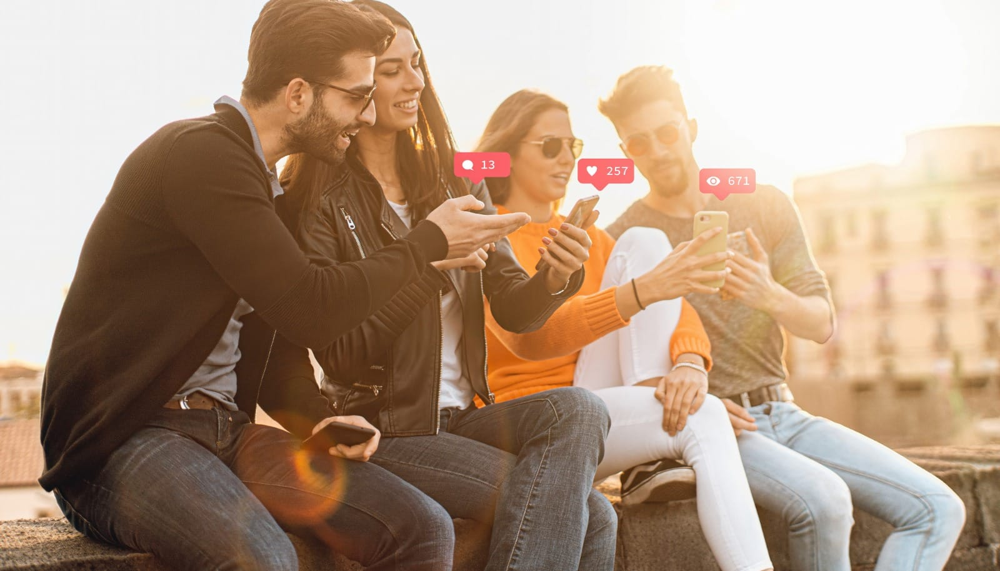

Bad news. We're all staying online. That quiet fantasy where we delete our accounts and go touch grass? It's not happening.

## The Analog Narrative Is a Delusion

The [Financial Times](https://www.newyorker.com/culture/infinite-scroll/its-cool-to-have-no-followers-now) ran a piece showing social media use has peaked. Other outlets declared having no followers is cool now. Going offline is a status symbol.

You read this and think: maybe we're finally logging off.

But here's the thing about status symbols. They're status symbols because most people cannot access them.

## Personal Brand Is Not Optional

Your university degree is pointless, they say. Your job might disappear to AI. Learn to code. Wait, coding is dead. Try plumbing.

The ground shifts every year.

If you don't have access to financial capital, your image is the one thing you own. It's not vanity. It's a survival strategy.

We maintain control over that image because we believe it defines our potential. Economic success. Social success. Romantic success. All of it flows from perception.

Social media is the platform enabling this transaction. But even if every app disappeared tomorrow, the pressure would remain. The culture of expectation would remain. The financial squeeze would remain.

But it's doing something even more critical than career building.

## And Right Now? Logging Off Is Irresponsible

In January 2026, while tech columnists write about digital detoxes, federal agents are killing American citizens in Minneapolis.

Operation Metro Surge deployed thousands of ICE agents across Minnesota. Two U.S. citizens are dead. Thousands arrested. Schools went remote. The state held its first general strike in 80 years.

You know how we know this? Social media.

Bystander video spread within hours. Organizers coordinated mutual aid. Activists documented raids in real time. Communities shared safety information faster than any official channel.

When the government escalates force against its own people, "touch grass" becomes a luxury opinion. The extremely online aren't addicted. They're paying attention.

Going offline right now means going blind.

## The Real World Is Too Risky

People aren't avoiding offline life because screens are more fun.

The real world is too expensive. Too precarious. Too far away from the people you love.

Where would we even go?

## Third Spaces Are Gone

Western societies spent 50 years defunding community infrastructure. The places where people used to gather for free have been gutted.

What replaced them? Branded experiences. Monetized hangouts. Third space as aesthetic.

Community gets subordinated to content. You don't go to the coffee shop to meet people. You go to photograph yourself as someone who goes to coffee shops.

## Government Bans Are Cowardice

Politicians want credit for banning TikTok. For protecting the children. For doing something brave.

Give me a break.

You want people offline? Here are some real solutions:

Control property markets so people don't move 90 minutes from their friends to afford rent.

Invest in live music. Stop letting a few noise complaints from new condo owners shut down venues that existed for decades.

Build an economy that doesn't extract from the young, the poor, and the working class to feed the old, the rich, and the owning class.

Banning apps is cowardice dressed as courage.

## The Uncomfortable Truth

We're not addicted to our phones. We're trapped by economics.

The scroll isn't a distraction from real life. For many, it is real life. It's where the opportunities are. The connections. The income.

Until someone fixes the underlying conditions, the logout fantasy stays a fantasy.

See you online.

