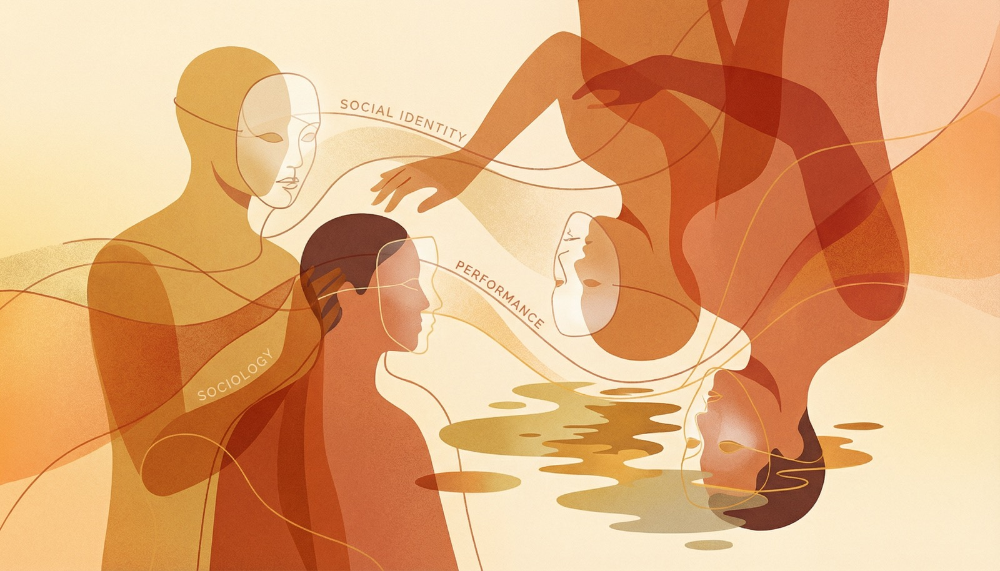

Life is a game of performance and posture. Whether you like it or not.

One of the most common responses to any conversation about class, cultural capital, or social distinction is a simple one: "Why don't people stop performing and be themselves?"

It sounds reasonable. It sounds like the right thing to say. But the further you look into it, the more you realize how difficult "being yourself" is. And I don't mean difficult in the motivational poster sense. I mean the concept itself falls apart under pressure.

So I sat with this idea and broke it down into two arguments for why "be yourself" is not the escape hatch people think it is.

## There Is No Backstage You

This is the part where it gets philosophical.

When someone tells you to be yourself, they're assuming something specific. They're assuming there's a pre-social, untouched version of you buried underneath all the conditioning. A version of you before class. Before culture. Before taste.

This person does not exist.

What you think of as your preferences, your instincts, your aesthetic sensibilities: these were absorbed through years of deep socialization. You've forgotten they were learned. So now they feel natural. They feel like "you."

Your taste in music was shaped by what your parents played in the car. Your posture was shaped by the schools you attended. The words you use to describe wine or food or film were absorbed from the people around you. None of it arrived from nowhere.

The set of dispositions you carry through life, generated by the conditions you grew up in. It's not a mask you put on. It's the thing doing the thinking.

And this isn't a dated idea. Stanford psychologist Brian Lowery arrived at a similar conclusion in his 2023 book. His central argument: you cannot be yourself by yourself. The self is always changing. It shifts based on who you're interacting with. It evolves.

If you accept this, the word "true" starts to fall apart. Most people use "true" to mean "real and unchanging." But the self is neither of those things.

So when someone says "be your true self," the question becomes: which one?

The version of you at work? At home? With your parents? With your friends from college? With strangers? None of these versions is fake. None of them is the "real" one either. They are all you, produced by different contexts.

The idea of a backstage self, some version of you waiting behind a curtain, is comforting. It's also fiction.

## Distinction Is Not a Choice

My second argument isn't about what the self is. It's about how society reads you.

The naive version of "be yourself" assumes distinction is something people do to each other. A voluntary act. Social snobbery. Something individuals choose to participate in and could stop doing if they wanted.

Distinction isn't a behavior. It's a structure. It operates whether you acknowledge it or not.

Think about fashion.

You get invited to the Grammys. You need to decide what to wear.

You might believe fashion as a concept is stupid. You might refuse to play the game. So you show up in pajamas.

Here's the thing: pajamas at the Grammys is still a fashion choice. It sends a message. Wearing a tuxedo sends a message. Wearing nothing sends a message. There is no outfit on earth, including the absence of one, without a signal attached to it.

You did not opt out. You cannot opt out. The system read you the moment you walked in.

The same logic applies to distinction. There is no neutral position. Every choice you make, from the words you use to the way you hold a fork to how you pronounce certain names, is being processed by the people around you.

The hiring manager. The admissions officer. The person sitting across from you on a first date.

This is why I talk about cultural capital so much. It is a measure of distinction between social strata. People detect it fast. They detect it unconsciously. And they make decisions based on it before either party knows what happened.

This detection happens whether you've studied any of this or not. Ignorance of the system isn't protecting you from the system.

And it becomes the reason why certain doors don't open. Why certain rooms feel wrong the moment you walk in. Why some people seem to glide through spaces you have to fight your way into.

## The Game Is Running

I agree with the sentiment. I do. The people saying "be who you are" want something good. They want people to stop pretending. To stop performing. To stop chasing approval they'll never get.

I want those things too.

But who you are has been decided by systems you didn't choose. The neighborhood you grew up in chose for you. The schools you attended chose for you. The income your parents earned chose for you. The language spoken at your dinner table chose for you.

You didn't pick your habits. It picked you.

And distinction, the process by which people sort each other into categories based on taste, behavior, and cultural signals, is one of those systems. It is still running. It runs in job interviews. It runs at dinner parties. It runs on dating apps. It runs in classrooms and boardrooms and courtrooms.

Pretending it doesn't exist won't make it stop.

What has worked for me is different. Acknowledging the system. Studying it. Understanding how it operates. Seeing it in action, in real time, in my own life.

I didn't do this to become a performer. I did it to stop being performed on. To stop being unconsciously sorted by a game I didn't know I was playing.

The game is still running. Whether you like it or not.

