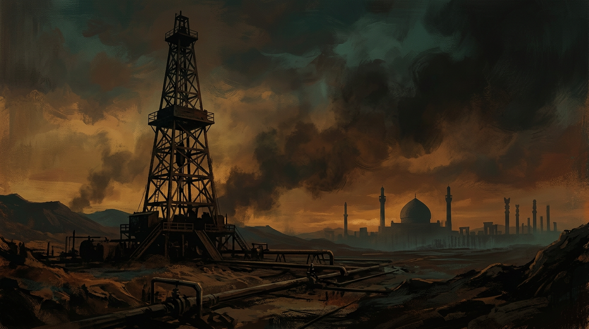

The unrest in Iran is not random. It did not emerge from a vacuum. It is the direct result of British and American imperialism. Every protest. Every crackdown. Every execution. The causes go back over a century.

I spent weeks going through the history. Reading primary sources. Listening to interviews. Processing all of it. Here is what I found.

It starts with oil.

## The Oil

In the early 1900s, a Shah from the Qajar dynasty sold the exclusive rights to Iran's oil to a British investor. This formed the Anglo-Persian Oil Company.

The company changed its name to the Anglo-Iranian Oil Company. Then it changed its name again. To British Petroleum.

BP.

The BP with the green flower logo and the gas stations you drive past. It used to be called the Anglo-Iranian Oil Company. And for decades, it sold Iran's oil while keeping most of the profits.

Iranians lived in poverty. The British lived off their resources. Iran was a colony in everything but name.

## Mossadegh

In the early 1950s, Iran elected a prime minister named Mohammad Mossadegh.

This is the only time the Iranian people united behind their leader. Mossadegh earned respect worldwide. Time magazine named him their Man of the Year in 1952, calling him the Iranian George Washington. The article is still on time.com.

His administration introduced social reforms. He supported women's rights. Workers' rights. He was secular and believed in the separation of religion and state. He believed the Shah should remain a symbol, not the ruler of the country.

And here is the big one.

He believed Iran's resources should belong to Iran.

So he nationalized the oil. He told the British to leave. Your monopoly on our oil is over. Go.

The British left. Physically. But they did not let go.

## The Coup

Britain and MI6 went to the United States. They fed the CIA lies about Mossadegh and communism. This was the McCarthy era. Fear of communism was enough to justify anything.

The CIA agreed to stage a coup.

Agents in Iran bribed newspapers. They staged protests. They hired mobs to fight each other in the streets. With the cooperation of the Shah, the coup succeeded.

They arrested Mossadegh. Imprisoned him for life. Gave the Shah full control of the government.

Democracy in Iran was over.

This was 1953. And it changed everything.

## The Shah's Iran

After the coup, the United States had influence over Iran's oil supply.

In 1954, the Consortium Agreement gave Iran ownership of 50% of its oil. The other 50% was split between American and British companies, with small portions going to French and Dutch firms. Britain lost its monopoly. Iran still did not have full control. But it was more than before.

The agreement was set to expire in 1979.

In 1973, Arab oil-exporting nations announced an embargo against countries supporting Israel. Iran's oil profits increased by 400%. The Shah used this money for his White Revolution: land reform, voting rights for women, literacy programs.

On paper, this sounds good. But the reforms benefited the cities. In the 1970s, when oil profits surged, half of Iran still lived in poverty. And the modernization was read as westernization by a group the Shah underestimated.

The clerics.

## The Clerics

Iran is a Shia Muslim nation. The clerics were the pastors, the community leaders, the landlords, the educators. Land reform took from them. Education reform threatened them. They opposed women's rights.

Women were gaining the right to vote. Going to university. Entering the workforce. Becoming equal participants in public life.

Changes were happening fast. The clerics told their communities: this westernization goes against Iranian sovereignty. It is pulling you away from God.

One cleric stood above the rest. Ayatollah Khomeini condemned the Shah's reforms in public, was imprisoned in 1963, and exiled in 1964.

## Khomeini's Rise

From exile, Khomeini recorded speeches on cassette tapes. They were smuggled into Iran. His influence grew.

He received support from all directions. He held press conferences in Paris. He opposed the West, and the West handed him a platform.

Khomeini lied. Again and again. He presented himself as a moderate. A leader for everyone. Students, socialists, democrats, Mossadegh supporters. They gathered under him, united less by a shared vision for Iran and more by their opposition to the Shah.

The people were not asking for an Islamic Republic. They wanted a republic.

Among his lies: free utilities. Free public transportation. Paradise in this life and the next. He catered to the rural and religious population, people living in poverty who felt excluded from the Shah's reforms.

The Shah was also an authoritarian. His secret police, SAVAK, arrested and killed political dissidents. The Iranian people had reason to oppose him. But Khomeini was not the answer they thought he was.

In August 1978, Islamic militants set fire to Cinema Rex in Abadan, killing about 400 civilians. They blamed the Shah. This was the turning point. Secular Iranians who had stayed neutral now believed the Shah posed a threat to their lives.

The revolution was in motion.

In November 1978, the Shah apologized for past mistakes. It was too late. The people rioted.

In January 1979, the Shah left Iran for cancer treatment. In truth, it was exile.

Khomeini returned. He lied again. He claimed 98% of Iranians voted for an Islamic Republic.

Everything got worse. The revolution's aftermath would later inspire Margaret Atwood's The Handmaid's Tale.

## Mahsa Amini

In 2022, Mahsa Amini was killed in the custody of Iran's morality police for not wearing her hijab to their standards. The "Woman, Life, Freedom" protests erupted across Iran and the world. Hundreds were killed. Thousands were arrested.

The morality police exist because of the Islamic Republic. The Islamic Republic exists because of the 1979 revolution. The revolution happened because of the Shah. The Shah held absolute power because of the 1953 coup. The coup was staged to protect oil profits.

The line from 1953 to 2022 is unbroken.

## March 2026

On March 1, 2026, a joint U.S.-Israeli military strike killed Ayatollah Ali Khamenei. He was 86. He had ruled Iran as Supreme Leader for 36 years.

The country split in half.

State media showed thousands in mourning. Black clothes. Chants of retaliation. 40 days of official mourning declared.

Social media showed something different. Dancing in the streets of Karaj and Izeh. Women removing their hijabs. Crowds toppling statues of Khamenei and Khomeini. People chanting outside the home of a teenager killed in protests months earlier.

One video showed a crowd shouting: "Am I dreaming? Hello to the new world."

## Limbo

Iran now faces its first succession crisis since 1989.

An interim council runs the country for now. The Assembly of Experts, a body of 88 clerics, is responsible for choosing the next Supreme Leader. Mojtaba Khamenei, the dead leader's son, is a front-runner. Israel has bombed the buildings in Qom and Tehran where the Assembly meets.

The IRGC, the military force that enforced Khamenei's rule for decades, holds the cards. Whoever becomes the next Supreme Leader answers to them. They control the military. The economy. The intelligence apparatus.

The Iranian people are watching. Again.

For the first time since 1979, the position of Supreme Leader is empty. The regime built to outlast any single person is being tested. The next chapter has not been written yet.

Maybe this time, the Iranian people get to write it themselves.

We shall see.

