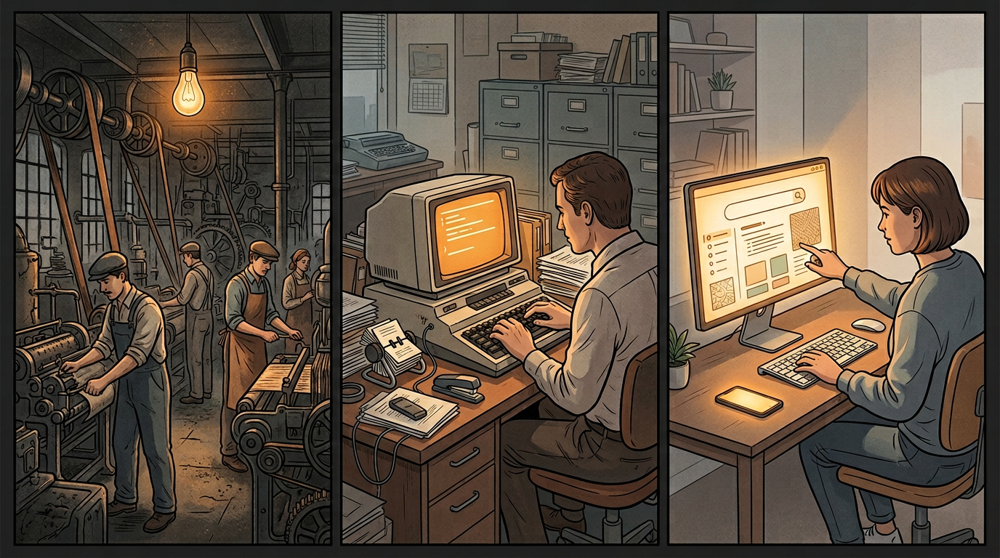

I was talking to other tech people about AI last week. People who build things for a living. People who have spent months testing every tool on the market.

The consensus surprised me.

AI is giving them better output. The quality of what comes back is higher than what they had before. But in terms of doing more, in terms of working at ten times the pace, no. Not close.

And I found this gap between the hype and the lived experience worth pulling apart.

## Two Types of AI Users

There are two camps.

The first camp says they use AI all the time and it has changed their life. When you ask what they're doing with it, the answer is: asking questions. Getting summaries. Looking things up. They replaced Google with ChatGPT. The output looks smarter. It feels more productive. But the task is the same.

The second camp is the people who have tested everything. They've used the coding tools. The agents. The workflow automations. The image generators. The voice tools. They know what works and what breaks.

Their feedback is different. The tools are good. They're getting better. But the ceiling hits fast. The context windows lose track. The code needs rewriting. The automation fails at step seven. The image has six fingers.

These people are not pessimists. They're practitioners. They've pushed the tools to their limits and found those limits.

So why is the hype so loud?

## Electricity Did Nothing for 40 Years

A video from Andrew Feldman put the whole thing together for me.

When electricity was first introduced to manufacturing, it replaced steam power. Factories had belt-driven systems. Belts ran from a central steam engine to every machine on the floor. One source of power. Everything connected.

Electricity came in as a backup. The factory owner swapped the steam engine for an electric motor. Same belts. Same layout. Same process. The only change was the power source.

The productivity gains were close to zero.

This went on for decades. Factories had electricity and saw no returns. People started to question whether electricity was overhyped.

The transformation came later. Someone realized you didn't need one central motor. You could put a small electric motor on each machine. Once you did that, the belts disappeared. The machines no longer needed to sit in a line. You could redesign the entire floor.

And that redesign changed everything. Materials flowed in one direction. Stations were placed where they made sense. Workers moved less. Output went up. Costs went down.

The gain didn't come from electricity. It came from reorganizing the system around electricity.

## Computers Were Typewriters

The same pattern happened with computers.

The first computers in offices replaced typewriters. People typed documents. The output looked better. You could edit without retyping the whole page. Spell check was new.

But if all you did was type on a computer instead of a typewriter, the speed increase was marginal. You were still doing the same job the same way.

The transformation came when computers connected to the internet.

Retail moved online. Amazon replaced the trip to the store. Cloud computing replaced the filing cabinet. Websites replaced the Yellow Pages. Email replaced the postal service for business communication.

None of these gains came from the computer itself. They came from rebuilding entire systems around what the computer made possible.

The computer was the electricity. The internet was the redesigned factory floor.

## Right Now, AI Is a Backup Generator

This is where we are with AI.

We're swapping in AI where we used to use Google. Where we used to use a junior copywriter. Where we used to write code from scratch. The tasks are the same. The tool is different.

And the results match what the factory owners saw in 1890. It's a bit better. It's a bit faster. It's not ten times anything.

That's because we haven't reorganized.

We're still running belt-driven systems. We're still typing on typewriters. We're still sitting in the same layout, doing the same work, in the same order, with the same assumptions about what "work" means.

The AI is bolted onto existing workflows. It hasn't changed the workflows themselves.

## The Habits Problem

There's another layer to this.

Those of us who have been using the internet for 20 years have habits. Deep ones. We know how we research. We know how we write. We know how we build. We know how we communicate. These patterns are baked in.

When a new tool arrives, we fit it into our existing process. We don't redesign the process. We add the tool to it.

This is normal. The factory owners did the same thing. They had a working system. They weren't going to tear it apart for a technology they didn't fully trust.

But the generation that grows up with AI won't have those habits. They won't be fitting AI into an internet-era workflow. They'll be building workflows that start with AI at the center.

The way a teenager uses AI in 2026 is different from how a 35-year-old software engineer uses it. The teenager doesn't have decades of muscle memory telling them how things should work. They'll organize differently. They'll create differently. They'll build systems we haven't imagined yet.

The biggest productivity gains from electricity came from people who had never worked in a belt-driven factory. They didn't need to unlearn the old system. They built the new one.

## What This Means

The people telling you AI is going to ten-times your productivity in 2026 are selling something.

The people telling you AI is useless are ignoring the pattern.

Both are wrong.

AI is in the replacement phase. It's the electric motor bolted onto the steam engine. It works. It's better than nothing. But the system hasn't changed.

The transformation will come when someone, or some generation, stops asking "how do I add AI to what I do?" and starts asking "what would I build if AI was the starting point?"

We're not there yet. The factory floor is still arranged for belts.

But the people who figure out the new layout first will be the ones who see the gains everyone is waiting for.

