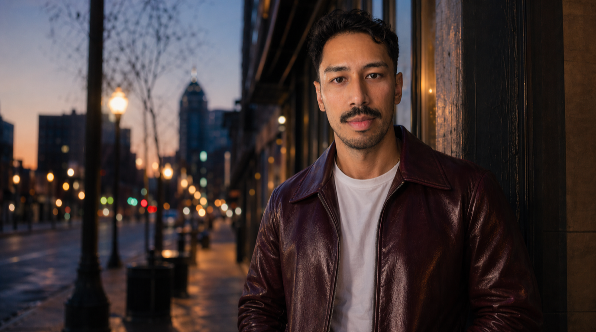

## Before the Critique, Some Credit

Columbus is a good city.

Walkable. Four seasons. A three-hour drive home to family in Michigan. A food scene I respect. A gay community bigger than the one I grew up near. A grown-up version of the Midwest I knew.

I came here a year ago wanting something pretty simple: close enough to family to matter, big enough to find my people, and not so big that life turns into pure grind.

I was not wrong about the city.

I was wrong about whether I would find my people inside it.

## I Am Not a Hopper

Before I go further, some context.

I have lived in a handful of cities. San Francisco was one of them, [years ago in my 20s, when travel and nightlife mattered a lot more to me](/2024/03/14/transition-from-party-animal-to-something-else). I give each place real time. Years, not months. I have left some reluctantly. I have stayed in others longer than I should have.

This is a slow decision, not a restless one.

When a city's people and I do not line up, I know it in my bones. It takes me a while to admit it, because admitting it means moving again, and I would rather be settled than right.

I kept hoping that part would change.

## What I Was Looking For

The list was short and clear:

- A three-hour drive to family
- A gay community to plug into and build inside of
- People excited about their passions
- A city where settling down does not mean slowing down

The first one I got immediately. The second is here in a real way. Columbus has a gay community, history, and people who care about it.

But it never turned into my people. The second half of the list never really showed up either.

## The Work Mindset Gap

I work for myself in tech. What excites me right now is building with AI, making things that help people, and creating systems that make work and life make more sense.

I am also at a point where I miss bringing that energy into one company. Client work is different. You can help in a lot of ways, but I miss going deep somewhere and helping build something greater over time.

I came here hoping to be around more of that kind of energy. People who get excited about what they care about. People who do not shut that part of themselves off at 5.

There are good jobs in Columbus. The mindset around them just feels different.

Work is work. You show up. You leave at 5. You go home. Picking up a project after dinner because you are still excited by it does not seem to be the common move here.

I am not dragging anyone for this. A lot of people are deeply happy inside a clock-in, clock-out life. I have tried to be one of them.

I am not one of them.

## The 5 O'Clock Wall

That difference showed up in small conversations all the time.

I would start talking about something I was building. A project. An idea. Some process I was trying to improve.

The response was usually polite. A nod. A vague "cool." Not much curiosity. Then the conversation would drift back to what bar was open late on Friday.

After a while, I started wondering if I was the problem.

Then I would talk to my old roommate from San Francisco and get the exact opposite reaction.

He wanted to know what I was working on. What it did. Why I was excited about it. What else I was trying to build.

He was interested. Engaged. Excited by it.

That contrast told me a lot.

## Am I Over Bars, or Over Columbus Bars?

Here is where I get honest about the back-and-forth.

I loved going out in my 20s. Nightlife was where I felt most myself. I still want close friends to laugh with at 1 a.m. I still want that kind of lightness in my life. I am not trying to age out of every joy I used to have.

I stopped drinking a while back. No dramatic story. I feel better without it.

Going out sober here made a few things harder to ignore. The same surface conversation. The same social loop. The same feeling that I had already done this night before.

But fun is not only bars. Outdoor trips. Road weekends. Dinner parties where someone cooks. Sober hangs with people who do not need a drink to be interesting. I want more of all of it.

So the question I keep circling is this: am I over bars, or over bars without the right crew inside them?

I keep going back, hoping a different group will be there. Hoping one of these nights the vibe clicks. It has not yet.

I want substance and lightness in the same week. Not one or the other. I have not found that mix here.

## The Ambition Gap

These are not kids. These are men my age.

I have a friend here who talks all the time about wanting to travel. Wanting to move somewhere new. Wanting to experience more of the world.

I give him real ideas. Cities. Actual ways to make it happen.

But he does not want a plan. He wants the feeling of wanting it.

I keep seeing that pattern. Big dreams, no movement. The second you make it concrete, people pull back. Too much. Too fast. Too real.

I am not trying to be intense. I just mean it when I say I want to do something.

## The Gay Part of It

I will say it straight.

A lot of men here, when they meet you, want one thing.

Once you signal you want more, the conversation starts thinning out. Sex as the front door to connection is a reality of gay dating culture. I have known that my whole life. I am not naive about it.

What keeps disappointing me is how often there is nothing behind it. No curiosity. No real desire to know a person.

I have given it time. I have been patient with early signs of depth.

I keep landing on the surface.

## What the Year Gave Me Anyway

It was not a waste.

I know more about myself now than I did when I arrived. I know the energy I am looking for, and I can feel its absence fast. I know ambition does not have to mean tech or money. It just means a person has something they are moving toward. Knowing what I will not settle for is its own kind of progress.

## What Comes Next

Three months left on my lease. I have not picked the next city.

When I look back at the years I felt most alive somewhere, the West Coast keeps coming up. Not as a brand. As a lived experience. The pace. The openness. People in motion, doing things, making moves, heading somewhere. That pull is real.

The next place needs to give me what I have been trying to name this whole post: people who are excited about what they care about, a gay community bigger than a single block of bars, and a crew for substance and lightness in the same week.

Family matters to me. But I cannot make proximity the whole decision if it is costing me my own happiness. I need to build a life that fits me first, then figure out how family fits into that.

Columbus showed me the shape of what I need. Now I need a city that actually fits it.

What are you still holding onto in a place that is not giving you what you need?

