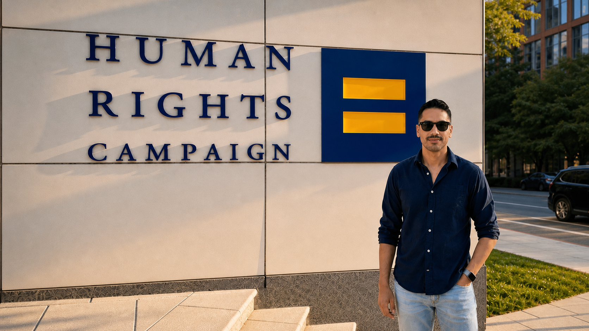
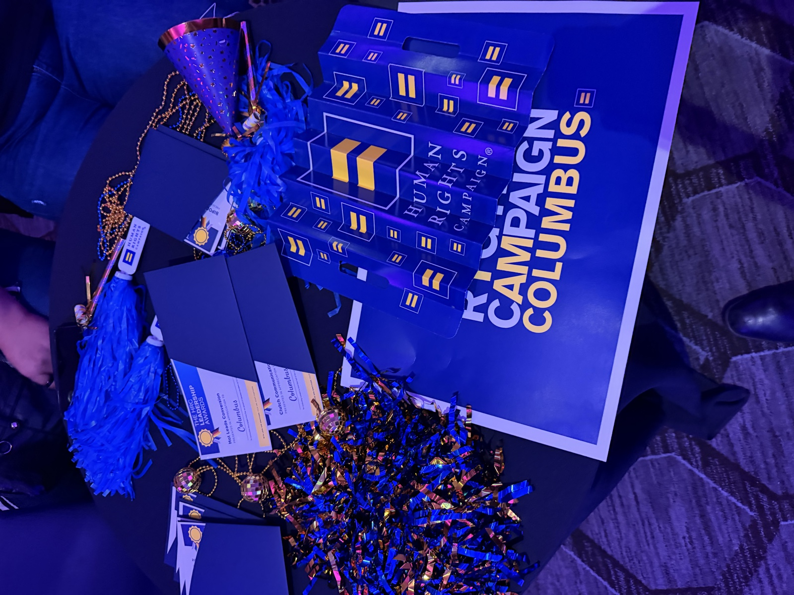
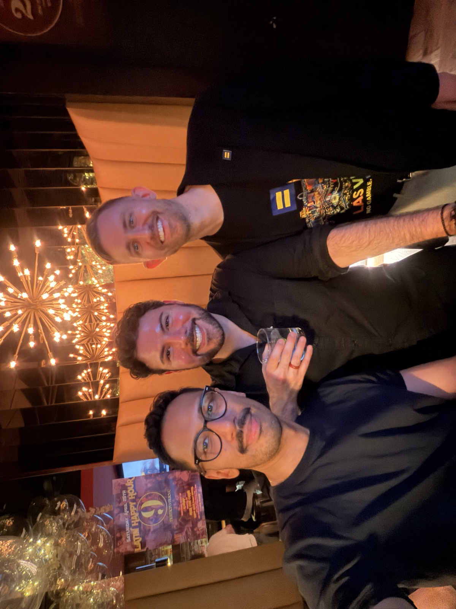
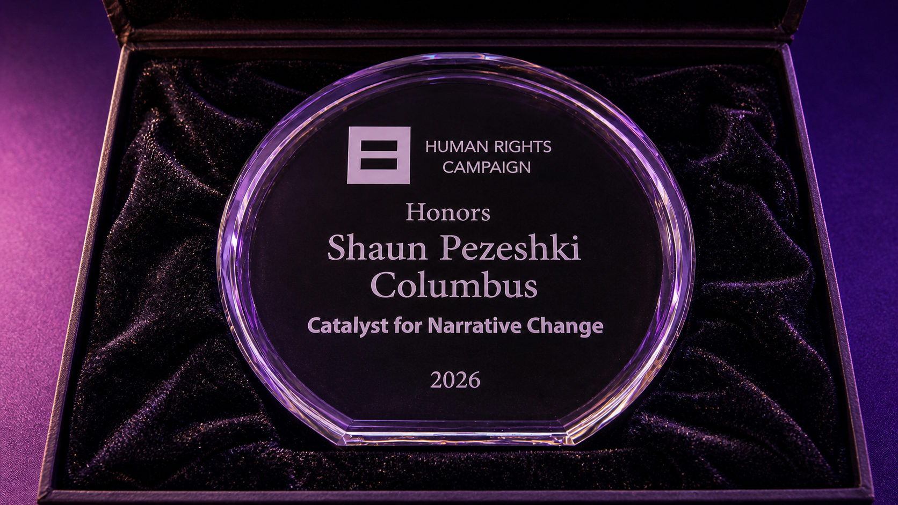
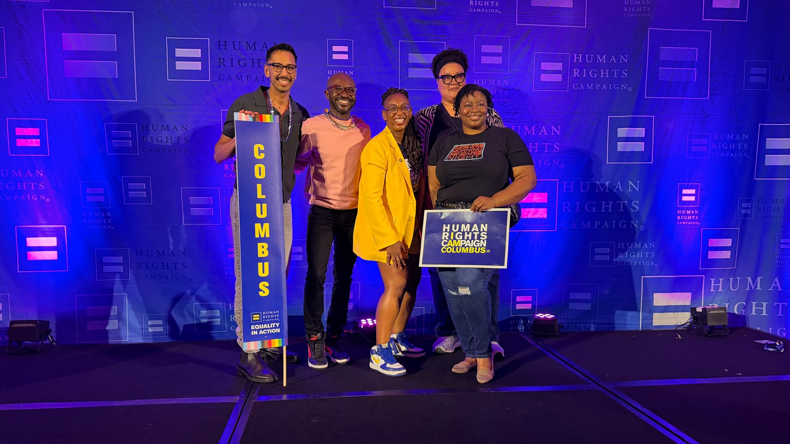

## The Happy Hour

I flew to DC for the Human Rights Campaign Equality in Action.

I expected panels. Updates on what HRC is doing. New people.

The first thing I walked into was the welcome happy hour for arrivals.

The room was a mix. People from different states. People with different identities. People who had built effective change in their own cities. People who came to help others find a voice.

I spent the first 15 minutes quiet.

I looked around. I talked to a few people. Everyone I met was friendly.

I did not feel out of place. I did not know what I was walking into. I thought I knew on the way in. I did not.

I met a bunch of people in short windows. Where are you from. What chapter. What brought you out here.

It was an interesting way to start.

## Same Fight, Different Cities

If you read [my Columbus post a couple of weeks back](/2026/04/22/columbus-taught-me-what-i-want), you know I have been thinking about community.

The people who notice when you show up.

The people who ask what you are working on and mean it.

The people who do not make caring feel embarrassing.

I found a lot of those people in DC.

Every conversation had weight.

People shared what they were doing in their own cities. How they were making impact. How they were getting more people involved. How they were keeping volunteers around.

It took time to connect. It does anywhere new. Even so, the room felt like a small community I was already part of.

We were in there for the same reason. Civil rights for LGBTQ+ Americans. Protecting the rights we already have.

An interesting microcosm of connection.

## Lobby Day From the Outside

I was not able to make lobby day.

Hundreds of HRC members went to the Hill. They met with senators and representatives from their own cities.

Some representatives came off the floor to greet their chapters. The Columbus team got one of those moments.

This is what the organization does.

This is how far we go to make change.

This is how we get involved with our local representation.

We are the ones impacting our communities.

## A Small Surprise

I serve as the Digital Engagement Chair for HRC's Columbus, Ohio chapter.

It is volunteer work. Most of it happens in small pieces. A post. A caption. A calendar. A reminder to someone who wants to help and does not know where to start.

When I joined, I positioned myself around one idea. Build proper ways to extend our chapter's messaging on digital platforms.

I like building things. I like building ideas.

So right at the start, I built a software tool to manage event and content requests coming in from our partners. It gave the team leeway time. We worked each request through a real process. We built out each post with intention instead of reacting.

In DC, they handed me the Catalyst for Narrative Change Award for 2026.

I did not see it coming.

This is not one of the marquee awards of the weekend. I had been with the chapter less than a year. I was floored I was even on the list.

I sat with it afterward.

I believe in the work HRC does. I believe in what it means for people like me.

Getting recognized for trying to do the work well, this early in, meant something.

## Stories Add Value

Being part of digital engagement has made me think more about what our chapter puts into the world.

I do not want our Columbus account to feel like a bulletin board.

Information matters. Dates matter. Links matter. Fundraising matters. People need to know where to go, what to give, and how to help.

But stories are what help people care.

I want us to share more about what is happening in the community. The people doing the work. The events bringing people together. The reasons behind the ask.

What we are doing.

Why we are doing it.

What someone else might try in their own city.

The midterms make this feel urgent.

HRC is running Let's Get Free: Vote Equality '26 to mobilize LGBTQ+ voters and allies for November.

If we want people to show up, stories are how we get them there.

It is the part of this work I want to keep getting better at.

## What Showing Up Looks Like

If you have been on the sidelines, here is what I would tell you.

Find your local HRC chapter. Most major cities have one. Smaller cities have a Steering Committee or a state-level group. They are listed on [hrc.org](https://www.hrc.org/in-your-area).

Volunteer if you have time.

Donate if you have money.

Phone bank if you have neither and a couple of evenings.

Bring one person with you. One is enough. These rooms grow because someone brings someone, who brings someone else.

If you have kept politics at arm's length, I get it.

It is exhausting.

It asks for attention when your life already asks for plenty.

But after this weekend, I understand something I did not understand before. Showing up is not about being the loudest person in the room. It is about finding the room where your part is useful.

I found one.

Next time, I want to bring more people with me.

Six months. Show up.

