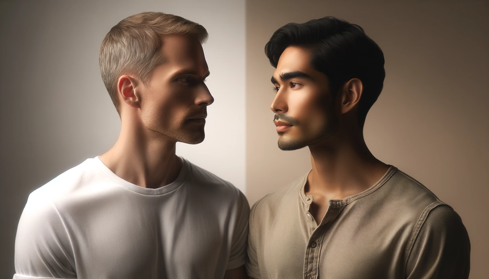

 

As an Filipino-Iranian gay man, I want to share the complex journey of self-discovery and acceptance, a journey that many of us in the LGBTQ+ community navigate, especially when layered with the rich textures of diverse racial and ethnic backgrounds. For those like me, who are gay and also part of a minority group, life is a unique blend of challenges, navigating not just our sexual identity but also the nuances of our cultural heritage. Let's delve into this journey together and talk about the importance of fostering a community that truly embraces everyone.

## Being Different in More Ways Than One

As a person of Filipino-Iranian descent who is also gay, I find myself navigating a delicate balance. My mixed heritage often leaves me feeling like an outsider within both the Filipino and Iranian communities, where being 'half' sometimes feels synonymous with being 'not enough.' This sense of partial acceptance complicates my connection to these integral parts of my identity, making it challenging to fully immerse myself in either culture.

## Looking for a Place to Belong

My journey for a sense of belonging is especially complex within the LGBTQ+ community. Here, I navigate not just the usual minority issues but also how I stack up against my white peers. This mix of my ethnic background and sexual orientation adds layers to my quest for acceptance, often leaving me feeling sidelined in many ways. Trying to fit in, some of us might tone down our cultural roots, only to be called out for not keeping it real. Yet, embracing our true selves, with all our cultural and racial uniqueness, can sometimes lead to feeling excluded or even fetishized. It's like we're caught in a cycle, seeking acceptance in both the broader world and within our own communities, but facing hurdles at every turn.

## When Inclusion Doesn't Include Everyone

It's kind of weird when you think about it. Here we are, part of a group that's all about fighting for the right to be ourselves, but sometimes we bump into these invisible walls that divide us based on where we come from or the color of our skin. It's a reminder that we've still got work to do, not just outside in the wider world but also within our own community, to make sure everyone really does feel included.

## Finding Our True Selves Together

So, what do we do about it? It starts with making sure everyone has the space to be their true self, without any masks or pretending. We've got to challenge those old stereotypes and tear down the barriers that keep us apart. This journey is about more than just each of us finding our place; it's about growing together and making our community a space where everyone, no matter their background, feels like they belong.

## What This All Means for Us

By sharing our stories and actively listening to one another, we begin to unravel the intricate layers that shape our identities. This process leads us to discover common ground within our diversity, fostering a sense of community where everyone is valued for their authentic selves.

Our journey isn't about striving for a world where everyone always agrees. It's about working together to build respect and understanding, despite our differences. Let's continue the conversation and work toward making sure everyone's true self is recognized and celebrated, learning and growing from each challenge we face, one step at a time.

