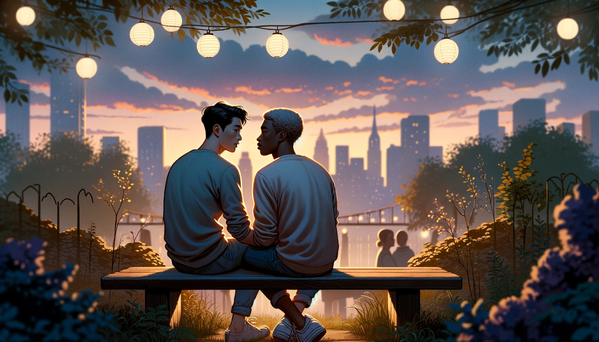

 

In today's changing LGBTQ+ dating world, finding connection and companionship can be challenging, especially for those with diverse backgrounds like mine. As someone of Filipino-Iranian descent, my experiences in dating are shaped by the complexities of my heritage and the hurdles of navigating racial and cultural dynamics in the dating scene.

In light of these complexities, I've identified seventeen significant challenges that many LGBTQ+ individuals from minority backgrounds encounter in the dating world:

### Identity and Expectations
1. **Juggling Multiple Identities**: When you're both LGBTQ+ and from a minority background, it can feel like you're walking a tightrope, trying to balance who you are with what your family and society expect. This balancing act can make finding real connections tough, especially when facing judgment from both inside and outside your communities.

2. **Balancing Personal Desires with Cultural Expectations**: It can be really hard to stay true to your cultural roots while also pursuing relationships that might not fit the traditional mold. This tension can feel even more intense if you've been brought up to value certain cultural traditions very highly.

3. **Exploring Your Sexuality When You're Worried About Cultural Backlash**: Discovering and embracing your sexuality can be scary if you come from a culture or religion that isn't accepting of LGBTQ+ identities. This fear can hold you back from expressing who you truly are.

4. **Looking for Love and Cultural Acceptance**: When searching for a partner, there's often a desire to find someone who not only gets you but also reflects and validates your cultural identity. This can stem from feelings of not being valued because of your background.

5. **Choosing Between Casual Dating and Cultural Expectations**: Enjoying casual relationships can sometimes clash with cultural pressures to settle down and continue family traditions. This clash can create a tug-of-war between wanting personal freedom and feeling obligated to meet cultural expectations.

6. **The Influence of Socioeconomic Status on Cross-Ethnic Dating Dynamics**: Socioeconomic status plays a pivotal role in shaping the dating experiences of LGBTQ+ individuals from minority backgrounds, especially when it comes to being accepted by potential partners from different ethnic and socioeconomic backgrounds. The disparities in financial stability, education, and social capital can lead to divisions within the dating scene, where individuals may find it challenging to connect with those outside their economic standing.

### Past Trauma and Fear of Rejection
7. **Dealing with "Past Hurts" in Dating**: If you've faced racism, discrimination, or exclusion, those experiences don't just disappear. They can make it harder to open up and trust someone in a relationship, as you might be wary of facing more pain.

8. **Fear of Commitment in the Face of Cultural Differences**: For minorities, the worry about committing to a relationship can be amplified by a lack of acceptance for LGBTQ+ relationships in their culture. This can make the idea of a long-term relationship even more daunting.

9. **Handling Jealousy When You Feel Marginalized**: Feeling like an outsider in both the LGBTQ+ community and your own cultural group can make jealousy even harder to handle in relationships. It can stir up insecurities and make trust more difficult to establish.

10. **Social Stigma and Internalized Shame**: Dealing with societal stigma and internalized shame surrounding both minority identity and LGBTQ+ identity can create emotional barriers in forming meaningful relationships. Overcoming internalized stigma and building self-acceptance are ongoing struggles for many individuals in the dating scene.

### Intersectionality and Discrimination
11. **Navigating Intersectional Discrimination and Fetishization**: When you're both LGBTQ+ and from a minority background, the dating world can present a complex web of intersectional discrimination. This discrimination may not only stem from prejudice based on your LGBTQ+ identity but can also be compounded by racial or ethnic biases. Moreover, a particularly insidious aspect of this intersectional discrimination is fetishization. Many LGBTQ+ individuals from minority backgrounds find themselves objectified, where potential partners may pursue them not for who they are but for stereotypes associated with their racial or ethnic identity. This fetishization can manifest in various forms, from overt sexual objectification to subtle preferences rooted in exoticism or racial stereotypes.

12. **Language and Cultural Barriers**: For individuals from minority backgrounds, language and cultural barriers can complicate communication and connection in dating. Differences in language fluency or cultural norms may hinder effective communication and understanding between partners.

13. **Limited Representation and Dating Pool**: Limited representation of LGBTQ+ individuals from minority backgrounds in mainstream media and dating apps can restrict the dating pool and make it difficult to find compatible partners who share similar experiences and identities.

### External Pressures and Legal Climate
14. **Timing in Relationships Around Cultural Milestones**: In minority cultures, there might be specific times or milestones when it's considered "appropriate" to start a relationship. This can add extra pressure to the already daunting world of dating.

15. **Family Acceptance and Support**: Gaining acceptance and support from family members can be particularly challenging for LGBTQ+ individuals from minority backgrounds due to cultural or religious beliefs. Lack of family acceptance can impact mental health and self-esteem, affecting one's ability to engage in healthy relationships. Additionally, family expectations regarding dating and marriage may add pressure to conform to cultural norms, complicating the process of finding compatible partners.

16. **Intersection of Religion and Sexual Orientation**: Negotiating the intersection of religious beliefs and LGBTQ+ identity can present significant challenges in dating. Religious teachings or community expectations may conflict with personal identity and desires, leading to internal conflict and external pressure.

17. **Legal and Political Climate**: In some regions, laws and political climates may pose additional challenges for LGBTQ+ individuals from minority backgrounds, including legal barriers to marriage or adoption, and increased vulnerability to discrimination and violence.

