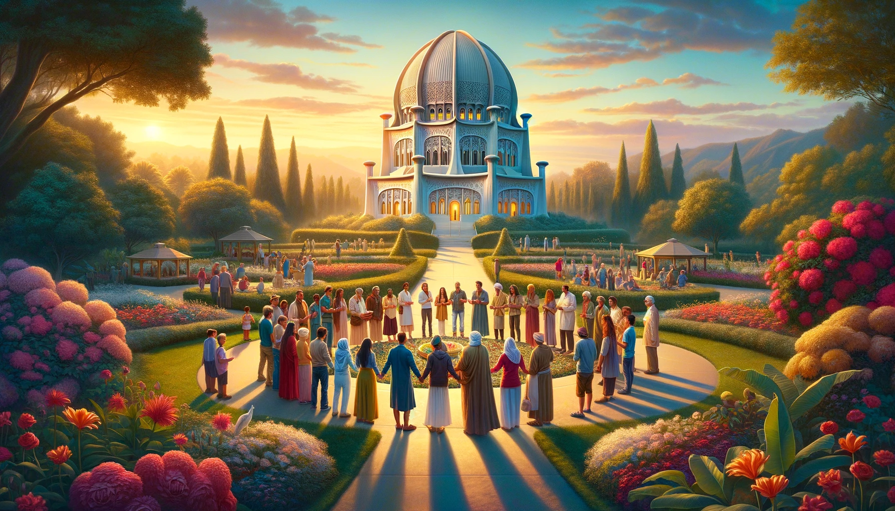

 

The Bahá'í 19-day Fast, beginning on March 2nd, is a period of spiritual reflection and renewal, culminating in the celebration of the Iranian new year.

## A Blended Upbringing

Growing up, faith in our household wasn't about strict religious rules. It was more of a blending of cultural and spiritual traditions. My parents wanted to pass down the beliefs they were raised with, even though they weren't deeply religious themselves. My dad followed Bahá'í principles, while my mom came from a Roman Catholic background. They exposed us to all sorts of different beliefs and practices.

## Journeys in Community

When I was little, our Sundays revolved around going to church in the mornings. But after I turned 10, we started attending Bahá'í Sunday school instead - something I kept doing until I graduated high school. Some of my most vivid memories are of those Sundays spent with my cousins. We were a tight-knit group, all navigating the teachings of the Bahá'í faith together. It was more than just learning; it felt like we were on this journey of self-discovery as a team, finding pieces of ourselves in those stories and lessons each week.

## Fasting: An Inconsistent Attempt

My personal experience with the Bahá'í fast was never about rigidly following the rules. It was more of a heartfelt attempt, even if inconsistent, to connect with that spiritual practice. The few times I did observe the fast, abstaining from food and drink from dawn to dusk, it became a profound period of self-reflection, discipline, and feeling united with the wider community. Around day 7 or 8, the physical hunger would fade, and I'd really tap into the essence of what the fast was about - cultivating empathy and strengthening our bonds.

## Lasting Lessons

I never managed to complete the full 19 days, but even my partial fasts sketched a broader understanding of that sacred time. It served as a reminder of our shared humanity and the connections among all people. It urged me to look beyond physical needs and focus on spiritual growth and bringing the community together in harmony.

When I look back now, those incomplete fasts were still powerful chapters that wove lessons of community, discipline and empathy into the fabric of who I am. My upbringing, immersed in the Bahá'í and Catholic traditions, taught me that faith goes beyond rituals and dogma. It's about the values we cherish and the perspectives we bring to this human experience.

## A Continuing Journey

The Bahá'í fast, with its emphasis on spiritual renewal and strengthening community ties, echoes principles of empathy, unity and personal growth that have guided my journey. While more spiritual than religious, my path continues to be shaped by these themes - viewing the world as a place rich with diverse narratives. It's a reminder that practices bringing us closer to our true selves and to others can foster a more compassionate, understanding world, regardless of our beliefs.

